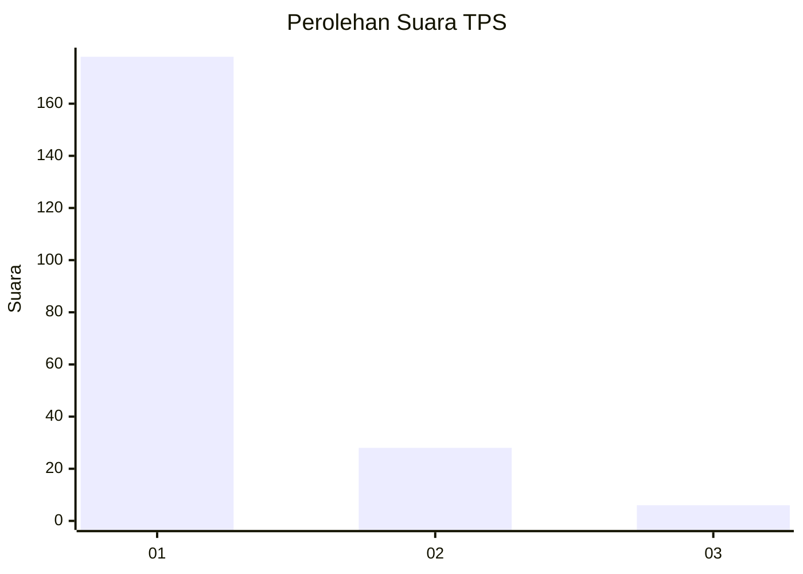
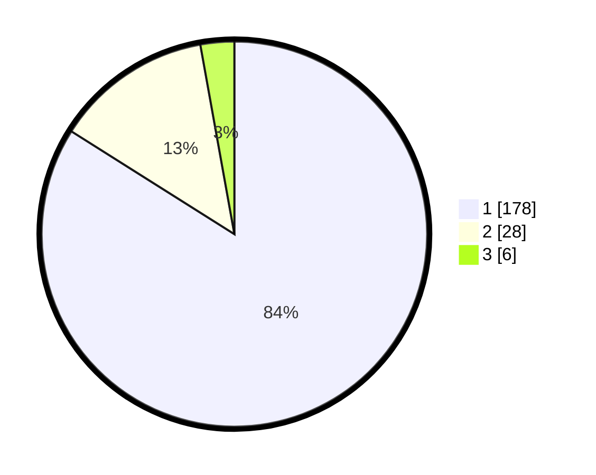

# Hasil

## Grafik

## Tabel

| No. | Nama Paslon    | Suara | Suara (raw) | Persentase |
|:--- |:-------------- | -----:| -----------:| ----------:|
| 1   | ANIES MUHAIMIN | 178   | [178][p-1]  | 83,96      |
| 2   | PRABOWO GIBRAN | 28    | [28][p-2]   | 13,21      |
| 3   | GANJAR MAHFUD  | 6     | [6][p-3]    | 2,83       |

[p-1]: https://github.com/gigit-pemilu/pemilu-2024-32-jawa-barat/blob/main/pilpres/hitung-suara/sub/32-jawa-barat/sub/08-kuningan/sub/09-kuningan/sub/2014-ancaran/sub/011-tps/sub/paslon-1.txt
[p-2]: https://github.com/gigit-pemilu/pemilu-2024-32-jawa-barat/blob/main/pilpres/hitung-suara/sub/32-jawa-barat/sub/08-kuningan/sub/09-kuningan/sub/2014-ancaran/sub/011-tps/sub/paslon-2.txt
[p-3]: https://github.com/gigit-pemilu/pemilu-2024-32-jawa-barat/blob/main/pilpres/hitung-suara/sub/32-jawa-barat/sub/08-kuningan/sub/09-kuningan/sub/2014-ancaran/sub/011-tps/sub/paslon-3.txt

## Foto C Plano

https://sirekap-obj-formc.kpu.go.id/cde8/pemilu/ppwp/32/08/09/20/14/3208092014011-20240214-191916--b1a19315-4bc3-45c5-af26-591d285438a0.jpg

https://sirekap-obj-formc.kpu.go.id/cde8/pemilu/ppwp/32/08/09/20/14/3208092014011-20240214-192424--be56119a-5cac-4588-9595-26f739d40c30.jpg

https://sirekap-obj-formc.kpu.go.id/cde8/pemilu/ppwp/32/08/09/20/14/3208092014011-20240214-192239--afdc00dc-9a1b-45de-a38d-fc073cc07c01.jpg

## Metadata

| Key        | Value               |
| ---------- | ------------------- |
| Time Stamp | 2024-02-24 22:31:28 |

