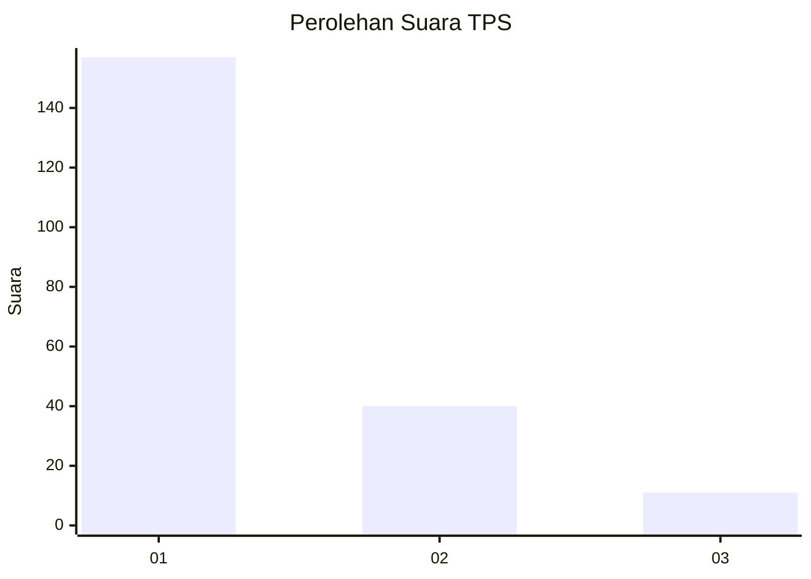
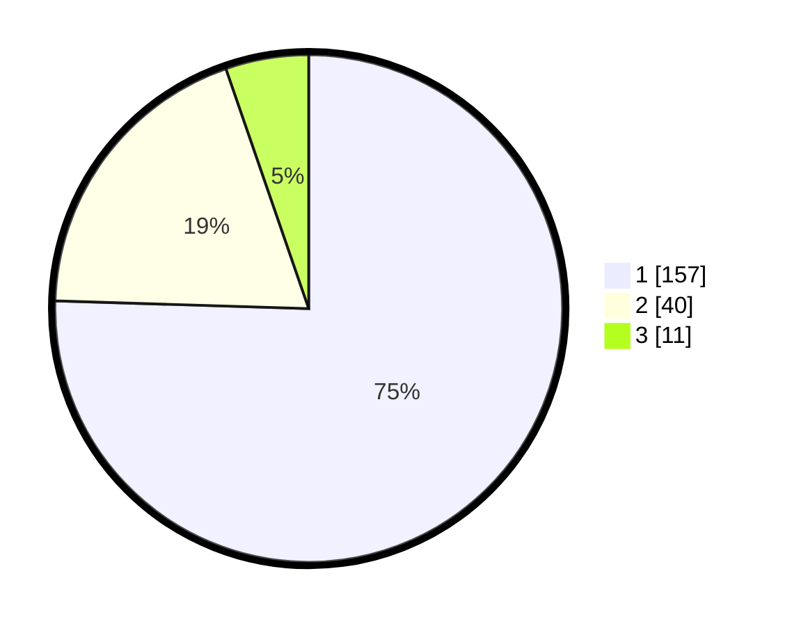

# Hasil

## Grafik

## Tabel

| No. | Nama Paslon    | Suara | Suara (raw) | Persentase |
|:--- |:-------------- | -----:| -----------:| ----------:|
| 1   | ANIES MUHAIMIN | 157   | [157][p-1]  | 75,48      |
| 2   | PRABOWO GIBRAN | 40    | [40][p-2]   | 19,23      |
| 3   | GANJAR MAHFUD  | 11    | [11][p-3]   | 5,29       |

[p-1]: https://github.com/gigit-pemilu/pemilu-2024-32-jawa-barat/blob/main/pilpres/hitung-suara/sub/32-jawa-barat/sub/08-kuningan/sub/09-kuningan/sub/2014-ancaran/sub/016-tps/sub/paslon-1.txt
[p-2]: https://github.com/gigit-pemilu/pemilu-2024-32-jawa-barat/blob/main/pilpres/hitung-suara/sub/32-jawa-barat/sub/08-kuningan/sub/09-kuningan/sub/2014-ancaran/sub/016-tps/sub/paslon-2.txt
[p-3]: https://github.com/gigit-pemilu/pemilu-2024-32-jawa-barat/blob/main/pilpres/hitung-suara/sub/32-jawa-barat/sub/08-kuningan/sub/09-kuningan/sub/2014-ancaran/sub/016-tps/sub/paslon-3.txt

## Foto C Plano

https://sirekap-obj-formc.kpu.go.id/12cb/pemilu/ppwp/32/08/09/20/14/3208092014016-20240214-185823--8e985571-6cfb-40e0-bd2e-ef4b92db5d9a.jpg

https://sirekap-obj-formc.kpu.go.id/12cb/pemilu/ppwp/32/08/09/20/14/3208092014016-20240214-185916--f1c0616e-0443-400a-9cf6-2873cfca035a.jpg

https://sirekap-obj-formc.kpu.go.id/12cb/pemilu/ppwp/32/08/09/20/14/3208092014016-20240214-190005--c01524b2-b95d-437b-b8dd-aec8869bdc04.jpg

## Metadata

| Key        | Value               |
| ---------- | ------------------- |
| Time Stamp | 2024-02-17 19:00:04 |

