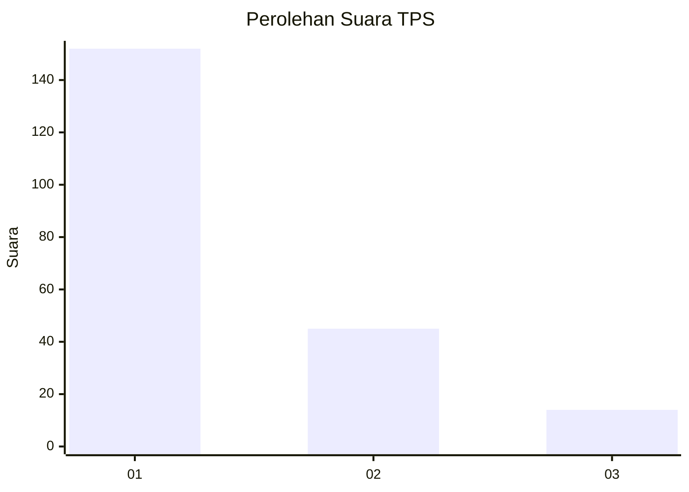
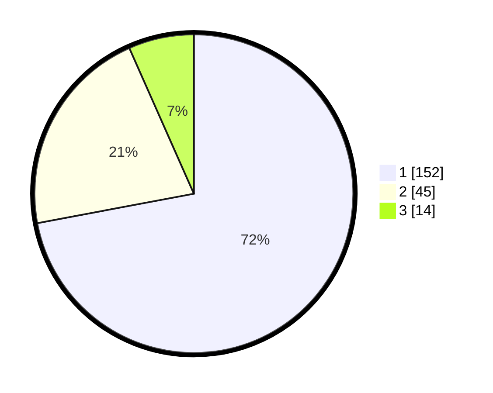

# Hasil

## Grafik

## Tabel

| No. | Nama Paslon    | Suara | Suara (raw) | Persentase |
|:--- |:-------------- | -----:| -----------:| ----------:|
| 1   | ANIES MUHAIMIN | 152   | [152][p-1]  | 72,04      |
| 2   | PRABOWO GIBRAN | 45    | [45][p-2]   | 21,33      |
| 3   | GANJAR MAHFUD  | 14    | [14][p-3]   | 6,64       |

[p-1]: https://github.com/gigit-pemilu/pemilu-2024/blob/main/pilpres/hitung-suara/sub/32-jawa-barat/sub/08-kuningan/sub/09-kuningan/sub/2014-ancaran/sub/021-tps/sub/paslon-1.txt
[p-2]: https://github.com/gigit-pemilu/pemilu-2024/blob/main/pilpres/hitung-suara/sub/32-jawa-barat/sub/08-kuningan/sub/09-kuningan/sub/2014-ancaran/sub/021-tps/sub/paslon-2.txt
[p-3]: https://github.com/gigit-pemilu/pemilu-2024/blob/main/pilpres/hitung-suara/sub/32-jawa-barat/sub/08-kuningan/sub/09-kuningan/sub/2014-ancaran/sub/021-tps/sub/paslon-3.txt

## Foto C Plano

https://sirekap-obj-formc.kpu.go.id/e060/pemilu/ppwp/32/08/09/20/14/3208092014021-20240214-155510--8796fb78-d45d-4479-b71f-fe0bbff7d4f4.jpg

https://sirekap-obj-formc.kpu.go.id/e060/pemilu/ppwp/32/08/09/20/14/3208092014021-20240214-155819--96a43755-f8d5-4010-969a-28ac9c57d8d5.jpg

https://sirekap-obj-formc.kpu.go.id/e060/pemilu/ppwp/32/08/09/20/14/3208092014021-20240214-155917--6107c83c-33c8-4d12-9449-67852a399031.jpg

## Metadata

| Key        | Value               |
| ---------- | ------------------- |
| Time Stamp | 2024-02-17 19:00:04 |

