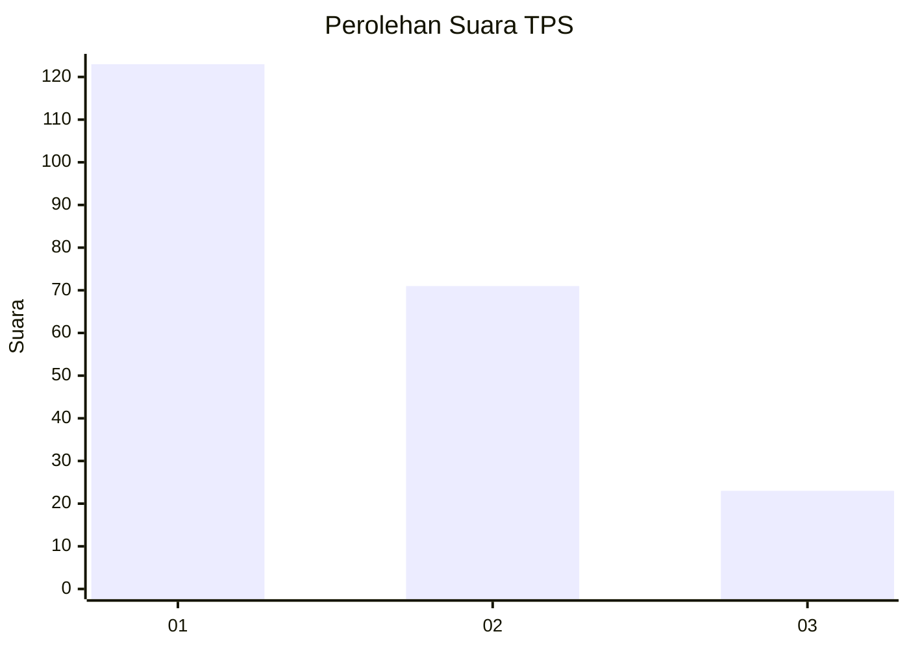
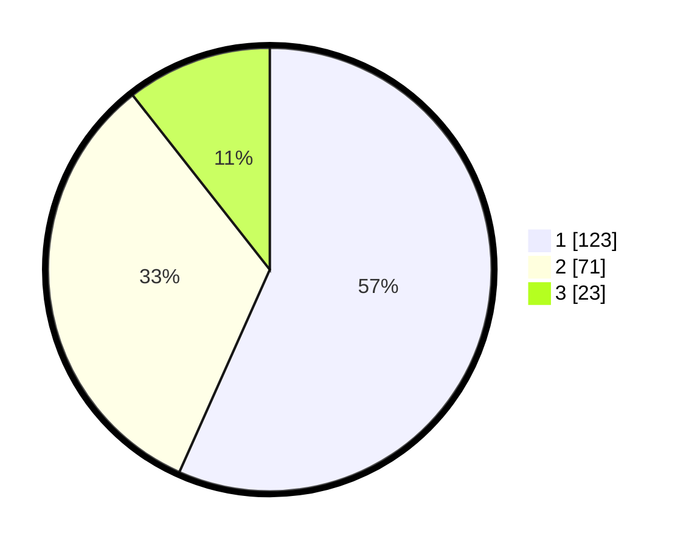

# Hasil

## Grafik

## Tabel

| No. | Nama Paslon    | Suara | Suara (raw) | Persentase |
|:--- |:-------------- | -----:| -----------:| ----------:|
| 1   | ANIES MUHAIMIN | 123   | [123][p-1]  | 56,68      |
| 2   | PRABOWO GIBRAN | 71    | [71][p-2]   | 32,72      |
| 3   | GANJAR MAHFUD  | 23    | [23][p-3]   | 10,60      |

[p-1]: https://github.com/gigit-pemilu/pemilu-2024-32-jawa-barat/blob/main/pilpres/hitung-suara/sub/32-jawa-barat/sub/08-kuningan/sub/10-ciawigebang/sub/2002-kadurama/sub/002-tps/sub/paslon-1.txt
[p-2]: https://github.com/gigit-pemilu/pemilu-2024-32-jawa-barat/blob/main/pilpres/hitung-suara/sub/32-jawa-barat/sub/08-kuningan/sub/10-ciawigebang/sub/2002-kadurama/sub/002-tps/sub/paslon-2.txt
[p-3]: https://github.com/gigit-pemilu/pemilu-2024-32-jawa-barat/blob/main/pilpres/hitung-suara/sub/32-jawa-barat/sub/08-kuningan/sub/10-ciawigebang/sub/2002-kadurama/sub/002-tps/sub/paslon-3.txt

## Foto C Plano

https://sirekap-obj-formc.kpu.go.id/0308/pemilu/ppwp/32/08/10/20/02/3208102002002-20240214-214739--4226d0e1-c75e-47c7-b3bb-9c42aa21779f.jpg

https://sirekap-obj-formc.kpu.go.id/0308/pemilu/ppwp/32/08/10/20/02/3208102002002-20240214-214934--63e15793-2ffb-4600-bf3f-4b91de4e5557.jpg

https://sirekap-obj-formc.kpu.go.id/0308/pemilu/ppwp/32/08/10/20/02/3208102002002-20240214-215100--f2753d24-1c67-4966-a7f8-052af854f28d.jpg

## Metadata

| Key        | Value               |
| ---------- | ------------------- |
| Time Stamp | 2024-02-15 15:00:29 |

