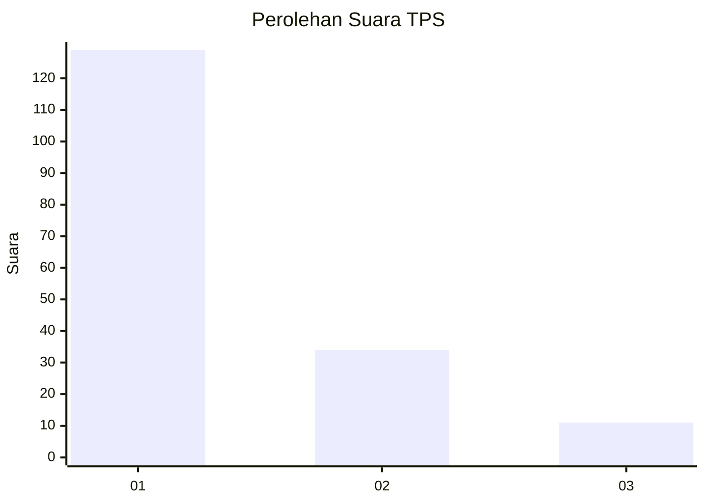
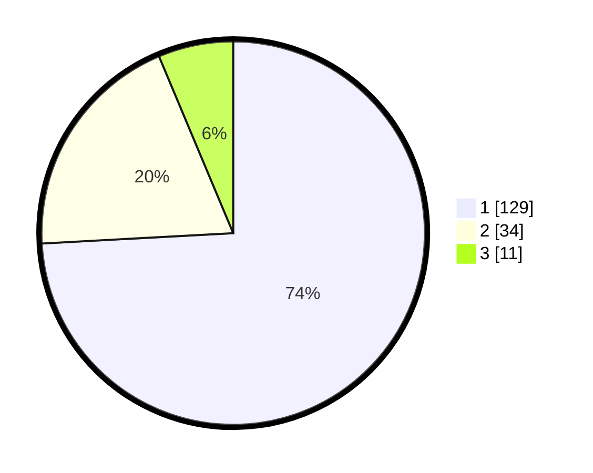

# Hasil

## Grafik

## Tabel

| No. | Nama Paslon    | Suara | Suara (raw) | Persentase |
|:--- |:-------------- | -----:| -----------:| ----------:|
| 1   | ANIES MUHAIMIN | 129   | [129][p-1]  | 74,14      |
| 2   | PRABOWO GIBRAN | 34    | [34][p-2]   | 19,54      |
| 3   | GANJAR MAHFUD  | 11    | [11][p-3]   | 6,32       |

[p-1]: https://github.com/gigit-pemilu/pemilu-2024/blob/main/pilpres/hitung-suara/sub/32-jawa-barat/sub/08-kuningan/sub/10-ciawigebang/sub/2013-ciawilor/sub/021-tps/sub/paslon-1.txt
[p-2]: https://github.com/gigit-pemilu/pemilu-2024/blob/main/pilpres/hitung-suara/sub/32-jawa-barat/sub/08-kuningan/sub/10-ciawigebang/sub/2013-ciawilor/sub/021-tps/sub/paslon-2.txt
[p-3]: https://github.com/gigit-pemilu/pemilu-2024/blob/main/pilpres/hitung-suara/sub/32-jawa-barat/sub/08-kuningan/sub/10-ciawigebang/sub/2013-ciawilor/sub/021-tps/sub/paslon-3.txt

## Foto C Plano

https://sirekap-obj-formc.kpu.go.id/696e/pemilu/ppwp/32/08/10/20/13/3208102013021-20240214-155802--85f0ed37-b618-4c43-8185-cbacaab2d491.jpg

https://sirekap-obj-formc.kpu.go.id/696e/pemilu/ppwp/32/08/10/20/13/3208102013021-20240214-141614--b693f565-08d0-498b-9316-0637f5eb7276.jpg

https://sirekap-obj-formc.kpu.go.id/696e/pemilu/ppwp/32/08/10/20/13/3208102013021-20240214-141927--c4282f96-d213-4fc5-8bcf-521e702d5e96.jpg

## Metadata

| Key        | Value               |
| ---------- | ------------------- |
| Time Stamp | 2024-02-14 21:46:01 |

