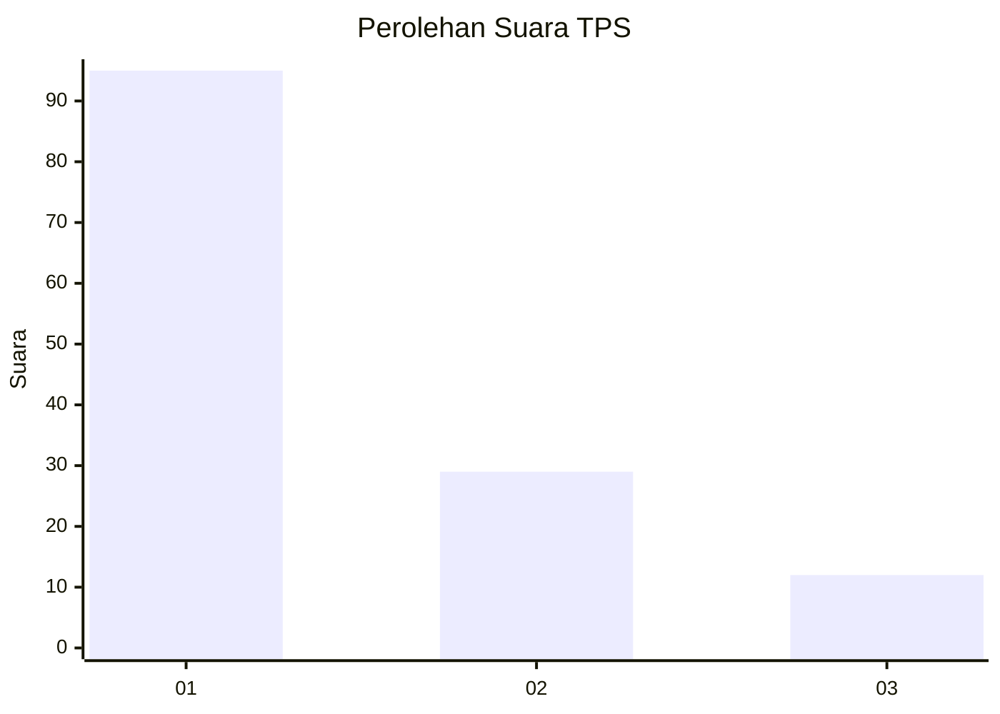
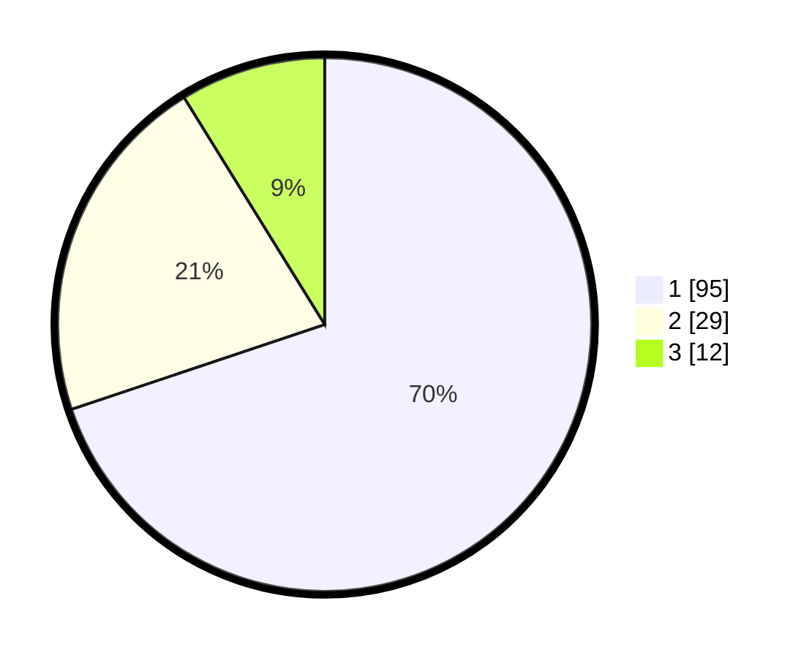

# Hasil

## Grafik

## Tabel

| No. | Nama Paslon    | Suara | Suara (raw) | Persentase |
|:--- |:-------------- | -----:| -----------:| ----------:|
| 1   | ANIES MUHAIMIN | 95    | [95][p-1]   | 69,85      |
| 2   | PRABOWO GIBRAN | 29    | [29][p-2]   | 21,32      |
| 3   | GANJAR MAHFUD  | 12    | [12][p-3]   | 8,82       |

[p-1]: https://github.com/gigit-pemilu/pemilu-2024/blob/main/pilpres/hitung-suara/sub/32-jawa-barat/sub/08-kuningan/sub/10-ciawigebang/sub/2015-sukadana/sub/006-tps/sub/paslon-1.txt
[p-2]: https://github.com/gigit-pemilu/pemilu-2024/blob/main/pilpres/hitung-suara/sub/32-jawa-barat/sub/08-kuningan/sub/10-ciawigebang/sub/2015-sukadana/sub/006-tps/sub/paslon-2.txt
[p-3]: https://github.com/gigit-pemilu/pemilu-2024/blob/main/pilpres/hitung-suara/sub/32-jawa-barat/sub/08-kuningan/sub/10-ciawigebang/sub/2015-sukadana/sub/006-tps/sub/paslon-3.txt

## Foto C Plano

https://sirekap-obj-formc.kpu.go.id/3e7b/pemilu/ppwp/32/08/10/20/15/3208102015006-20240214-235902--fa5befac-a14a-470c-9e83-097243916af6.jpg

https://sirekap-obj-formc.kpu.go.id/3e7b/pemilu/ppwp/32/08/10/20/15/3208102015006-20240215-000122--398039e2-f3f5-431d-bffa-2557cdc03b2c.jpg

https://sirekap-obj-formc.kpu.go.id/3e7b/pemilu/ppwp/32/08/10/20/15/3208102015006-20240215-000351--2f6e4215-9bac-48b5-9c98-211bd5085da0.jpg

## Metadata

| Key        | Value               |
| ---------- | ------------------- |
| Time Stamp | 2024-02-15 19:30:26 |

