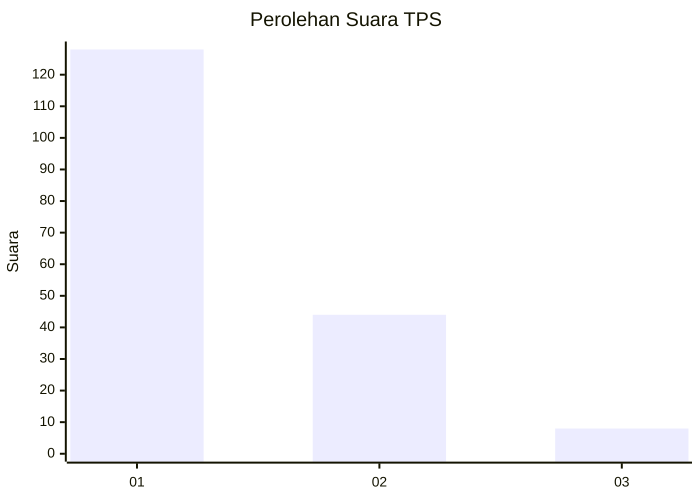
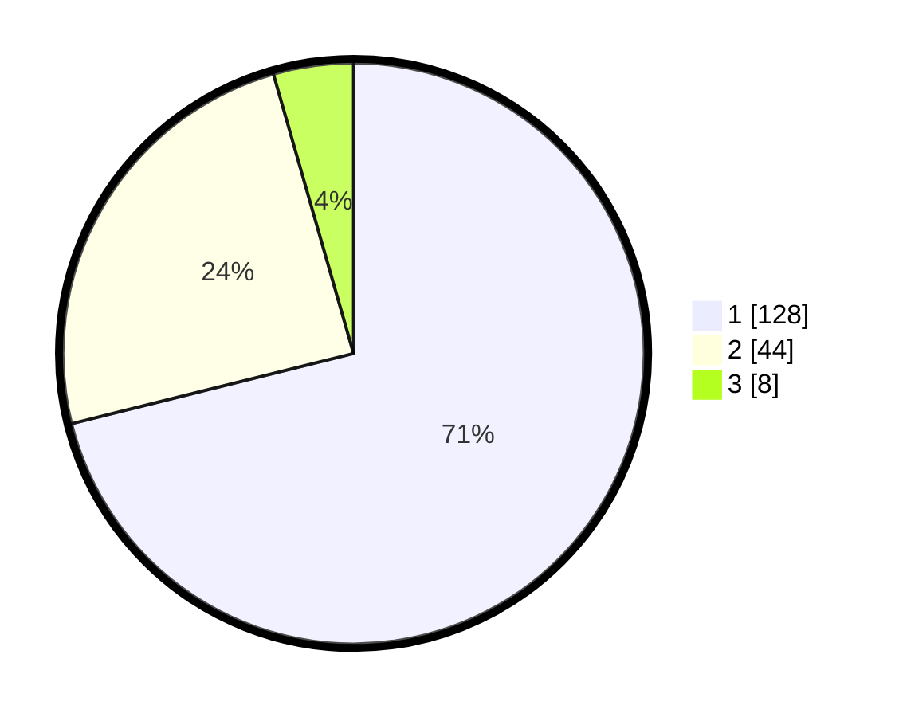

# Hasil

## Grafik

## Tabel

| No. | Nama Paslon    | Suara | Suara (raw) | Persentase |
|:--- |:-------------- | -----:| -----------:| ----------:|
| 1   | ANIES MUHAIMIN | 128   | [128][p-1]  | 71,11      |
| 2   | PRABOWO GIBRAN | 44    | [44][p-2]   | 24,44      |
| 3   | GANJAR MAHFUD  | 8     | [8][p-3]    | 4,44       |

[p-1]: https://github.com/gigit-pemilu/pemilu-2024/blob/main/pilpres/hitung-suara/sub/32-jawa-barat/sub/08-kuningan/sub/10-ciawigebang/sub/2022-dukuhdalem/sub/003-tps/sub/paslon-1.txt
[p-2]: https://github.com/gigit-pemilu/pemilu-2024/blob/main/pilpres/hitung-suara/sub/32-jawa-barat/sub/08-kuningan/sub/10-ciawigebang/sub/2022-dukuhdalem/sub/003-tps/sub/paslon-2.txt
[p-3]: https://github.com/gigit-pemilu/pemilu-2024/blob/main/pilpres/hitung-suara/sub/32-jawa-barat/sub/08-kuningan/sub/10-ciawigebang/sub/2022-dukuhdalem/sub/003-tps/sub/paslon-3.txt

## Foto C Plano

https://sirekap-obj-formc.kpu.go.id/a2c7/pemilu/ppwp/32/08/10/20/22/3208102022003-20240215-004202--5e7d2f05-b83e-44bc-ae73-859ef50b1886.jpg

https://sirekap-obj-formc.kpu.go.id/a2c7/pemilu/ppwp/32/08/10/20/22/3208102022003-20240215-004313--8748a332-4abd-4587-a5ae-dba9a6cac0d2.jpg

https://sirekap-obj-formc.kpu.go.id/a2c7/pemilu/ppwp/32/08/10/20/22/3208102022003-20240215-004430--ca649b84-1eea-4a5a-b8c4-03bf267acba4.jpg

## Metadata

| Key        | Value               |
| ---------- | ------------------- |
| Time Stamp | 2024-02-15 20:00:44 |

