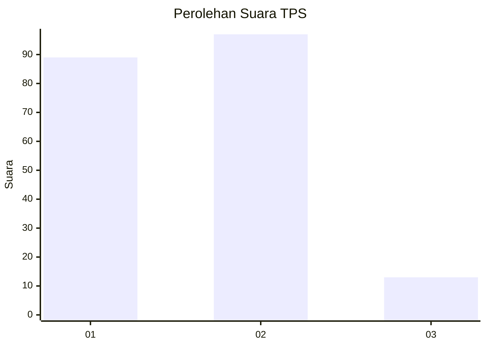
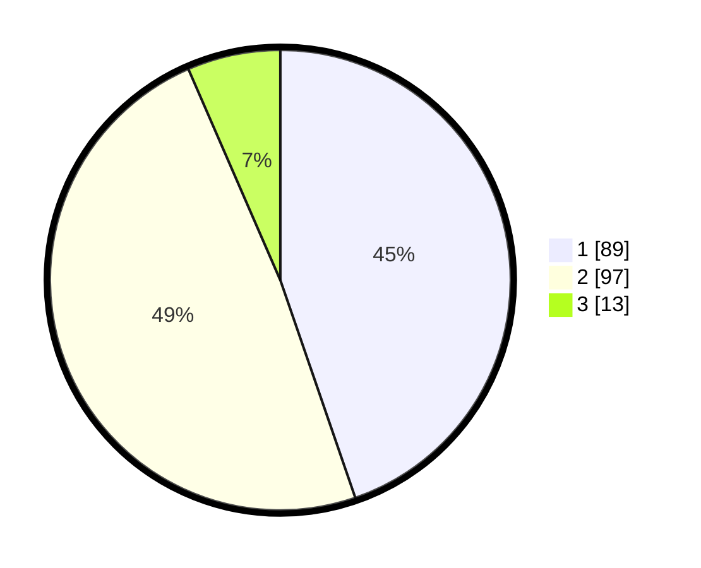

# Hasil

## Grafik

## Tabel

| No. | Nama Paslon    | Suara | Suara (raw) | Persentase |
|:--- |:-------------- | -----:| -----------:| ----------:|
| 1   | ANIES MUHAIMIN | 89    | [89][p-1]   | 44,72      |
| 2   | PRABOWO GIBRAN | 97    | [97][p-2]   | 48,74      |
| 3   | GANJAR MAHFUD  | 13    | [13][p-3]   | 6,53       |

[p-1]: https://github.com/gigit-pemilu/pemilu-2024-32-jawa-barat/blob/main/pilpres/hitung-suara/sub/32-jawa-barat/sub/08-kuningan/sub/11-cidahu/sub/2001-cihideunggirang/sub/001-tps/sub/paslon-1.txt
[p-2]: https://github.com/gigit-pemilu/pemilu-2024-32-jawa-barat/blob/main/pilpres/hitung-suara/sub/32-jawa-barat/sub/08-kuningan/sub/11-cidahu/sub/2001-cihideunggirang/sub/001-tps/sub/paslon-2.txt
[p-3]: https://github.com/gigit-pemilu/pemilu-2024-32-jawa-barat/blob/main/pilpres/hitung-suara/sub/32-jawa-barat/sub/08-kuningan/sub/11-cidahu/sub/2001-cihideunggirang/sub/001-tps/sub/paslon-3.txt

## Foto C Plano

https://sirekap-obj-formc.kpu.go.id/a87c/pemilu/ppwp/32/08/11/20/01/3208112001001-20240223-131647--b417aaed-4104-4cb5-86e2-7d38792527b4.jpg

https://sirekap-obj-formc.kpu.go.id/a87c/pemilu/ppwp/32/08/11/20/01/3208112001001-20240223-131656--4188a3ab-4fdc-4730-9184-4203f32de27d.jpg

https://sirekap-obj-formc.kpu.go.id/a87c/pemilu/ppwp/32/08/11/20/01/3208112001001-20240223-131705--aef7f740-6f81-4e92-a09b-af1bddffb4cf.jpg

## Metadata

| Key        | Value               |
| ---------- | ------------------- |
| Time Stamp | 2024-02-24 22:31:28 |

