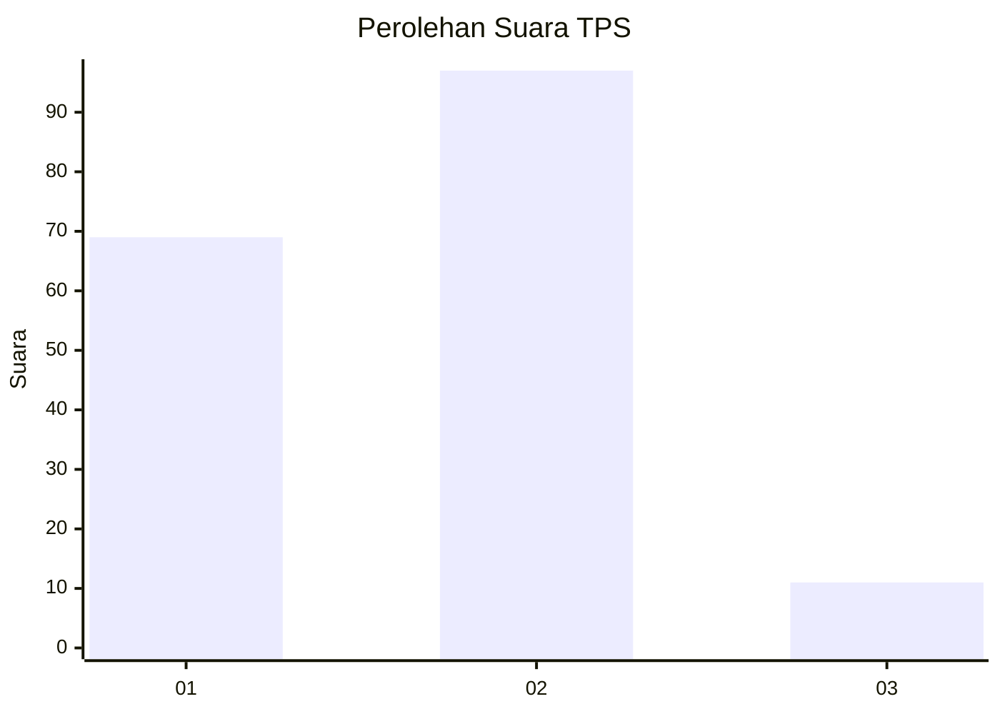
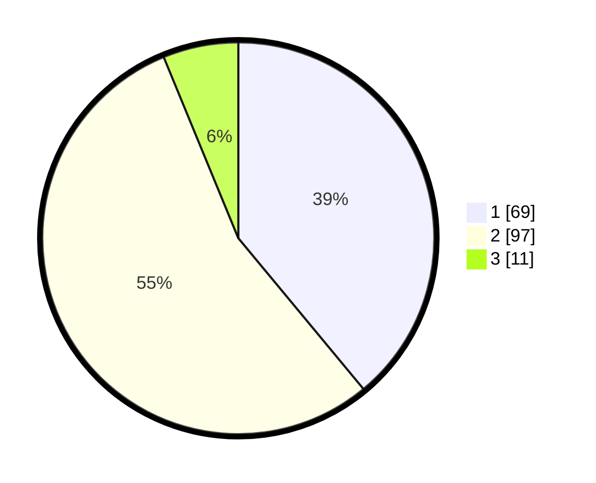

# Hasil

## Grafik

## Tabel

| No. | Nama Paslon    | Suara | Suara (raw) | Persentase |
|:--- |:-------------- | -----:| -----------:| ----------:|
| 1   | ANIES MUHAIMIN | 69    | [69][p-1]   | 38,98      |
| 2   | PRABOWO GIBRAN | 97    | [97][p-2]   | 54,80      |
| 3   | GANJAR MAHFUD  | 11    | [11][p-3]   | 6,21       |

[p-1]: https://github.com/gigit-pemilu/pemilu-2024-32-jawa-barat/blob/main/pilpres/hitung-suara/sub/32-jawa-barat/sub/08-kuningan/sub/11-cidahu/sub/2001-cihideunggirang/sub/002-tps/sub/paslon-1.txt
[p-2]: https://github.com/gigit-pemilu/pemilu-2024-32-jawa-barat/blob/main/pilpres/hitung-suara/sub/32-jawa-barat/sub/08-kuningan/sub/11-cidahu/sub/2001-cihideunggirang/sub/002-tps/sub/paslon-2.txt
[p-3]: https://github.com/gigit-pemilu/pemilu-2024-32-jawa-barat/blob/main/pilpres/hitung-suara/sub/32-jawa-barat/sub/08-kuningan/sub/11-cidahu/sub/2001-cihideunggirang/sub/002-tps/sub/paslon-3.txt

## Foto C Plano

https://sirekap-obj-formc.kpu.go.id/44e3/pemilu/ppwp/32/08/11/20/01/3208112001002-20240214-230736--adbb96b9-d376-4c98-b2fa-012570c1c6c7.jpg

https://sirekap-obj-formc.kpu.go.id/44e3/pemilu/ppwp/32/08/11/20/01/3208112001002-20240214-230854--e3b5b5ea-17be-43a9-9de8-a5c808096493.jpg

https://sirekap-obj-formc.kpu.go.id/44e3/pemilu/ppwp/32/08/11/20/01/3208112001002-20240214-230953--a03b6dad-3962-4f51-8119-05c47927eee8.jpg

## Metadata

| Key        | Value               |
| ---------- | ------------------- |
| Time Stamp | 2024-02-15 22:00:27 |

