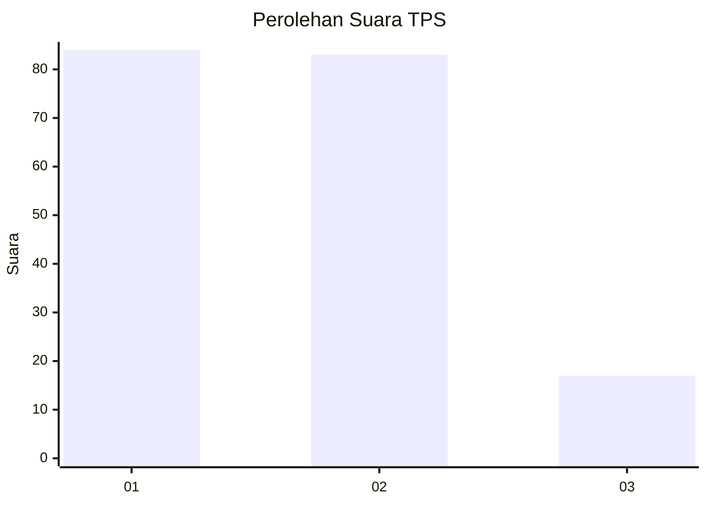
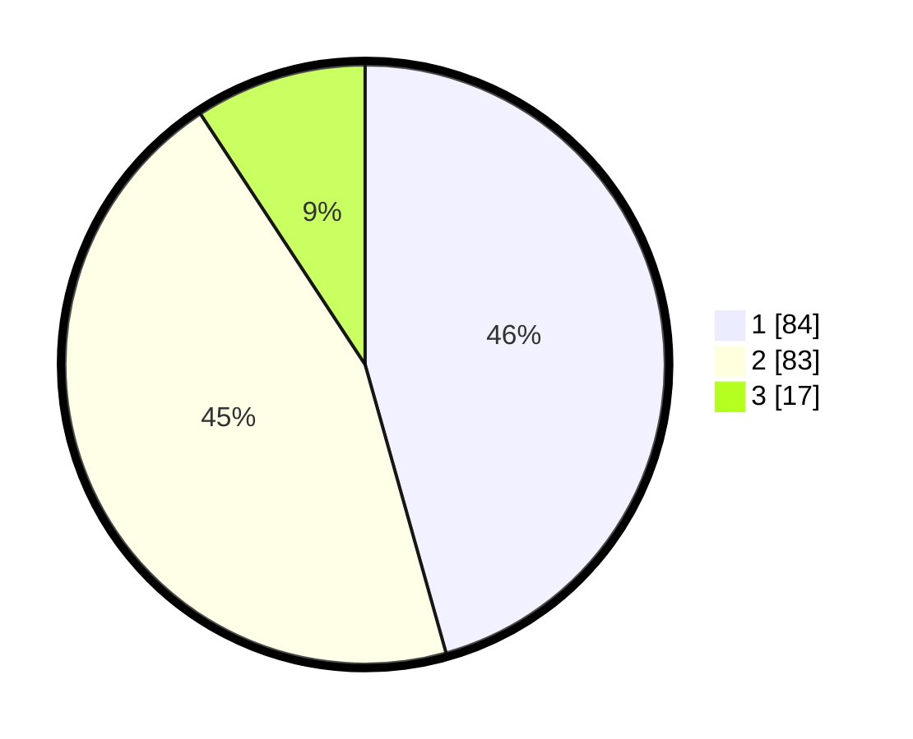

# Hasil

## Grafik

## Tabel

| No. | Nama Paslon    | Suara | Suara (raw) | Persentase |
|:--- |:-------------- | -----:| -----------:| ----------:|
| 1   | ANIES MUHAIMIN | 84    | [84][p-1]   | 45,65      |
| 2   | PRABOWO GIBRAN | 83    | [83][p-2]   | 45,11      |
| 3   | GANJAR MAHFUD  | 17    | [17][p-3]   | 9,24       |

[p-1]: https://github.com/gigit-pemilu/pemilu-2024-32-jawa-barat/blob/main/pilpres/hitung-suara/sub/32-jawa-barat/sub/08-kuningan/sub/11-cidahu/sub/2001-cihideunggirang/sub/003-tps/sub/paslon-1.txt
[p-2]: https://github.com/gigit-pemilu/pemilu-2024-32-jawa-barat/blob/main/pilpres/hitung-suara/sub/32-jawa-barat/sub/08-kuningan/sub/11-cidahu/sub/2001-cihideunggirang/sub/003-tps/sub/paslon-2.txt
[p-3]: https://github.com/gigit-pemilu/pemilu-2024-32-jawa-barat/blob/main/pilpres/hitung-suara/sub/32-jawa-barat/sub/08-kuningan/sub/11-cidahu/sub/2001-cihideunggirang/sub/003-tps/sub/paslon-3.txt

## Foto C Plano

https://sirekap-obj-formc.kpu.go.id/f611/pemilu/ppwp/32/08/11/20/01/3208112001003-20240223-131734--1da74ae5-a4ca-4a19-a4b2-e1c391b7baba.jpg

https://sirekap-obj-formc.kpu.go.id/f611/pemilu/ppwp/32/08/11/20/01/3208112001003-20240214-212635--4a3366ec-6488-4dac-8d55-9394dfc53ade.jpg

https://sirekap-obj-formc.kpu.go.id/f611/pemilu/ppwp/32/08/11/20/01/3208112001003-20240214-193705--f1850ef8-8e9e-49d7-8e3f-b673ae8a80a0.jpg

## Metadata

| Key        | Value               |
| ---------- | ------------------- |
| Time Stamp | 2024-02-24 22:31:28 |

