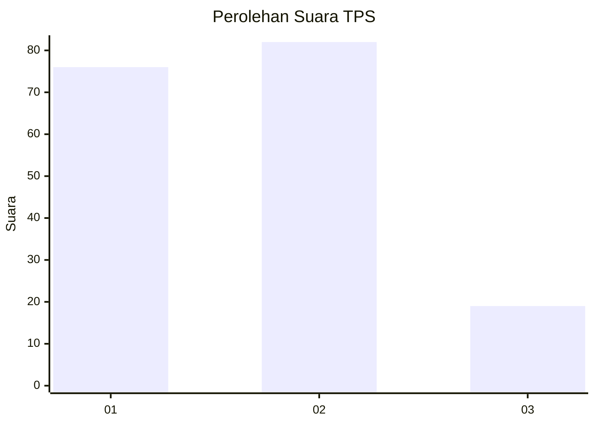
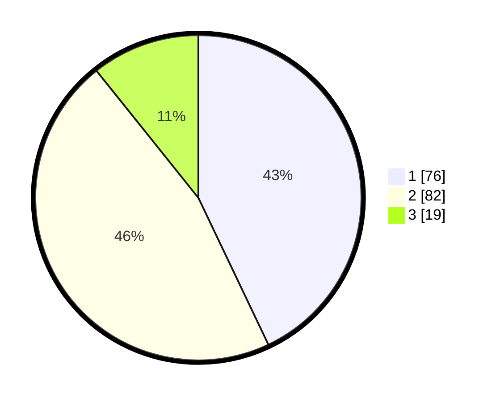

# Hasil

## Grafik

## Tabel

| No. | Nama Paslon    | Suara | Suara (raw) | Persentase |
|:--- |:-------------- | -----:| -----------:| ----------:|
| 1   | ANIES MUHAIMIN | 76    | [76][p-1]   | 42,94      |
| 2   | PRABOWO GIBRAN | 82    | [82][p-2]   | 46,33      |
| 3   | GANJAR MAHFUD  | 19    | [19][p-3]   | 10,73      |

[p-1]: https://github.com/gigit-pemilu/pemilu-2024-32-jawa-barat/blob/main/pilpres/hitung-suara/sub/32-jawa-barat/sub/08-kuningan/sub/11-cidahu/sub/2001-cihideunggirang/sub/004-tps/sub/paslon-1.txt
[p-2]: https://github.com/gigit-pemilu/pemilu-2024-32-jawa-barat/blob/main/pilpres/hitung-suara/sub/32-jawa-barat/sub/08-kuningan/sub/11-cidahu/sub/2001-cihideunggirang/sub/004-tps/sub/paslon-2.txt
[p-3]: https://github.com/gigit-pemilu/pemilu-2024-32-jawa-barat/blob/main/pilpres/hitung-suara/sub/32-jawa-barat/sub/08-kuningan/sub/11-cidahu/sub/2001-cihideunggirang/sub/004-tps/sub/paslon-3.txt

## Foto C Plano

https://sirekap-obj-formc.kpu.go.id/c70d/pemilu/ppwp/32/08/11/20/01/3208112001004-20240215-011152--6a68a729-d117-4cb8-a55d-820a3d1f6f91.jpg

https://sirekap-obj-formc.kpu.go.id/c70d/pemilu/ppwp/32/08/11/20/01/3208112001004-20240223-131805--4f460873-5415-4637-b7ab-655a40b4a44b.jpg

https://sirekap-obj-formc.kpu.go.id/c70d/pemilu/ppwp/32/08/11/20/01/3208112001004-20240215-011633--72235fa9-ab92-4177-a65e-1168f86ed8ca.jpg

## Metadata

| Key        | Value               |
| ---------- | ------------------- |
| Time Stamp | 2024-02-24 22:31:28 |

