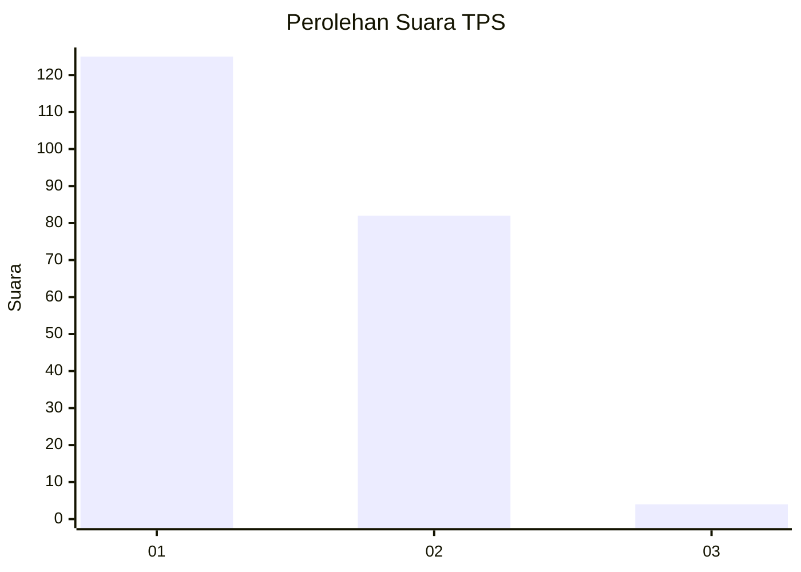
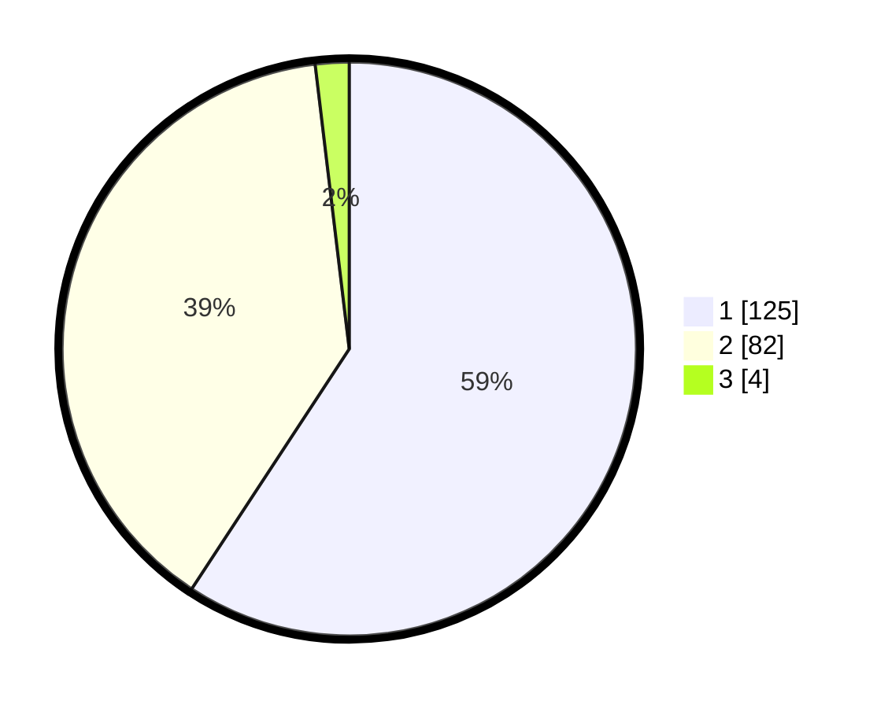

# Hasil

## Grafik

## Tabel

| No. | Nama Paslon    | Suara | Suara (raw) | Persentase |
|:--- |:-------------- | -----:| -----------:| ----------:|
| 1   | ANIES MUHAIMIN | 125   | [125][p-1]  | 59,24      |
| 2   | PRABOWO GIBRAN | 82    | [82][p-2]   | 38,86      |
| 3   | GANJAR MAHFUD  | 4     | [4][p-3]    | 1,90       |

[p-1]: https://github.com/gigit-pemilu/pemilu-2024/blob/main/pilpres/hitung-suara/sub/32-jawa-barat/sub/08-kuningan/sub/11-cidahu/sub/2002-cihideunghilir/sub/005-tps/sub/paslon-1.txt
[p-2]: https://github.com/gigit-pemilu/pemilu-2024/blob/main/pilpres/hitung-suara/sub/32-jawa-barat/sub/08-kuningan/sub/11-cidahu/sub/2002-cihideunghilir/sub/005-tps/sub/paslon-2.txt
[p-3]: https://github.com/gigit-pemilu/pemilu-2024/blob/main/pilpres/hitung-suara/sub/32-jawa-barat/sub/08-kuningan/sub/11-cidahu/sub/2002-cihideunghilir/sub/005-tps/sub/paslon-3.txt

## Foto C Plano

https://sirekap-obj-formc.kpu.go.id/6a10/pemilu/ppwp/32/08/11/20/02/3208112002005-20240214-233906--303a4780-0514-4ddf-bc8a-1945fc6ef164.jpg

https://sirekap-obj-formc.kpu.go.id/6a10/pemilu/ppwp/32/08/11/20/02/3208112002005-20240214-234050--deb49d1e-77dc-421c-ab0b-8fafc268baf8.jpg

https://sirekap-obj-formc.kpu.go.id/6a10/pemilu/ppwp/32/08/11/20/02/3208112002005-20240223-133514--52244cd0-f42f-4085-95d5-b6b3cd88a7ce.jpg

## Metadata

| Key        | Value               |
| ---------- | ------------------- |
| Time Stamp | 2024-02-24 22:31:28 |

