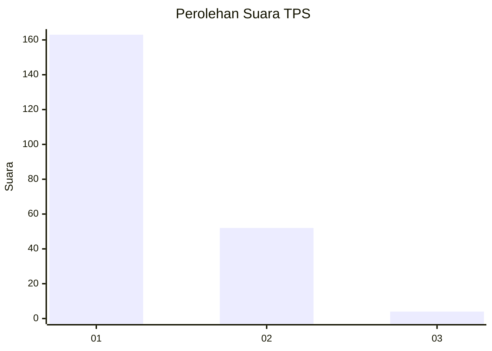
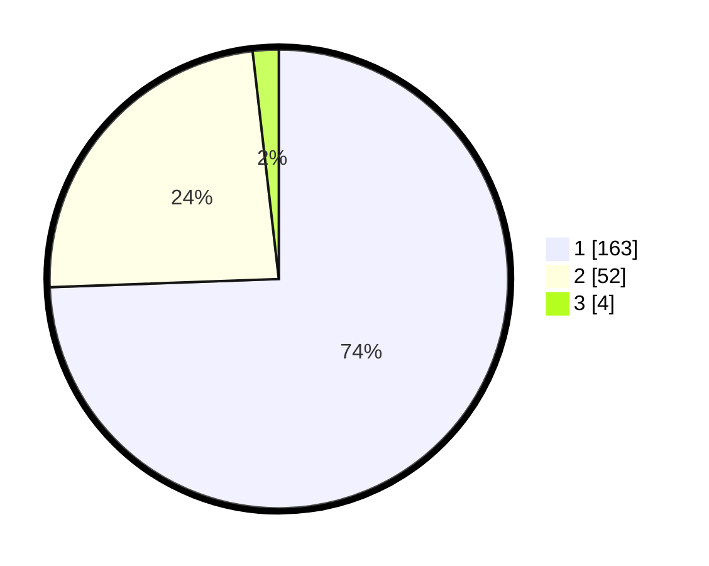

# Hasil

## Grafik

## Tabel

| No. | Nama Paslon    | Suara | Suara (raw) | Persentase |
|:--- |:-------------- | -----:| -----------:| ----------:|
| 1   | ANIES MUHAIMIN | 163   | [163][p-1]  | 74,43      |
| 2   | PRABOWO GIBRAN | 52    | [52][p-2]   | 23,74      |
| 3   | GANJAR MAHFUD  | 4     | [4][p-3]    | 1,83       |

[p-1]: https://github.com/gigit-pemilu/pemilu-2024/blob/main/pilpres/hitung-suara/sub/32-jawa-barat/sub/08-kuningan/sub/11-cidahu/sub/2003-cidahu/sub/003-tps/sub/paslon-1.txt
[p-2]: https://github.com/gigit-pemilu/pemilu-2024/blob/main/pilpres/hitung-suara/sub/32-jawa-barat/sub/08-kuningan/sub/11-cidahu/sub/2003-cidahu/sub/003-tps/sub/paslon-2.txt
[p-3]: https://github.com/gigit-pemilu/pemilu-2024/blob/main/pilpres/hitung-suara/sub/32-jawa-barat/sub/08-kuningan/sub/11-cidahu/sub/2003-cidahu/sub/003-tps/sub/paslon-3.txt

## Foto C Plano

https://sirekap-obj-formc.kpu.go.id/1b3e/pemilu/ppwp/32/08/11/20/03/3208112003003-20240223-114753--4f31ebd2-4ab4-4556-81a6-67cb60fee9da.jpg

https://sirekap-obj-formc.kpu.go.id/1b3e/pemilu/ppwp/32/08/11/20/03/3208112003003-20240223-114814--e4ce53c4-81be-4b92-83fe-b7c55aeeed66.jpg

https://sirekap-obj-formc.kpu.go.id/1b3e/pemilu/ppwp/32/08/11/20/03/3208112003003-20240223-114828--d5d909bd-96bc-446f-be56-e291ca136727.jpg

## Metadata

| Key        | Value               |
| ---------- | ------------------- |
| Time Stamp | 2024-02-24 22:31:28 |

