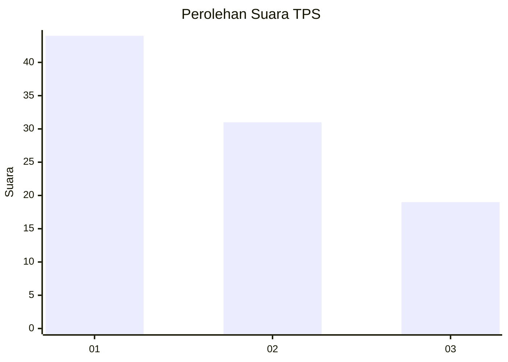
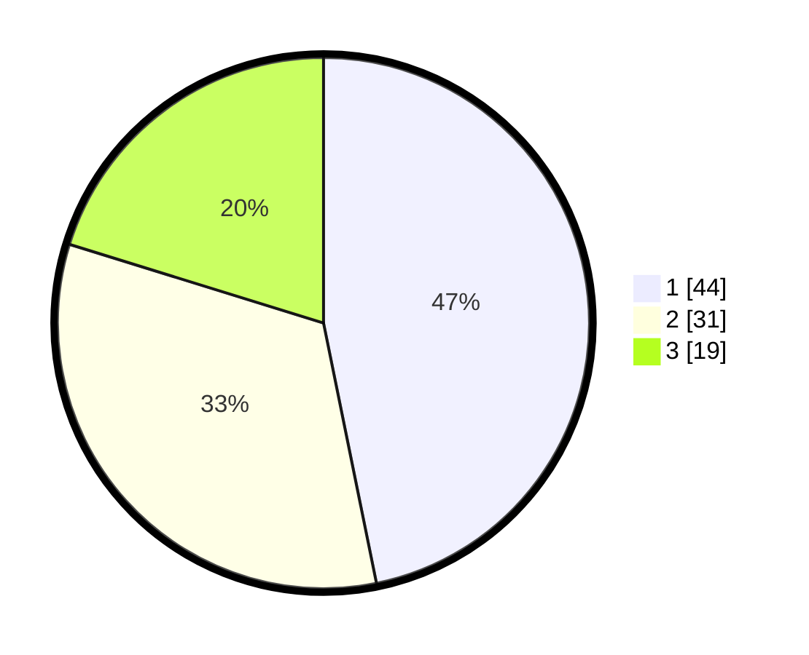

# Hasil

## Grafik

## Tabel

| No. | Nama Paslon    | Suara | Suara (raw) | Persentase |
|:--- |:-------------- | -----:| -----------:| ----------:|
| 1   | ANIES MUHAIMIN | 44    | [44][p-1]   | 46,81      |
| 2   | PRABOWO GIBRAN | 31    | [31][p-2]   | 32,98      |
| 3   | GANJAR MAHFUD  | 19    | [19][p-3]   | 20,21      |

[p-1]: https://github.com/gigit-pemilu/pemilu-2024-32-jawa-barat/blob/main/pilpres/hitung-suara/sub/32-jawa-barat/sub/08-kuningan/sub/11-cidahu/sub/2007-cikeusik/sub/004-tps/sub/paslon-1.txt
[p-2]: https://github.com/gigit-pemilu/pemilu-2024-32-jawa-barat/blob/main/pilpres/hitung-suara/sub/32-jawa-barat/sub/08-kuningan/sub/11-cidahu/sub/2007-cikeusik/sub/004-tps/sub/paslon-2.txt
[p-3]: https://github.com/gigit-pemilu/pemilu-2024-32-jawa-barat/blob/main/pilpres/hitung-suara/sub/32-jawa-barat/sub/08-kuningan/sub/11-cidahu/sub/2007-cikeusik/sub/004-tps/sub/paslon-3.txt

## Foto C Plano

https://sirekap-obj-formc.kpu.go.id/0e76/pemilu/ppwp/32/08/11/20/07/3208112007004-20240223-155902--dd4cdaed-a0e5-4dd0-8c4b-158f7b1e41b4.jpg

https://sirekap-obj-formc.kpu.go.id/0e76/pemilu/ppwp/32/08/11/20/07/3208112007004-20240223-155912--538df3fc-ddad-4a71-964b-bd0f4ef7b0ab.jpg

https://sirekap-obj-formc.kpu.go.id/0e76/pemilu/ppwp/32/08/11/20/07/3208112007004-20240223-155920--e9e0f29e-a80a-429d-9bd1-2c49a93967cf.jpg

## Metadata

| Key        | Value               |
| ---------- | ------------------- |
| Time Stamp | 2024-02-24 22:31:28 |

