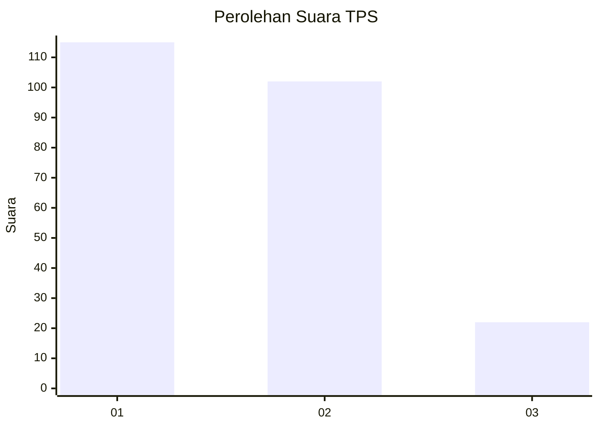
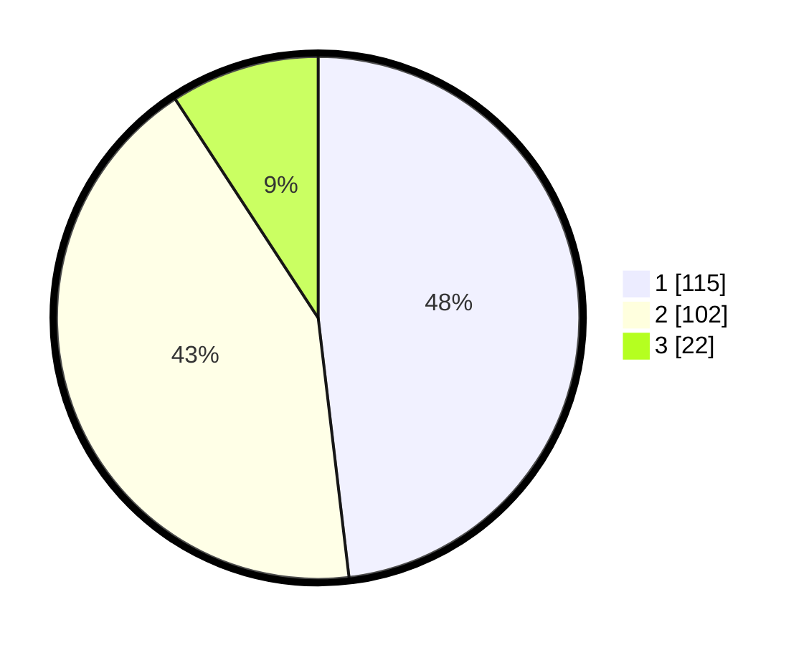

# Hasil

## Grafik

## Tabel

| No. | Nama Paslon    | Suara | Suara (raw) | Persentase |
|:--- |:-------------- | -----:| -----------:| ----------:|
| 1   | ANIES MUHAIMIN | 115   | [115][p-1]  | 48,12      |
| 2   | PRABOWO GIBRAN | 102   | [102][p-2]  | 42,68      |
| 3   | GANJAR MAHFUD  | 22    | [22][p-3]   | 9,21       |

[p-1]: https://github.com/gigit-pemilu/pemilu-2024/blob/main/pilpres/hitung-suara/sub/32-jawa-barat/sub/08-kuningan/sub/12-jalaksana/sub/2008-sadamantra/sub/005-tps/sub/paslon-1.txt
[p-2]: https://github.com/gigit-pemilu/pemilu-2024/blob/main/pilpres/hitung-suara/sub/32-jawa-barat/sub/08-kuningan/sub/12-jalaksana/sub/2008-sadamantra/sub/005-tps/sub/paslon-2.txt
[p-3]: https://github.com/gigit-pemilu/pemilu-2024/blob/main/pilpres/hitung-suara/sub/32-jawa-barat/sub/08-kuningan/sub/12-jalaksana/sub/2008-sadamantra/sub/005-tps/sub/paslon-3.txt

## Foto C Plano

https://sirekap-obj-formc.kpu.go.id/f391/pemilu/ppwp/32/08/12/20/08/3208122008005-20240224-175322--5a51ce09-4560-49dc-b14b-3245545e3769.jpg

https://sirekap-obj-formc.kpu.go.id/f391/pemilu/ppwp/32/08/12/20/08/3208122008005-20240224-175328--5a5e4b15-b6a3-48b5-8c8e-4549eeb8d02e.jpg

https://sirekap-obj-formc.kpu.go.id/f391/pemilu/ppwp/32/08/12/20/08/3208122008005-20240224-175335--2b008d8d-0e3b-4dd7-a6b8-7b329f73af86.jpg

## Metadata

| Key        | Value               |
| ---------- | ------------------- |
| Time Stamp | 2024-02-25 10:00:00 |

