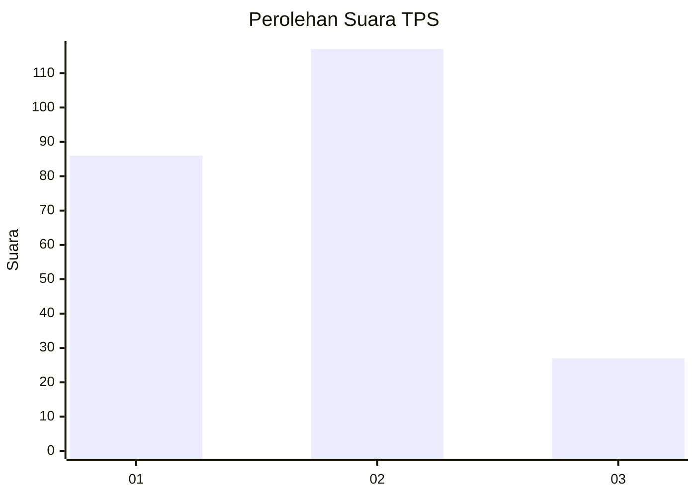
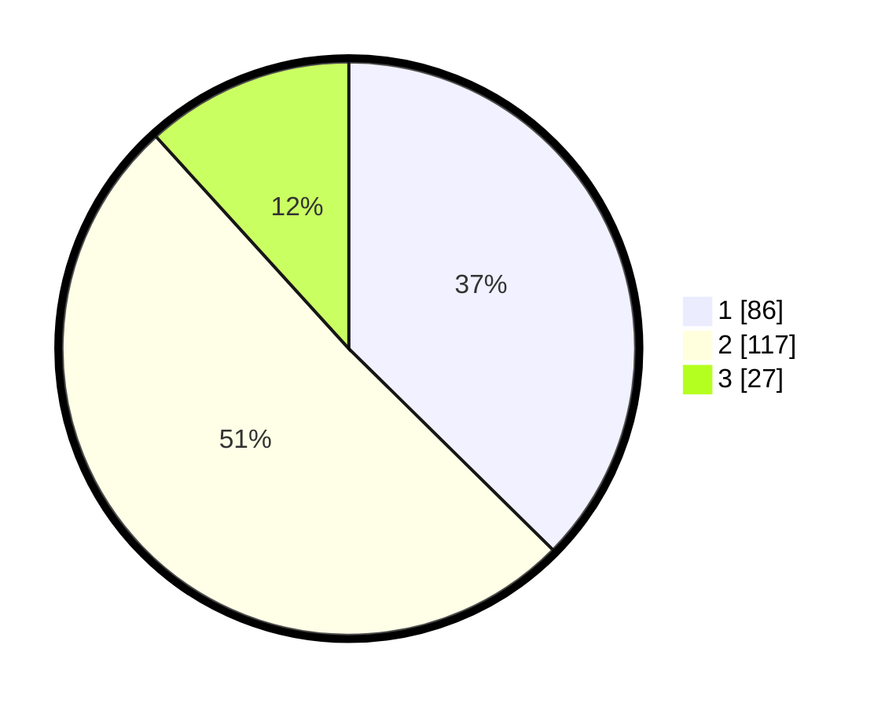

# Hasil

## Grafik

## Tabel

| No. | Nama Paslon    | Suara | Suara (raw) | Persentase |
|:--- |:-------------- | -----:| -----------:| ----------:|
| 1   | ANIES MUHAIMIN | 86    | [86][p-1]   | 37,39      |
| 2   | PRABOWO GIBRAN | 117   | [117][p-2]  | 50,87      |
| 3   | GANJAR MAHFUD  | 27    | [27][p-3]   | 11,74      |

[p-1]: https://github.com/gigit-pemilu/pemilu-2024/blob/main/pilpres/hitung-suara/sub/32-jawa-barat/sub/08-kuningan/sub/13-cilimus/sub/2006-bandorasawetan/sub/002-tps/sub/paslon-1.txt
[p-2]: https://github.com/gigit-pemilu/pemilu-2024/blob/main/pilpres/hitung-suara/sub/32-jawa-barat/sub/08-kuningan/sub/13-cilimus/sub/2006-bandorasawetan/sub/002-tps/sub/paslon-2.txt
[p-3]: https://github.com/gigit-pemilu/pemilu-2024/blob/main/pilpres/hitung-suara/sub/32-jawa-barat/sub/08-kuningan/sub/13-cilimus/sub/2006-bandorasawetan/sub/002-tps/sub/paslon-3.txt

## Foto C Plano

https://sirekap-obj-formc.kpu.go.id/3b25/pemilu/ppwp/32/08/13/20/06/3208132006002-20240214-203246--e483ee71-85ea-4cf6-bc22-3d255f855539.jpg

https://sirekap-obj-formc.kpu.go.id/3b25/pemilu/ppwp/32/08/13/20/06/3208132006002-20240214-203300--fbeccdce-7007-404f-9142-baa736d60df8.jpg

https://sirekap-obj-formc.kpu.go.id/3b25/pemilu/ppwp/32/08/13/20/06/3208132006002-20240214-203314--6bf1101e-e0ef-4c00-9de7-a62f59e240dd.jpg

## Metadata

| Key        | Value               |
| ---------- | ------------------- |
| Time Stamp | 2024-02-15 15:00:29 |

