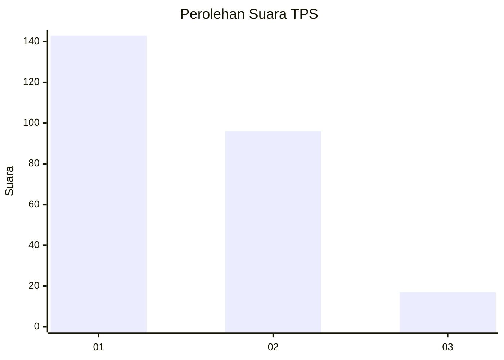
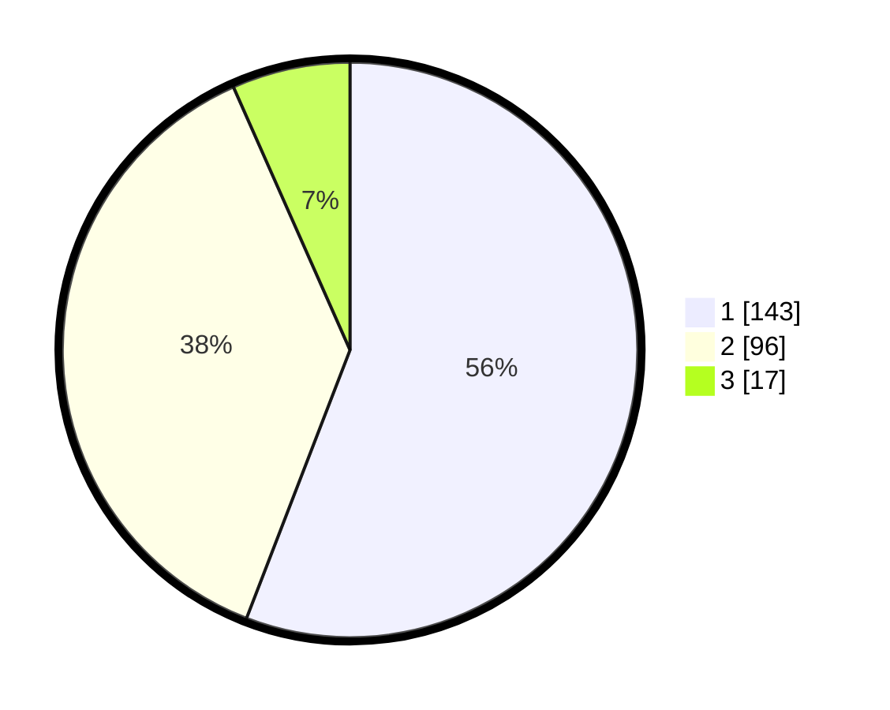

# Hasil

## Grafik

## Tabel

| No. | Nama Paslon    | Suara | Suara (raw) | Persentase |
|:--- |:-------------- | -----:| -----------:| ----------:|
| 1   | ANIES MUHAIMIN | 143   | [143][p-1]  | 55,86      |
| 2   | PRABOWO GIBRAN | 96    | [96][p-2]   | 37,50      |
| 3   | GANJAR MAHFUD  | 17    | [17][p-3]   | 6,64       |

[p-1]: https://github.com/gigit-pemilu/pemilu-2024/blob/main/pilpres/hitung-suara/sub/32-jawa-barat/sub/08-kuningan/sub/13-cilimus/sub/2015-cilimus/sub/019-tps/sub/paslon-1.txt
[p-2]: https://github.com/gigit-pemilu/pemilu-2024/blob/main/pilpres/hitung-suara/sub/32-jawa-barat/sub/08-kuningan/sub/13-cilimus/sub/2015-cilimus/sub/019-tps/sub/paslon-2.txt
[p-3]: https://github.com/gigit-pemilu/pemilu-2024/blob/main/pilpres/hitung-suara/sub/32-jawa-barat/sub/08-kuningan/sub/13-cilimus/sub/2015-cilimus/sub/019-tps/sub/paslon-3.txt

## Foto C Plano

https://sirekap-obj-formc.kpu.go.id/97bf/pemilu/ppwp/32/08/13/20/15/3208132015019-20240214-213408--e9137835-030a-4c94-a00e-1ff4a7923155.jpg

https://sirekap-obj-formc.kpu.go.id/97bf/pemilu/ppwp/32/08/13/20/15/3208132015019-20240214-223131--adda928e-17ef-4f77-8b7e-15be29faa2cc.jpg

https://sirekap-obj-formc.kpu.go.id/97bf/pemilu/ppwp/32/08/13/20/15/3208132015019-20240214-223248--87b64e98-74eb-46b5-8b43-b4139891902d.jpg

## Metadata

| Key        | Value               |
| ---------- | ------------------- |
| Time Stamp | 2024-02-15 09:00:24 |

