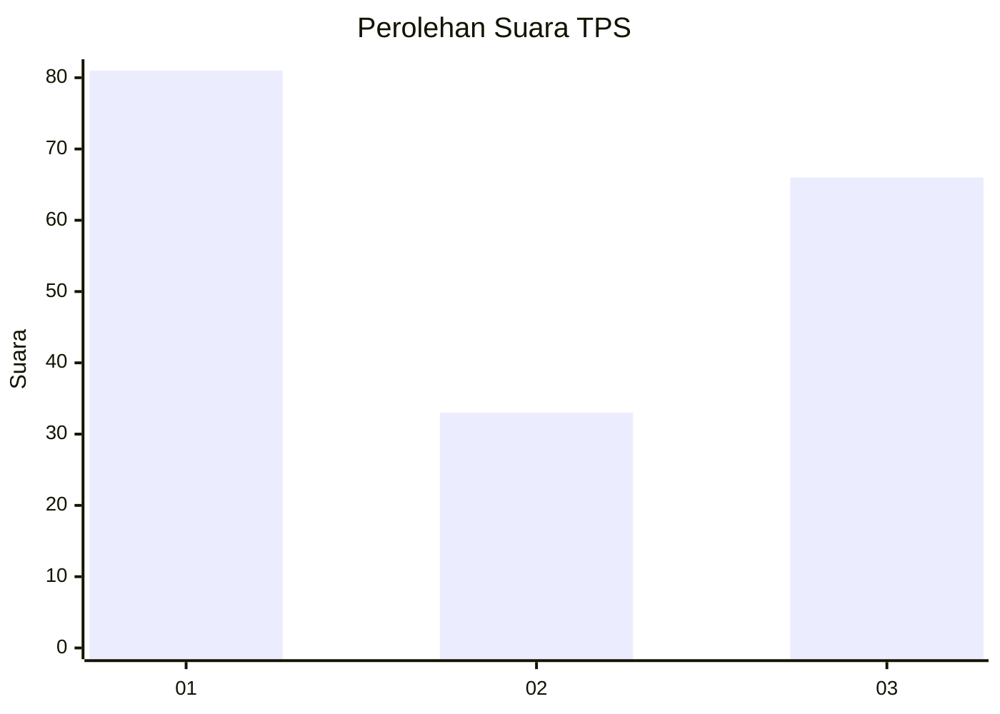
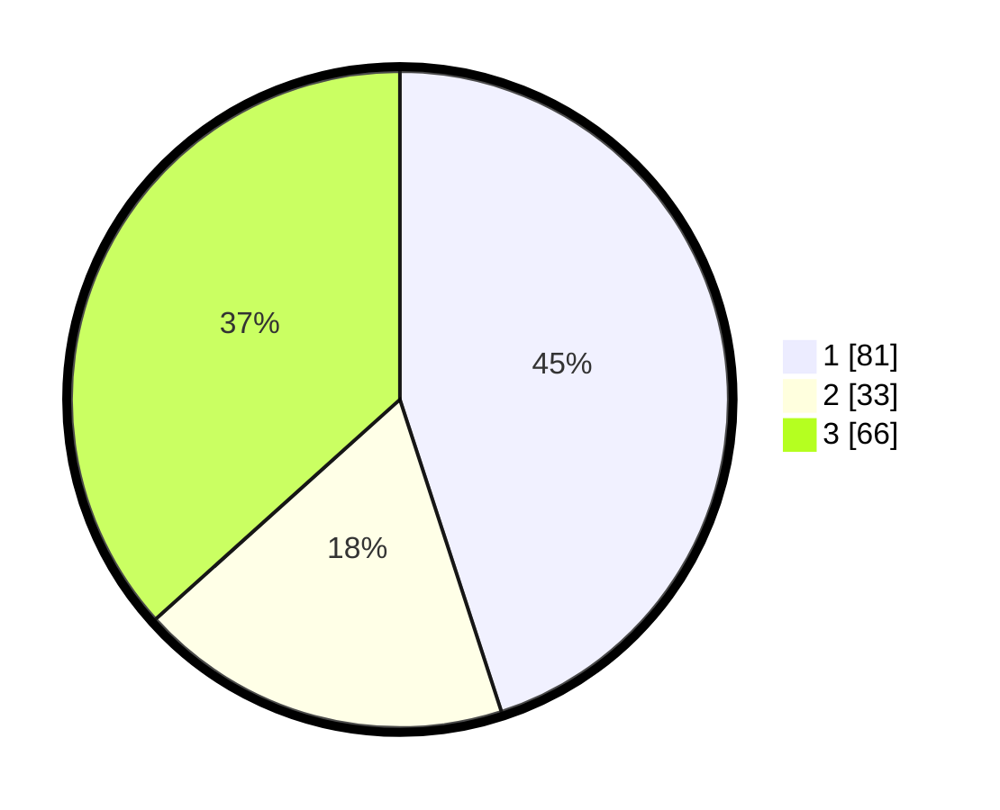

# Hasil

## Grafik

## Tabel

| No. | Nama Paslon    | Suara | Suara (raw) | Persentase |
|:--- |:-------------- | -----:| -----------:| ----------:|
| 1   | ANIES MUHAIMIN | 81    | [81][p-1]   | 45,00      |
| 2   | PRABOWO GIBRAN | 33    | [33][p-2]   | 18,33      |
| 3   | GANJAR MAHFUD  | 66    | [66][p-3]   | 36,67      |

[p-1]: https://github.com/gigit-pemilu/pemilu-2024-32-jawa-barat/blob/main/pilpres/hitung-suara/sub/32-jawa-barat/sub/08-kuningan/sub/15-selajambe/sub/2001-selajambe/sub/001-tps/sub/paslon-1.txt
[p-2]: https://github.com/gigit-pemilu/pemilu-2024-32-jawa-barat/blob/main/pilpres/hitung-suara/sub/32-jawa-barat/sub/08-kuningan/sub/15-selajambe/sub/2001-selajambe/sub/001-tps/sub/paslon-2.txt
[p-3]: https://github.com/gigit-pemilu/pemilu-2024-32-jawa-barat/blob/main/pilpres/hitung-suara/sub/32-jawa-barat/sub/08-kuningan/sub/15-selajambe/sub/2001-selajambe/sub/001-tps/sub/paslon-3.txt

## Foto C Plano

https://sirekap-obj-formc.kpu.go.id/8f1d/pemilu/ppwp/32/08/15/20/01/3208152001001-20240214-141703--ac9c34ee-8936-4e6a-9331-68616aea99c2.jpg

https://sirekap-obj-formc.kpu.go.id/8f1d/pemilu/ppwp/32/08/15/20/01/3208152001001-20240217-215425--f7e52671-9fcb-4d7f-9fac-8904af67f3a4.jpg

https://sirekap-obj-formc.kpu.go.id/8f1d/pemilu/ppwp/32/08/15/20/01/3208152001001-20240217-215432--d51467bc-402f-42b6-b644-692b3b53cc4b.jpg

## Metadata

| Key        | Value               |
| ---------- | ------------------- |
| Time Stamp | 2024-02-19 06:16:00 |

