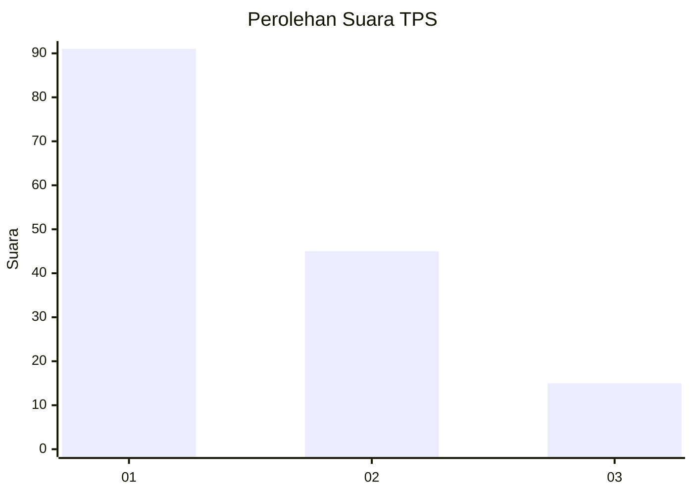
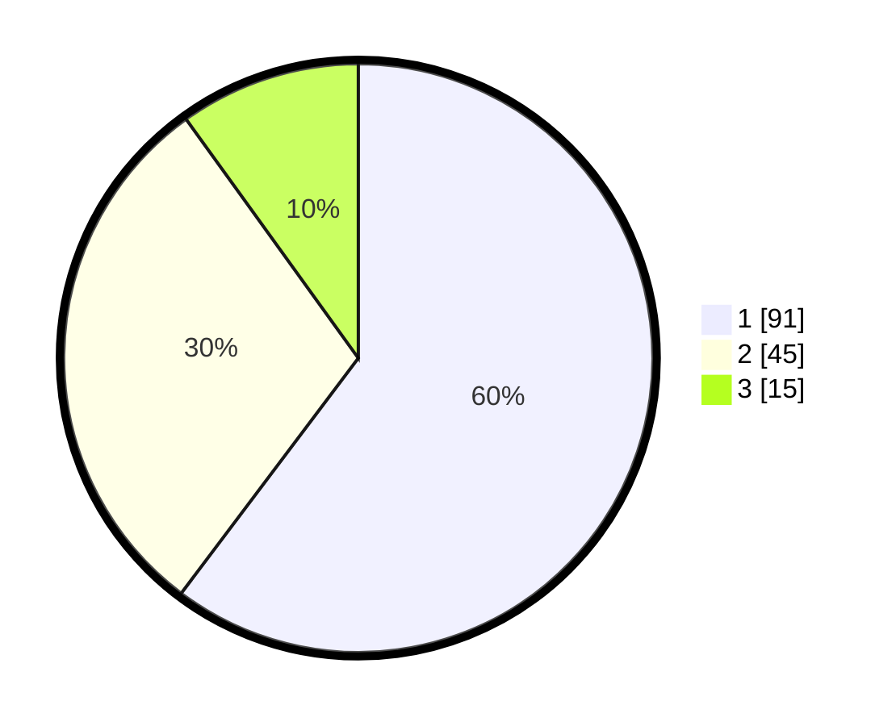

# Hasil

## Grafik

## Tabel

| No. | Nama Paslon    | Suara | Suara (raw) | Persentase |
|:--- |:-------------- | -----:| -----------:| ----------:|
| 1   | ANIES MUHAIMIN | 91    | [91][p-1]   | 60,26      |
| 2   | PRABOWO GIBRAN | 45    | [45][p-2]   | 29,80      |
| 3   | GANJAR MAHFUD  | 15    | [15][p-3]   | 9,93       |

[p-1]: https://github.com/gigit-pemilu/pemilu-2024/blob/main/pilpres/hitung-suara/sub/32-jawa-barat/sub/08-kuningan/sub/15-selajambe/sub/2002-cantilan/sub/001-tps/sub/paslon-1.txt
[p-2]: https://github.com/gigit-pemilu/pemilu-2024/blob/main/pilpres/hitung-suara/sub/32-jawa-barat/sub/08-kuningan/sub/15-selajambe/sub/2002-cantilan/sub/001-tps/sub/paslon-2.txt
[p-3]: https://github.com/gigit-pemilu/pemilu-2024/blob/main/pilpres/hitung-suara/sub/32-jawa-barat/sub/08-kuningan/sub/15-selajambe/sub/2002-cantilan/sub/001-tps/sub/paslon-3.txt

## Foto C Plano

https://sirekap-obj-formc.kpu.go.id/97c8/pemilu/ppwp/32/08/15/20/02/3208152002001-20240218-090727--10999771-b07b-4dd3-b978-43236b8f2c16.jpg

https://sirekap-obj-formc.kpu.go.id/97c8/pemilu/ppwp/32/08/15/20/02/3208152002001-20240217-213254--d161be1d-e558-4026-ba40-345d88759350.jpg

https://sirekap-obj-formc.kpu.go.id/97c8/pemilu/ppwp/32/08/15/20/02/3208152002001-20240217-213300--367e81f3-5474-4397-aaaa-d4572a68d12b.jpg

## Metadata

| Key        | Value               |
| ---------- | ------------------- |
| Time Stamp | 2024-02-19 06:16:00 |

