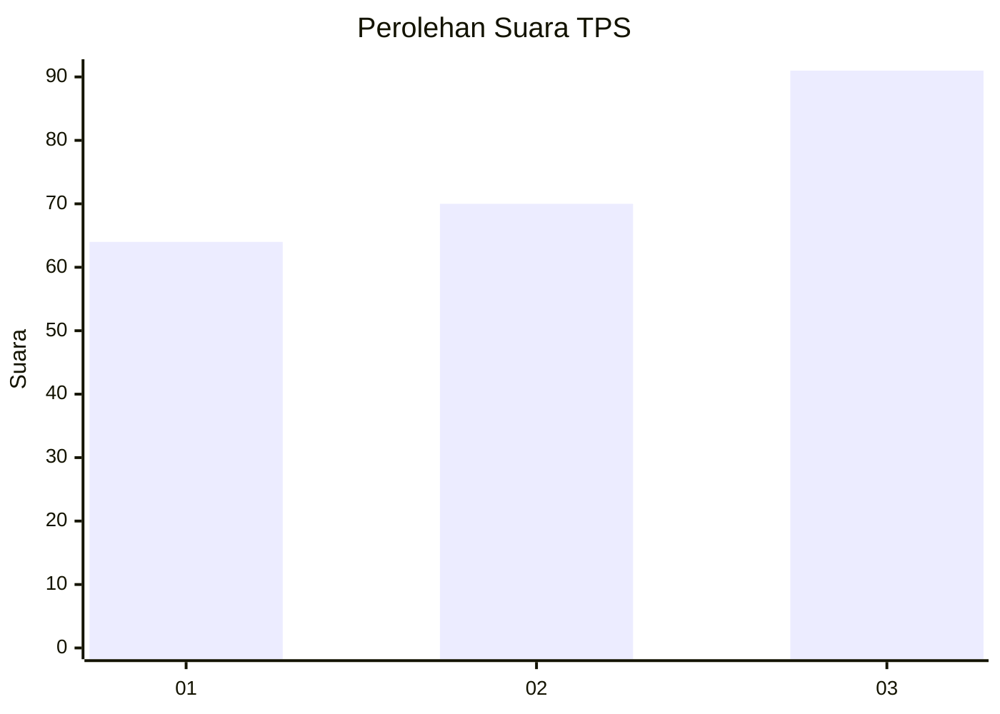
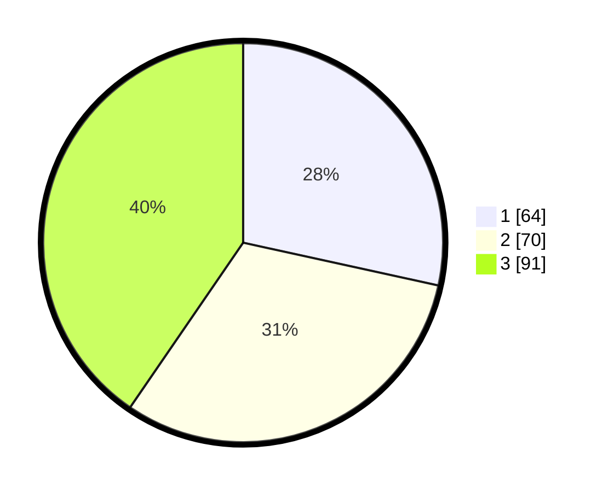

# Hasil

## Grafik

## Tabel

| No. | Nama Paslon    | Suara | Suara (raw) | Persentase |
|:--- |:-------------- | -----:| -----------:| ----------:|
| 1   | ANIES MUHAIMIN | 64    | [64][p-1]   | 28,44      |
| 2   | PRABOWO GIBRAN | 70    | [70][p-2]   | 31,11      |
| 3   | GANJAR MAHFUD  | 91    | [91][p-3]   | 40,44      |

[p-1]: https://github.com/gigit-pemilu/pemilu-2024/blob/main/pilpres/hitung-suara/sub/32-jawa-barat/sub/08-kuningan/sub/15-selajambe/sub/2005-jamberama/sub/005-tps/sub/paslon-1.txt
[p-2]: https://github.com/gigit-pemilu/pemilu-2024/blob/main/pilpres/hitung-suara/sub/32-jawa-barat/sub/08-kuningan/sub/15-selajambe/sub/2005-jamberama/sub/005-tps/sub/paslon-2.txt
[p-3]: https://github.com/gigit-pemilu/pemilu-2024/blob/main/pilpres/hitung-suara/sub/32-jawa-barat/sub/08-kuningan/sub/15-selajambe/sub/2005-jamberama/sub/005-tps/sub/paslon-3.txt

## Foto C Plano

https://sirekap-obj-formc.kpu.go.id/f45c/pemilu/ppwp/32/08/15/20/05/3208152005005-20240215-040253--fddc15e9-e4f3-4f54-8a9e-a4c4590cc2a6.jpg

https://sirekap-obj-formc.kpu.go.id/f45c/pemilu/ppwp/32/08/15/20/05/3208152005005-20240217-214912--d3cf51fc-0207-46f5-9835-d36780aeb96d.jpg

https://sirekap-obj-formc.kpu.go.id/f45c/pemilu/ppwp/32/08/15/20/05/3208152005005-20240217-214918--d1360cec-5fbf-4ca9-a629-a18015141fb8.jpg

## Metadata

| Key        | Value               |
| ---------- | ------------------- |
| Time Stamp | 2024-02-19 06:16:00 |

