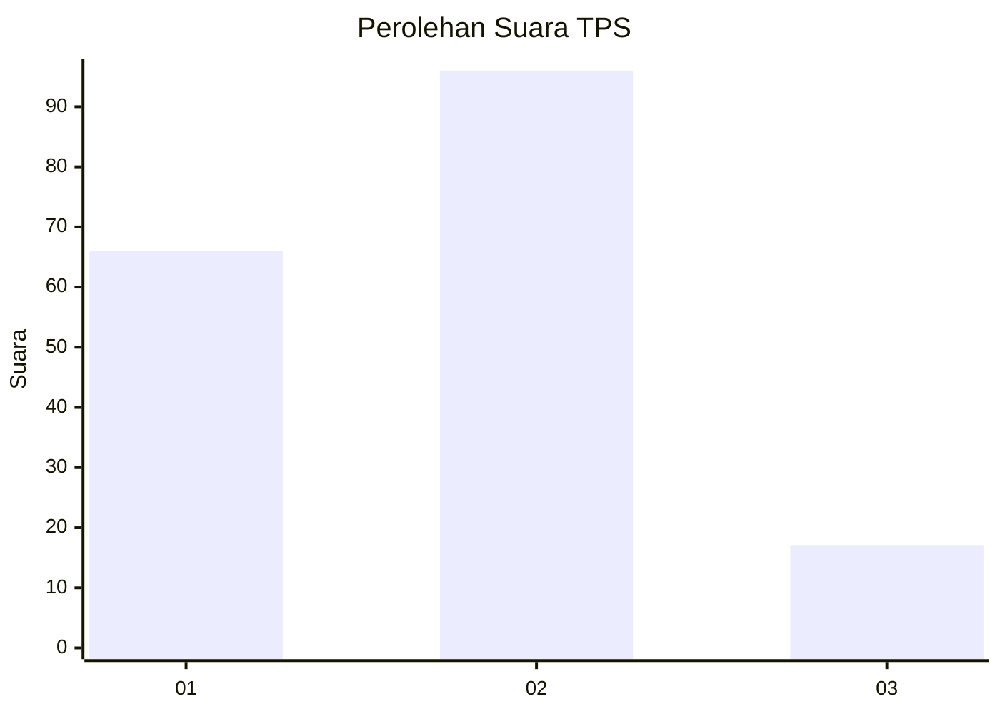

# Hasil

## Grafik

## Tabel

| No. | Nama Paslon    | Suara | Suara (raw) | Persentase |
|:--- |:-------------- | -----:| -----------:| ----------:|
| 1   | ANIES MUHAIMIN | 66    | [66][p-1]   | 36,87      |
| 2   | PRABOWO GIBRAN | 96    | [96][p-2]   | 53,63      |
| 3   | GANJAR MAHFUD  | 17    | [17][p-3]   | 9,50       |

[p-1]: https://github.com/gigit-pemilu/pemilu-2024/blob/main/pilpres/hitung-suara/sub/32-jawa-barat/sub/08-kuningan/sub/16-kramatmulya/sub/2004-cilaja/sub/006-tps/sub/paslon-1.txt
[p-2]: https://github.com/gigit-pemilu/pemilu-2024/blob/main/pilpres/hitung-suara/sub/32-jawa-barat/sub/08-kuningan/sub/16-kramatmulya/sub/2004-cilaja/sub/006-tps/sub/paslon-2.txt
[p-3]: https://github.com/gigit-pemilu/pemilu-2024/blob/main/pilpres/hitung-suara/sub/32-jawa-barat/sub/08-kuningan/sub/16-kramatmulya/sub/2004-cilaja/sub/006-tps/sub/paslon-3.txt

## Foto C Plano

https://sirekap-obj-formc.kpu.go.id/075a/pemilu/ppwp/32/08/16/20/04/3208162004006-20240214-155417--5acc0f00-5aa3-40c3-8f09-1b301f6ced0f.jpg

https://sirekap-obj-formc.kpu.go.id/075a/pemilu/ppwp/32/08/16/20/04/3208162004006-20240214-155908--9a2c64e4-38cc-43bf-8c69-e2f477d6e875.jpg

https://sirekap-obj-formc.kpu.go.id/075a/pemilu/ppwp/32/08/16/20/04/3208162004006-20240214-160104--8b497821-92d1-4369-8176-091c874a7d8d.jpg

## Metadata

| Key        | Value               |
| ---------- | ------------------- |
| Time Stamp | 2024-02-16 14:00:34 |

