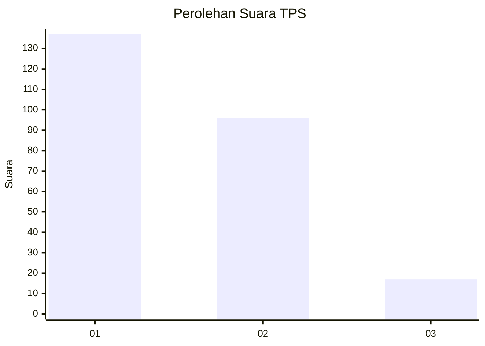
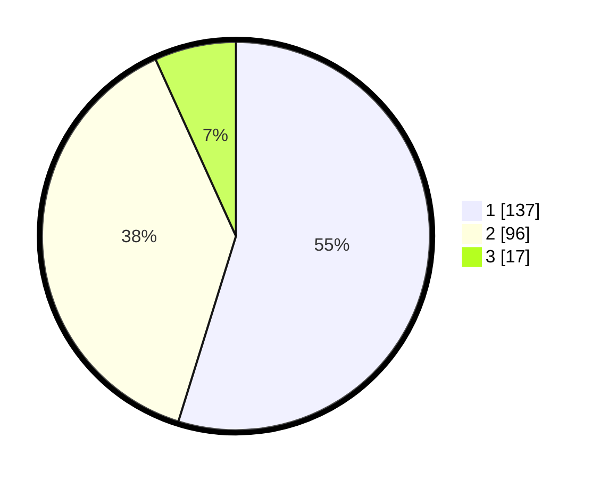

# Hasil

## Grafik

## Tabel

| No. | Nama Paslon    | Suara | Suara (raw) | Persentase |
|:--- |:-------------- | -----:| -----------:| ----------:|
| 1   | ANIES MUHAIMIN | 137   | [137][p-1]  | 54,80      |
| 2   | PRABOWO GIBRAN | 96    | [96][p-2]   | 38,40      |
| 3   | GANJAR MAHFUD  | 17    | [17][p-3]   | 6,80       |

[p-1]: https://github.com/gigit-pemilu/pemilu-2024-32-jawa-barat/blob/main/pilpres/hitung-suara/sub/32-jawa-barat/sub/08-kuningan/sub/16-kramatmulya/sub/2012-kalapagunung/sub/001-tps/sub/paslon-1.txt
[p-2]: https://github.com/gigit-pemilu/pemilu-2024-32-jawa-barat/blob/main/pilpres/hitung-suara/sub/32-jawa-barat/sub/08-kuningan/sub/16-kramatmulya/sub/2012-kalapagunung/sub/001-tps/sub/paslon-2.txt
[p-3]: https://github.com/gigit-pemilu/pemilu-2024-32-jawa-barat/blob/main/pilpres/hitung-suara/sub/32-jawa-barat/sub/08-kuningan/sub/16-kramatmulya/sub/2012-kalapagunung/sub/001-tps/sub/paslon-3.txt

## Foto C Plano

https://sirekap-obj-formc.kpu.go.id/c8df/pemilu/ppwp/32/08/16/20/12/3208162012001-20240214-155150--816ee075-09c2-41d8-8183-8958e0bbaf19.jpg

https://sirekap-obj-formc.kpu.go.id/c8df/pemilu/ppwp/32/08/16/20/12/3208162012001-20240214-155300--7a5f538a-cfab-4a55-b27d-8064436e1e09.jpg

https://sirekap-obj-formc.kpu.go.id/c8df/pemilu/ppwp/32/08/16/20/12/3208162012001-20240214-155345--aa5441b8-0c0d-4a0d-bcc9-32421e1b93f5.jpg

## Metadata

| Key        | Value               |
| ---------- | ------------------- |
| Time Stamp | 2024-02-16 16:25:10 |

