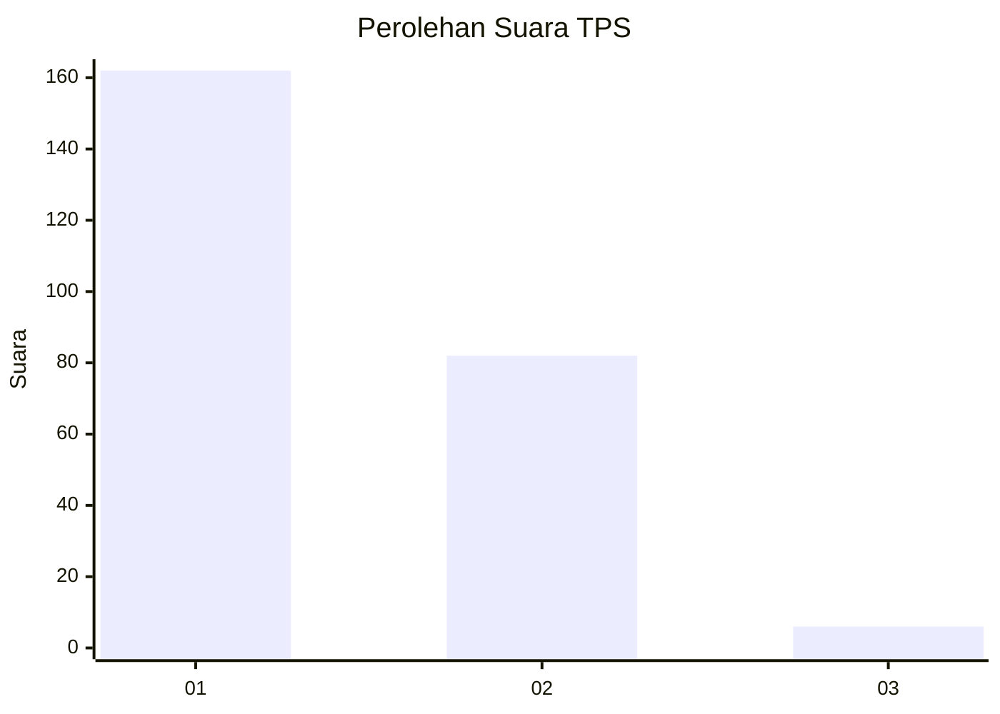
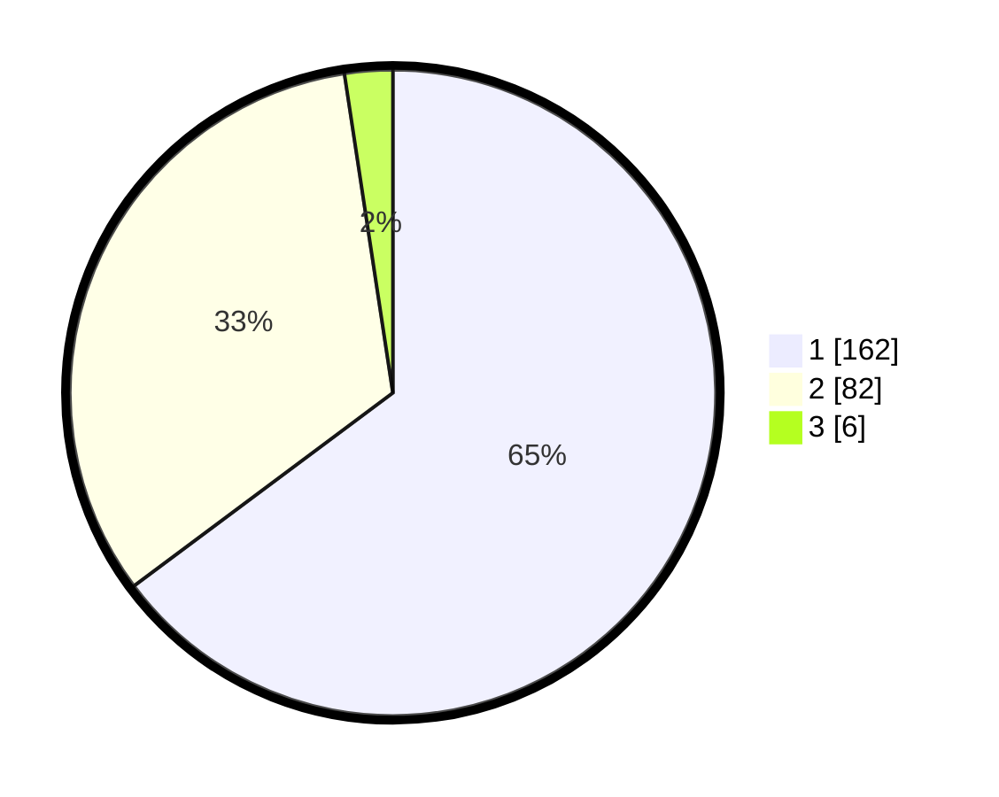

# Hasil

## Grafik

## Tabel

| No. | Nama Paslon    | Suara | Suara (raw) | Persentase |
|:--- |:-------------- | -----:| -----------:| ----------:|
| 1   | ANIES MUHAIMIN | 162   | [162][p-1]  | 64,80      |
| 2   | PRABOWO GIBRAN | 82    | [82][p-2]   | 32,80      |
| 3   | GANJAR MAHFUD  | 6     | [6][p-3]    | 2,40       |

[p-1]: https://github.com/gigit-pemilu/pemilu-2024/blob/main/pilpres/hitung-suara/sub/32-jawa-barat/sub/08-kuningan/sub/16-kramatmulya/sub/2014-cikaso/sub/012-tps/sub/paslon-1.txt
[p-2]: https://github.com/gigit-pemilu/pemilu-2024/blob/main/pilpres/hitung-suara/sub/32-jawa-barat/sub/08-kuningan/sub/16-kramatmulya/sub/2014-cikaso/sub/012-tps/sub/paslon-2.txt
[p-3]: https://github.com/gigit-pemilu/pemilu-2024/blob/main/pilpres/hitung-suara/sub/32-jawa-barat/sub/08-kuningan/sub/16-kramatmulya/sub/2014-cikaso/sub/012-tps/sub/paslon-3.txt

## Foto C Plano

https://sirekap-obj-formc.kpu.go.id/b833/pemilu/ppwp/32/08/16/20/14/3208162014012-20240215-014112--b14dee39-7721-4b5f-802c-af22a61a5a02.jpg

https://sirekap-obj-formc.kpu.go.id/b833/pemilu/ppwp/32/08/16/20/14/3208162014012-20240215-014120--6710ce20-4e3c-4212-ba13-68f457201c09.jpg

https://sirekap-obj-formc.kpu.go.id/b833/pemilu/ppwp/32/08/16/20/14/3208162014012-20240215-014210--f5906b90-7475-4a47-bad9-5acdbc362ce7.jpg

## Metadata

| Key        | Value               |
| ---------- | ------------------- |
| Time Stamp | 2024-02-25 17:00:00 |

