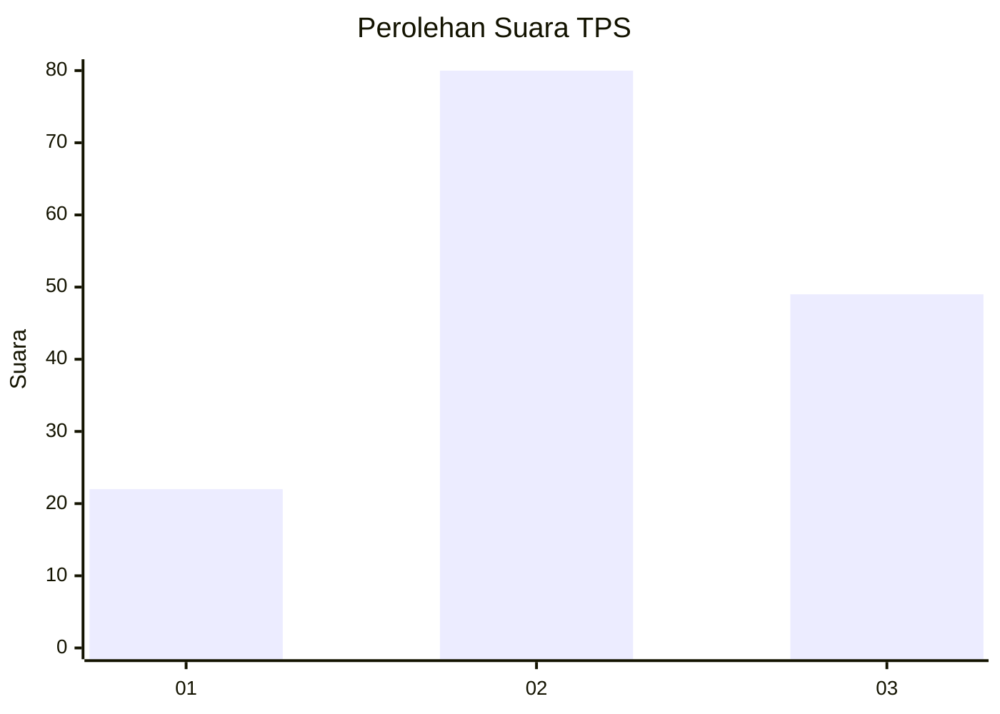
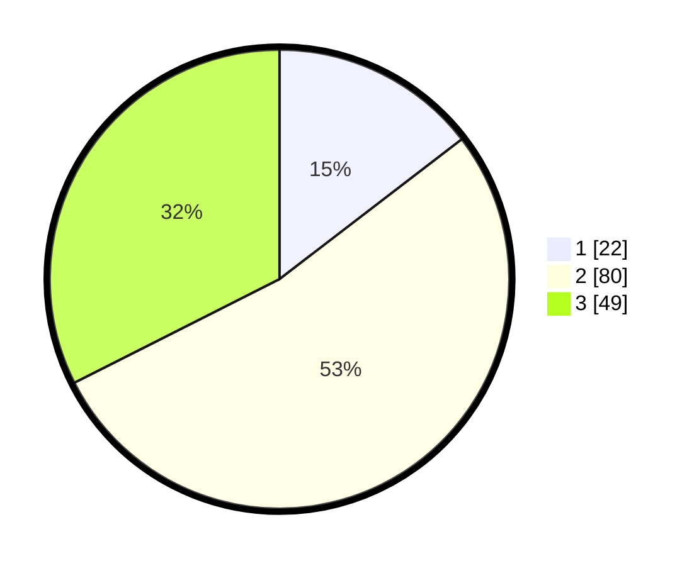

# Hasil

## Grafik

## Tabel

| No. | Nama Paslon    | Suara | Suara (raw) | Persentase |
|:--- |:-------------- | -----:| -----------:| ----------:|
| 1   | ANIES MUHAIMIN | 22    | [22][p-1]   | 14,57      |
| 2   | PRABOWO GIBRAN | 80    | [80][p-2]   | 52,98      |
| 3   | GANJAR MAHFUD  | 49    | [49][p-3]   | 32,45      |

[p-1]: https://github.com/gigit-pemilu/pemilu-2024/blob/main/pilpres/hitung-suara/sub/32-jawa-barat/sub/08-kuningan/sub/18-cigugur/sub/1001-cigugur/sub/002-tps/sub/paslon-1.txt
[p-2]: https://github.com/gigit-pemilu/pemilu-2024/blob/main/pilpres/hitung-suara/sub/32-jawa-barat/sub/08-kuningan/sub/18-cigugur/sub/1001-cigugur/sub/002-tps/sub/paslon-2.txt
[p-3]: https://github.com/gigit-pemilu/pemilu-2024/blob/main/pilpres/hitung-suara/sub/32-jawa-barat/sub/08-kuningan/sub/18-cigugur/sub/1001-cigugur/sub/002-tps/sub/paslon-3.txt

## Foto C Plano

https://sirekap-obj-formc.kpu.go.id/9888/pemilu/ppwp/32/08/18/10/01/3208181001002-20240215-030235--ff907d88-cc00-4cc8-86b3-25b1e465cb3a.jpg

https://sirekap-obj-formc.kpu.go.id/9888/pemilu/ppwp/32/08/18/10/01/3208181001002-20240215-030258--116c3dc8-afb8-4519-85bc-9fa11ec4a0bf.jpg

https://sirekap-obj-formc.kpu.go.id/9888/pemilu/ppwp/32/08/18/10/01/3208181001002-20240215-030311--bf4ffe9c-423c-43fa-8f65-64a0ae2a7293.jpg

## Metadata

| Key        | Value               |
| ---------- | ------------------- |
| Time Stamp | 2024-02-17 17:30:00 |

