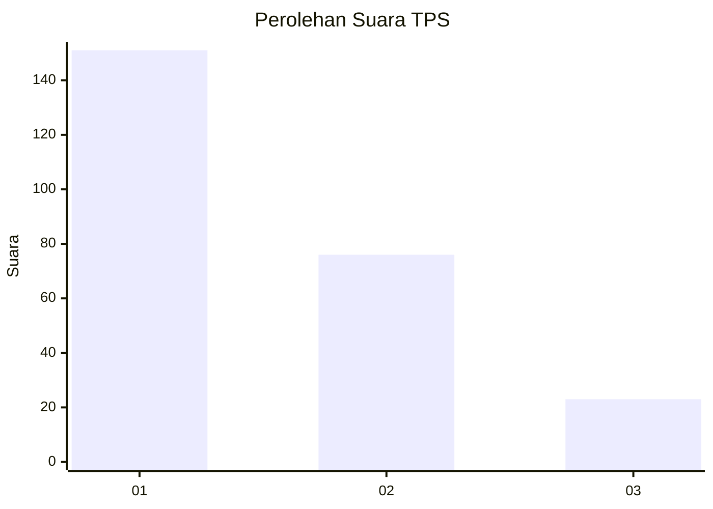
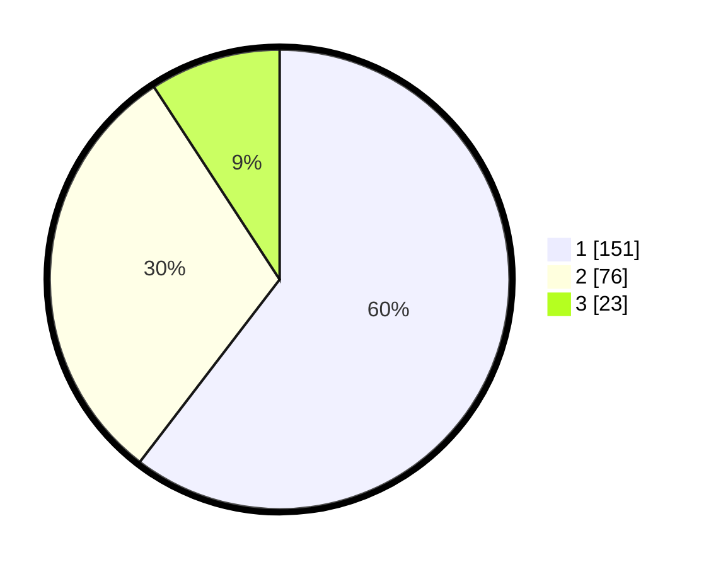

# Hasil

## Grafik

## Tabel

| No. | Nama Paslon    | Suara | Suara (raw) | Persentase |
|:--- |:-------------- | -----:| -----------:| ----------:|
| 1   | ANIES MUHAIMIN | 151   | [151][p-1]  | 60,40      |
| 2   | PRABOWO GIBRAN | 76    | [76][p-2]   | 30,40      |
| 3   | GANJAR MAHFUD  | 23    | [23][p-3]   | 9,20       |

[p-1]: https://github.com/gigit-pemilu/pemilu-2024-32-jawa-barat/blob/main/pilpres/hitung-suara/sub/32-jawa-barat/sub/08-kuningan/sub/18-cigugur/sub/1003-winduherang/sub/007-tps/sub/paslon-1.txt
[p-2]: https://github.com/gigit-pemilu/pemilu-2024-32-jawa-barat/blob/main/pilpres/hitung-suara/sub/32-jawa-barat/sub/08-kuningan/sub/18-cigugur/sub/1003-winduherang/sub/007-tps/sub/paslon-2.txt
[p-3]: https://github.com/gigit-pemilu/pemilu-2024-32-jawa-barat/blob/main/pilpres/hitung-suara/sub/32-jawa-barat/sub/08-kuningan/sub/18-cigugur/sub/1003-winduherang/sub/007-tps/sub/paslon-3.txt

## Foto C Plano

https://sirekap-obj-formc.kpu.go.id/59c5/pemilu/ppwp/32/08/18/10/03/3208181003007-20240214-155012--7b5c4726-e2e0-461d-9995-b48c25afc7a8.jpg

https://sirekap-obj-formc.kpu.go.id/59c5/pemilu/ppwp/32/08/18/10/03/3208181003007-20240214-155824--9fbe192d-e5d7-4e87-8fe9-d9e0dc452630.jpg

https://sirekap-obj-formc.kpu.go.id/59c5/pemilu/ppwp/32/08/18/10/03/3208181003007-20240214-192239--f6695c43-86bd-4b21-89ed-50d0d86df7bf.jpg

## Metadata

| Key        | Value               |
| ---------- | ------------------- |
| Time Stamp | 2024-02-17 18:00:00 |

