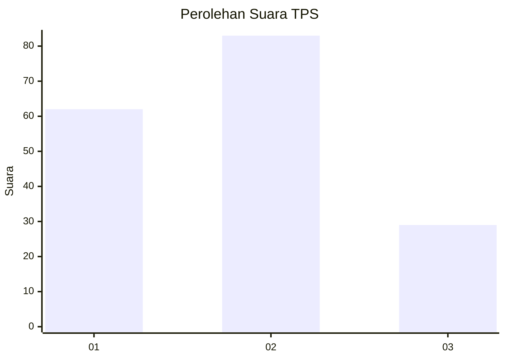
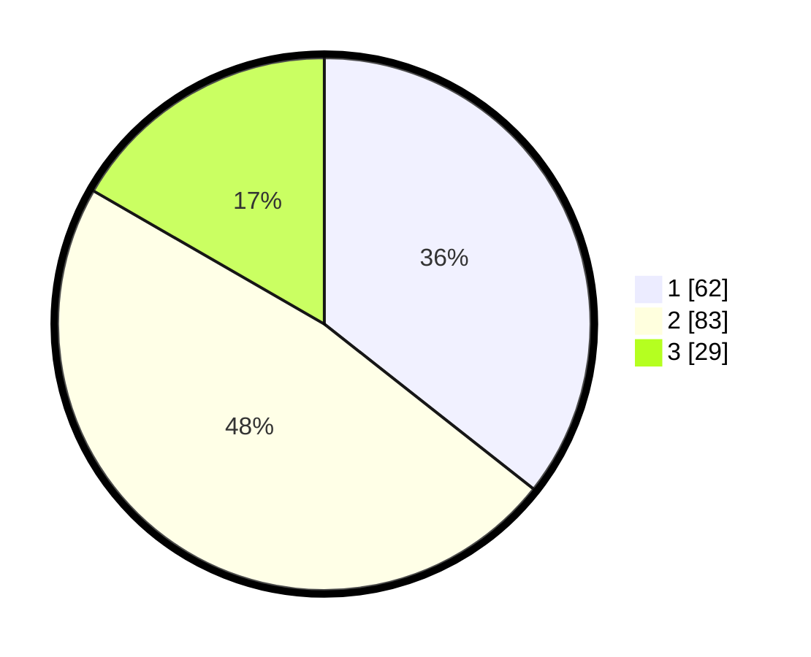

# Hasil

## Grafik

## Tabel

| No. | Nama Paslon    | Suara | Suara (raw) | Persentase |
|:--- |:-------------- | -----:| -----------:| ----------:|
| 1   | ANIES MUHAIMIN | 62    | [62][p-1]   | 35,63      |
| 2   | PRABOWO GIBRAN | 83    | [83][p-2]   | 47,70      |
| 3   | GANJAR MAHFUD  | 29    | [29][p-3]   | 16,67      |

[p-1]: https://github.com/gigit-pemilu/pemilu-2024/blob/main/pilpres/hitung-suara/sub/32-jawa-barat/sub/08-kuningan/sub/20-nusaherang/sub/2001-haurkuning/sub/003-tps/sub/paslon-1.txt
[p-2]: https://github.com/gigit-pemilu/pemilu-2024/blob/main/pilpres/hitung-suara/sub/32-jawa-barat/sub/08-kuningan/sub/20-nusaherang/sub/2001-haurkuning/sub/003-tps/sub/paslon-2.txt
[p-3]: https://github.com/gigit-pemilu/pemilu-2024/blob/main/pilpres/hitung-suara/sub/32-jawa-barat/sub/08-kuningan/sub/20-nusaherang/sub/2001-haurkuning/sub/003-tps/sub/paslon-3.txt

## Foto C Plano

https://sirekap-obj-formc.kpu.go.id/610e/pemilu/ppwp/32/08/20/20/01/3208202001003-20240214-222903--972d2c76-4267-4d40-90f1-de89bd0ef495.jpg

https://sirekap-obj-formc.kpu.go.id/610e/pemilu/ppwp/32/08/20/20/01/3208202001003-20240214-205720--d1f8a8c6-5422-4a97-9e02-3ac52d3a709e.jpg

https://sirekap-obj-formc.kpu.go.id/610e/pemilu/ppwp/32/08/20/20/01/3208202001003-20240214-223119--fe7c635c-4760-4ba9-98d8-fd606e7e1ef5.jpg

## Metadata

| Key        | Value               |
| ---------- | ------------------- |
| Time Stamp | 2024-02-15 21:01:18 |

