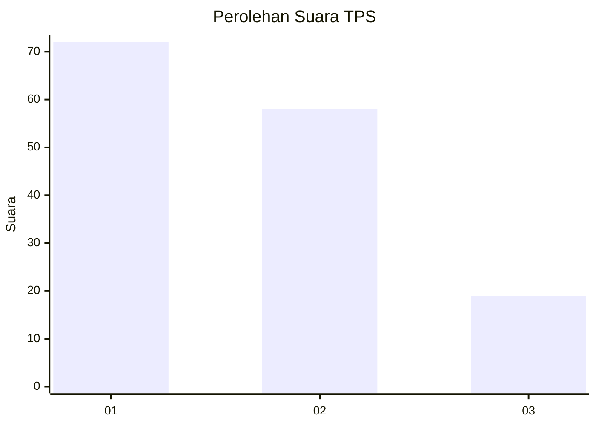
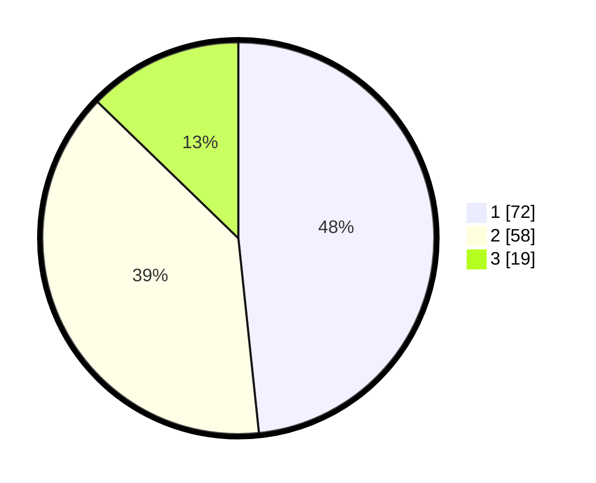

# Hasil

## Grafik

## Tabel

| No. | Nama Paslon    | Suara | Suara (raw) | Persentase |
|:--- |:-------------- | -----:| -----------:| ----------:|
| 1   | ANIES MUHAIMIN | 72    | [72][p-1]   | 48,32      |
| 2   | PRABOWO GIBRAN | 58    | [58][p-2]   | 38,93      |
| 3   | GANJAR MAHFUD  | 19    | [19][p-3]   | 12,75      |

[p-1]: https://github.com/gigit-pemilu/pemilu-2024/blob/main/pilpres/hitung-suara/sub/32-jawa-barat/sub/08-kuningan/sub/20-nusaherang/sub/2001-haurkuning/sub/005-tps/sub/paslon-1.txt
[p-2]: https://github.com/gigit-pemilu/pemilu-2024/blob/main/pilpres/hitung-suara/sub/32-jawa-barat/sub/08-kuningan/sub/20-nusaherang/sub/2001-haurkuning/sub/005-tps/sub/paslon-2.txt
[p-3]: https://github.com/gigit-pemilu/pemilu-2024/blob/main/pilpres/hitung-suara/sub/32-jawa-barat/sub/08-kuningan/sub/20-nusaherang/sub/2001-haurkuning/sub/005-tps/sub/paslon-3.txt

## Foto C Plano

https://sirekap-obj-formc.kpu.go.id/54fb/pemilu/ppwp/32/08/20/20/01/3208202001005-20240215-020716--d6fd42c1-3f92-4677-b84e-81b2137c0904.jpg

https://sirekap-obj-formc.kpu.go.id/54fb/pemilu/ppwp/32/08/20/20/01/3208202001005-20240215-015256--b4d5a93e-27a7-4d1f-91f3-70ad8d138f96.jpg

https://sirekap-obj-formc.kpu.go.id/54fb/pemilu/ppwp/32/08/20/20/01/3208202001005-20240215-020121--a45493e0-8fc0-4b1e-84d7-2a6413c80ca5.jpg

## Metadata

| Key        | Value               |
| ---------- | ------------------- |
| Time Stamp | 2024-02-15 21:01:18 |

