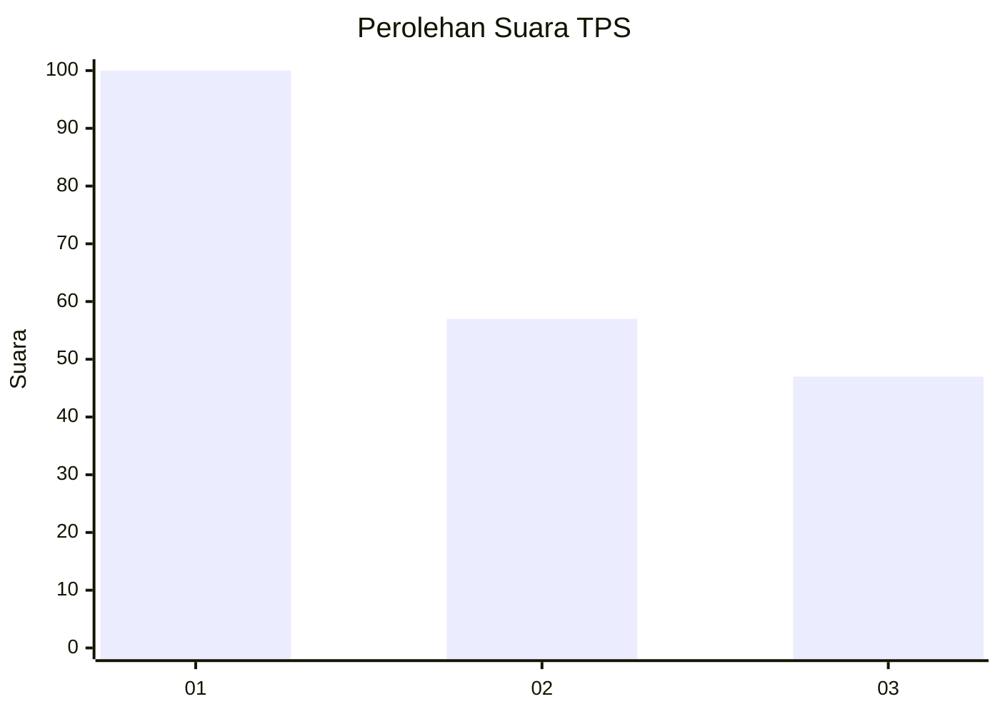
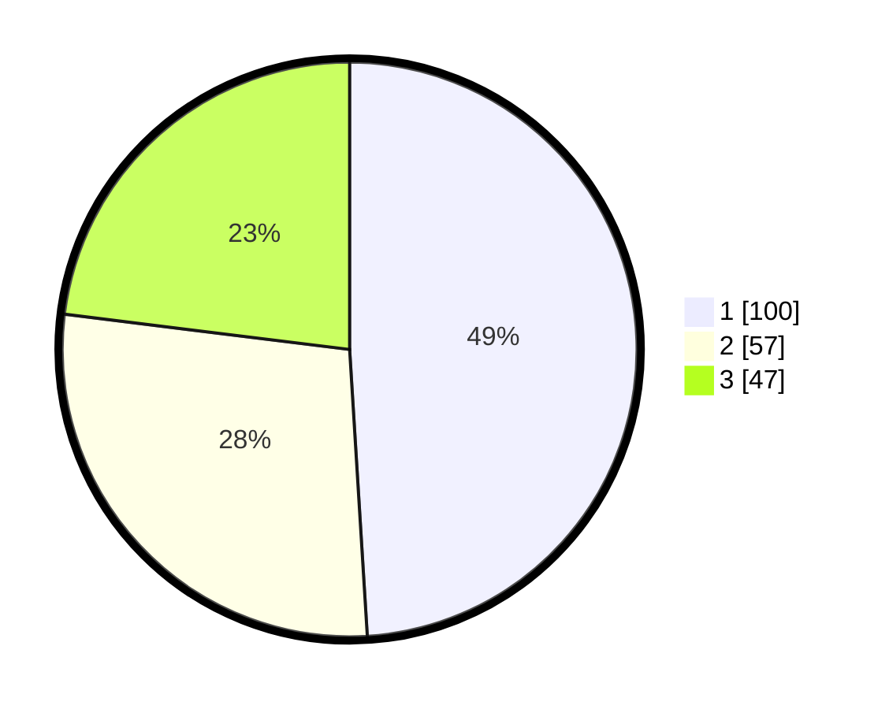

# Hasil

## Grafik

## Tabel

| No. | Nama Paslon    | Suara | Suara (raw) | Persentase |
|:--- |:-------------- | -----:| -----------:| ----------:|
| 1   | ANIES MUHAIMIN | 100   | [100][p-1]  | 49,02      |
| 2   | PRABOWO GIBRAN | 57    | [57][p-2]   | 27,94      |
| 3   | GANJAR MAHFUD  | 47    | [47][p-3]   | 23,04      |

[p-1]: https://github.com/gigit-pemilu/pemilu-2024-32-jawa-barat/blob/main/pilpres/hitung-suara/sub/32-jawa-barat/sub/08-kuningan/sub/21-cipicung/sub/2001-muncangela/sub/001-tps/sub/paslon-1.txt
[p-2]: https://github.com/gigit-pemilu/pemilu-2024-32-jawa-barat/blob/main/pilpres/hitung-suara/sub/32-jawa-barat/sub/08-kuningan/sub/21-cipicung/sub/2001-muncangela/sub/001-tps/sub/paslon-2.txt
[p-3]: https://github.com/gigit-pemilu/pemilu-2024-32-jawa-barat/blob/main/pilpres/hitung-suara/sub/32-jawa-barat/sub/08-kuningan/sub/21-cipicung/sub/2001-muncangela/sub/001-tps/sub/paslon-3.txt

## Foto C Plano

https://sirekap-obj-formc.kpu.go.id/008f/pemilu/ppwp/32/08/21/20/01/3208212001001-20240214-140957--739430c2-9822-49b7-be45-47b91dd78531.jpg

https://sirekap-obj-formc.kpu.go.id/008f/pemilu/ppwp/32/08/21/20/01/3208212001001-20240214-141444--10a7ed2b-4ae0-4834-9046-81da56ac83b2.jpg

https://sirekap-obj-formc.kpu.go.id/008f/pemilu/ppwp/32/08/21/20/01/3208212001001-20240214-141501--f5105023-8dcf-4e12-b89d-12b3c124800e.jpg

## Metadata

| Key        | Value               |
| ---------- | ------------------- |
| Time Stamp | 2024-02-15 23:29:50 |

