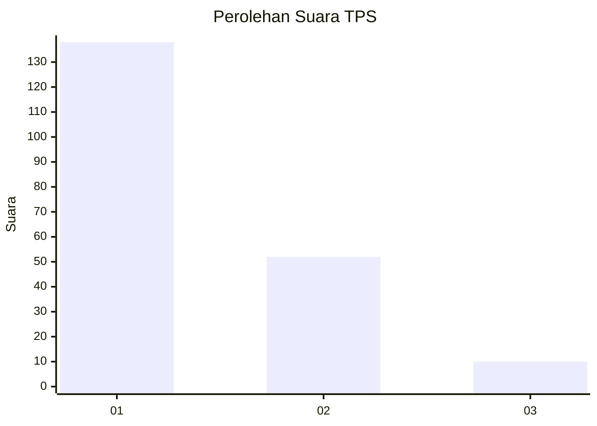
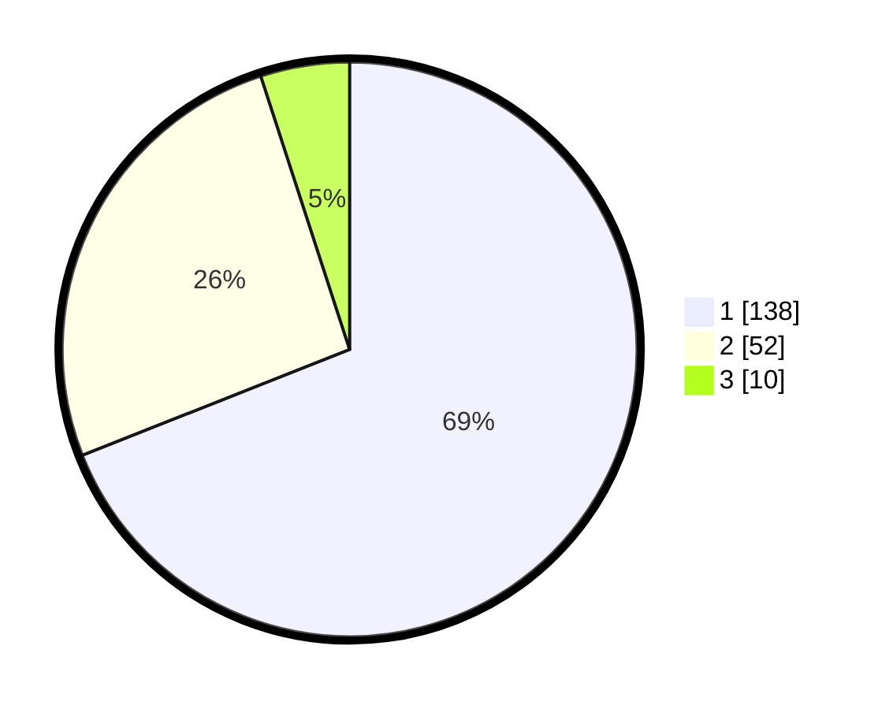

# Hasil

## Grafik

## Tabel

| No. | Nama Paslon    | Suara | Suara (raw) | Persentase |
|:--- |:-------------- | -----:| -----------:| ----------:|
| 1   | ANIES MUHAIMIN | 138   | [138][p-1]  | 69,00      |
| 2   | PRABOWO GIBRAN | 52    | [52][p-2]   | 26,00      |
| 3   | GANJAR MAHFUD  | 10    | [10][p-3]   | 5,00       |

[p-1]: https://github.com/gigit-pemilu/pemilu-2024/blob/main/pilpres/hitung-suara/sub/32-jawa-barat/sub/08-kuningan/sub/21-cipicung/sub/2001-muncangela/sub/004-tps/sub/paslon-1.txt
[p-2]: https://github.com/gigit-pemilu/pemilu-2024/blob/main/pilpres/hitung-suara/sub/32-jawa-barat/sub/08-kuningan/sub/21-cipicung/sub/2001-muncangela/sub/004-tps/sub/paslon-2.txt
[p-3]: https://github.com/gigit-pemilu/pemilu-2024/blob/main/pilpres/hitung-suara/sub/32-jawa-barat/sub/08-kuningan/sub/21-cipicung/sub/2001-muncangela/sub/004-tps/sub/paslon-3.txt

## Foto C Plano

https://sirekap-obj-formc.kpu.go.id/3a51/pemilu/ppwp/32/08/21/20/01/3208212001004-20240214-215142--2ed55afa-f93a-48be-9669-446fc3792c09.jpg

https://sirekap-obj-formc.kpu.go.id/3a51/pemilu/ppwp/32/08/21/20/01/3208212001004-20240214-215245--e8a1d0e3-c501-4eb6-9b40-cbf0085ec5d9.jpg

https://sirekap-obj-formc.kpu.go.id/3a51/pemilu/ppwp/32/08/21/20/01/3208212001004-20240214-215326--f1d1ea28-071d-43f2-8886-6826344d2842.jpg

## Metadata

| Key        | Value               |
| ---------- | ------------------- |
| Time Stamp | 2024-02-17 16:00:02 |

