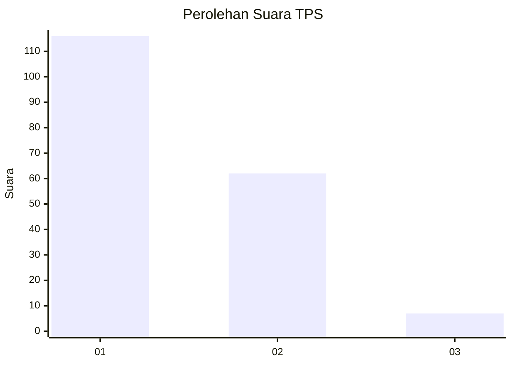
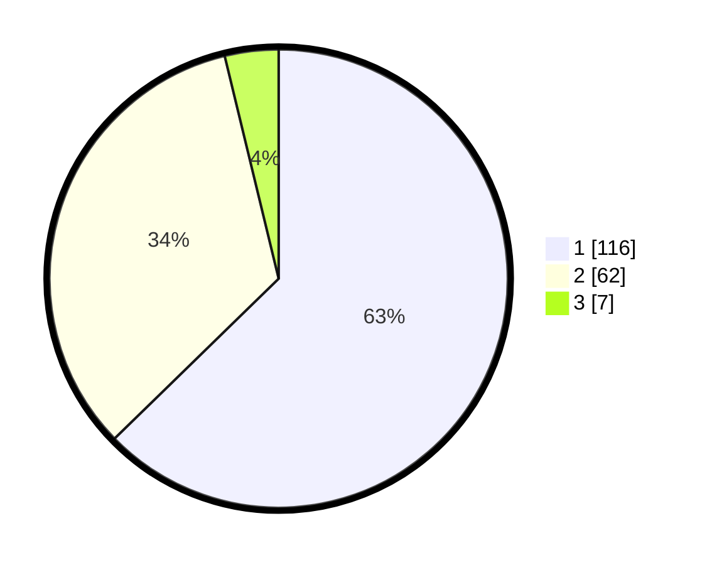

# Hasil

## Grafik

## Tabel

| No. | Nama Paslon    | Suara | Suara (raw) | Persentase |
|:--- |:-------------- | -----:| -----------:| ----------:|
| 1   | ANIES MUHAIMIN | 116   | [116][p-1]  | 62,70      |
| 2   | PRABOWO GIBRAN | 62    | [62][p-2]   | 33,51      |
| 3   | GANJAR MAHFUD  | 7     | [7][p-3]    | 3,78       |

[p-1]: https://github.com/gigit-pemilu/pemilu-2024/blob/main/pilpres/hitung-suara/sub/32-jawa-barat/sub/08-kuningan/sub/21-cipicung/sub/2001-muncangela/sub/006-tps/sub/paslon-1.txt
[p-2]: https://github.com/gigit-pemilu/pemilu-2024/blob/main/pilpres/hitung-suara/sub/32-jawa-barat/sub/08-kuningan/sub/21-cipicung/sub/2001-muncangela/sub/006-tps/sub/paslon-2.txt
[p-3]: https://github.com/gigit-pemilu/pemilu-2024/blob/main/pilpres/hitung-suara/sub/32-jawa-barat/sub/08-kuningan/sub/21-cipicung/sub/2001-muncangela/sub/006-tps/sub/paslon-3.txt

## Foto C Plano

https://sirekap-obj-formc.kpu.go.id/ce7f/pemilu/ppwp/32/08/21/20/01/3208212001006-20240214-230651--6ae3c752-2b9a-4e93-bde0-9a5125595263.jpg

https://sirekap-obj-formc.kpu.go.id/ce7f/pemilu/ppwp/32/08/21/20/01/3208212001006-20240214-230331--040e37bc-22d5-4038-8c71-cd3ef17b5ede.jpg

https://sirekap-obj-formc.kpu.go.id/ce7f/pemilu/ppwp/32/08/21/20/01/3208212001006-20240214-230936--872e68f0-7593-4081-a1db-00e4b53aec27.jpg

## Metadata

| Key        | Value               |
| ---------- | ------------------- |
| Time Stamp | 2024-02-15 23:29:50 |

