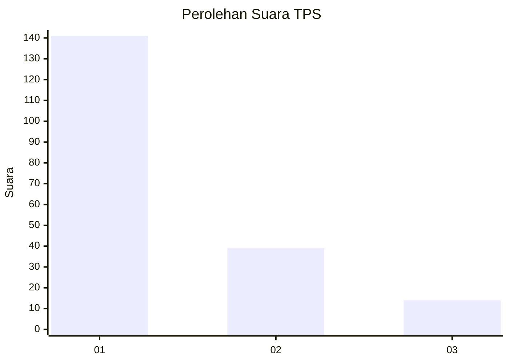
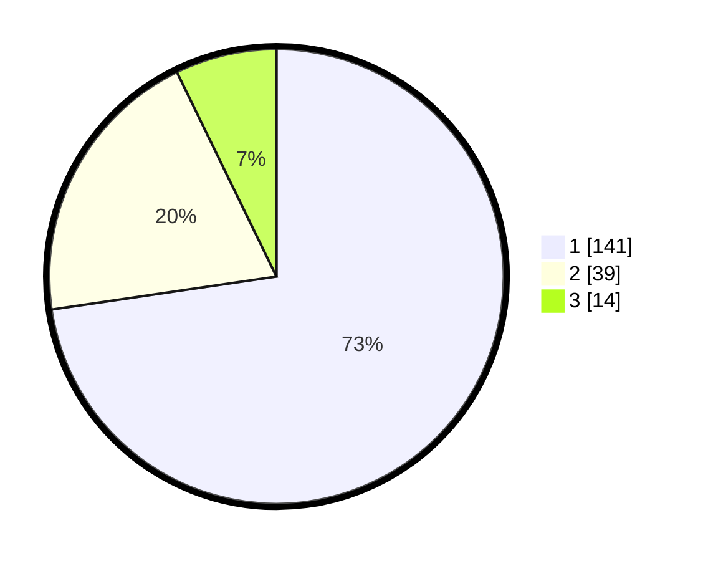

# Hasil

## Grafik

## Tabel

| No. | Nama Paslon    | Suara | Suara (raw) | Persentase |
|:--- |:-------------- | -----:| -----------:| ----------:|
| 1   | ANIES MUHAIMIN | 141   | [141][p-1]  | 72,68      |
| 2   | PRABOWO GIBRAN | 39    | [39][p-2]   | 20,10      |
| 3   | GANJAR MAHFUD  | 14    | [14][p-3]   | 7,22       |

[p-1]: https://github.com/gigit-pemilu/pemilu-2024/blob/main/pilpres/hitung-suara/sub/32-jawa-barat/sub/08-kuningan/sub/21-cipicung/sub/2001-muncangela/sub/009-tps/sub/paslon-1.txt
[p-2]: https://github.com/gigit-pemilu/pemilu-2024/blob/main/pilpres/hitung-suara/sub/32-jawa-barat/sub/08-kuningan/sub/21-cipicung/sub/2001-muncangela/sub/009-tps/sub/paslon-2.txt
[p-3]: https://github.com/gigit-pemilu/pemilu-2024/blob/main/pilpres/hitung-suara/sub/32-jawa-barat/sub/08-kuningan/sub/21-cipicung/sub/2001-muncangela/sub/009-tps/sub/paslon-3.txt

## Foto C Plano

https://sirekap-obj-formc.kpu.go.id/d4c7/pemilu/ppwp/32/08/21/20/01/3208212001009-20240214-141217--1613dde5-2fe8-4fa7-8c6a-06415f682b4d.jpg

https://sirekap-obj-formc.kpu.go.id/d4c7/pemilu/ppwp/32/08/21/20/01/3208212001009-20240214-141318--1c2da801-ae1c-4da1-bf84-c0c57a106456.jpg

https://sirekap-obj-formc.kpu.go.id/d4c7/pemilu/ppwp/32/08/21/20/01/3208212001009-20240214-141430--29f0b567-00d7-4b5e-bccd-8d31087f7315.jpg

## Metadata

| Key        | Value               |
| ---------- | ------------------- |
| Time Stamp | 2024-02-14 21:46:01 |

