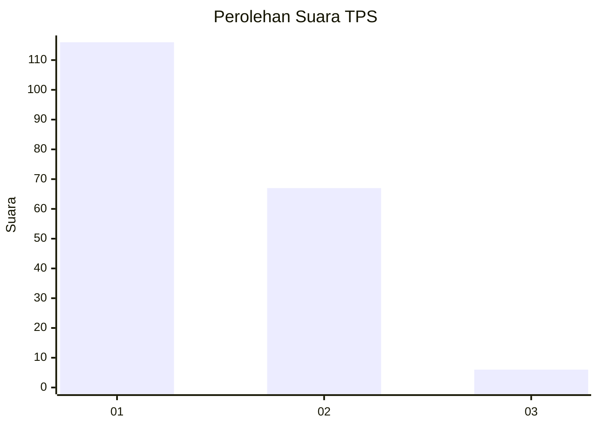
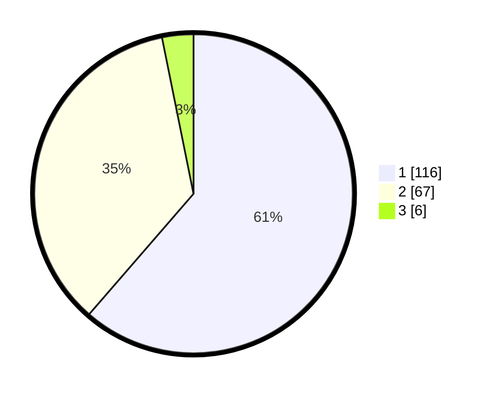

# Hasil

## Grafik

## Tabel

| No. | Nama Paslon    | Suara | Suara (raw) | Persentase |
|:--- |:-------------- | -----:| -----------:| ----------:|
| 1   | ANIES MUHAIMIN | 116   | [116][p-1]  | 61,38      |
| 2   | PRABOWO GIBRAN | 67    | [67][p-2]   | 35,45      |
| 3   | GANJAR MAHFUD  | 6     | [6][p-3]    | 3,17       |

[p-1]: https://github.com/gigit-pemilu/pemilu-2024/blob/main/pilpres/hitung-suara/sub/32-jawa-barat/sub/08-kuningan/sub/21-cipicung/sub/2001-muncangela/sub/011-tps/sub/paslon-1.txt
[p-2]: https://github.com/gigit-pemilu/pemilu-2024/blob/main/pilpres/hitung-suara/sub/32-jawa-barat/sub/08-kuningan/sub/21-cipicung/sub/2001-muncangela/sub/011-tps/sub/paslon-2.txt
[p-3]: https://github.com/gigit-pemilu/pemilu-2024/blob/main/pilpres/hitung-suara/sub/32-jawa-barat/sub/08-kuningan/sub/21-cipicung/sub/2001-muncangela/sub/011-tps/sub/paslon-3.txt

## Foto C Plano

https://sirekap-obj-formc.kpu.go.id/9ace/pemilu/ppwp/32/08/21/20/01/3208212001011-20240214-220236--642ccaab-77c1-4eb1-ad09-2b03e44f3321.jpg

https://sirekap-obj-formc.kpu.go.id/9ace/pemilu/ppwp/32/08/21/20/01/3208212001011-20240214-220242--37211fef-4248-4f06-9024-3f97acf6c259.jpg

https://sirekap-obj-formc.kpu.go.id/9ace/pemilu/ppwp/32/08/21/20/01/3208212001011-20240214-220248--c361de35-e0bb-4e3e-8133-9f294a57d3e3.jpg

## Metadata

| Key        | Value               |
| ---------- | ------------------- |
| Time Stamp | 2024-02-15 23:29:50 |

