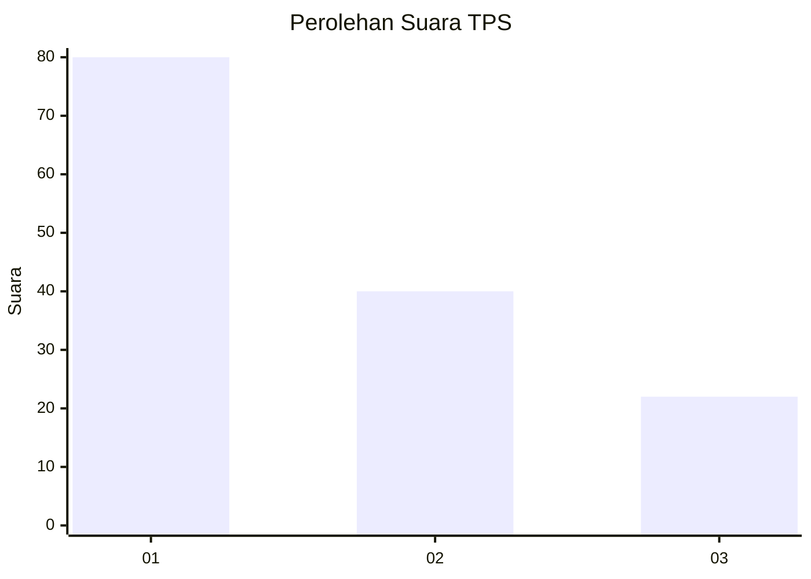
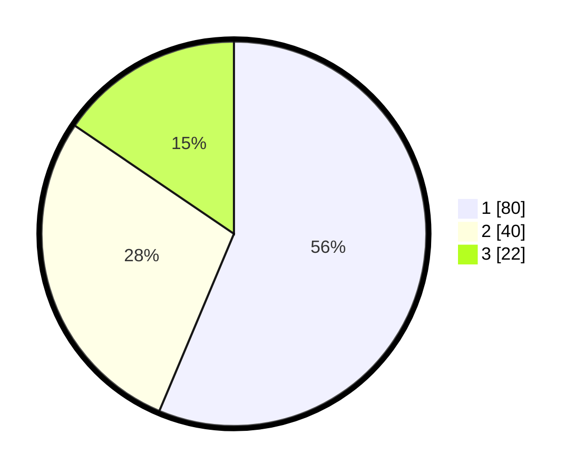

# Hasil

## Grafik

## Tabel

| No. | Nama Paslon    | Suara | Suara (raw) | Persentase |
|:--- |:-------------- | -----:| -----------:| ----------:|
| 1   | ANIES MUHAIMIN | 80    | [80][p-1]   | 56,34      |
| 2   | PRABOWO GIBRAN | 40    | [40][p-2]   | 28,17      |
| 3   | GANJAR MAHFUD  | 22    | [22][p-3]   | 15,49      |

[p-1]: https://github.com/gigit-pemilu/pemilu-2024/blob/main/pilpres/hitung-suara/sub/32-jawa-barat/sub/08-kuningan/sub/21-cipicung/sub/2003-susukan/sub/008-tps/sub/paslon-1.txt
[p-2]: https://github.com/gigit-pemilu/pemilu-2024/blob/main/pilpres/hitung-suara/sub/32-jawa-barat/sub/08-kuningan/sub/21-cipicung/sub/2003-susukan/sub/008-tps/sub/paslon-2.txt
[p-3]: https://github.com/gigit-pemilu/pemilu-2024/blob/main/pilpres/hitung-suara/sub/32-jawa-barat/sub/08-kuningan/sub/21-cipicung/sub/2003-susukan/sub/008-tps/sub/paslon-3.txt

## Foto C Plano

https://sirekap-obj-formc.kpu.go.id/e050/pemilu/ppwp/32/08/21/20/03/3208212003008-20240222-160124--5977d759-cb4b-4124-a8ab-a9e27c828725.jpg

https://sirekap-obj-formc.kpu.go.id/e050/pemilu/ppwp/32/08/21/20/03/3208212003008-20240217-144027--d76dc238-2826-4e95-a18b-4d783cce4642.jpg

https://sirekap-obj-formc.kpu.go.id/e050/pemilu/ppwp/32/08/21/20/03/3208212003008-20240217-144035--1c91dab3-1c5e-434b-ae14-cf8334e057e5.jpg

## Metadata

| Key        | Value               |
| ---------- | ------------------- |
| Time Stamp | 2024-02-22 17:00:00 |

