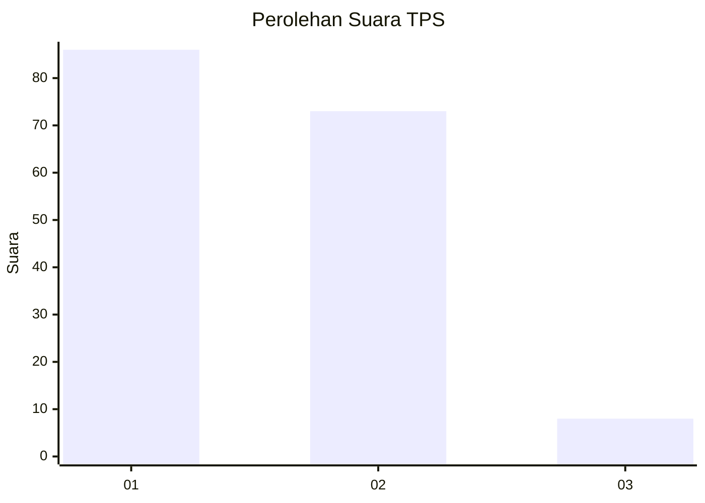
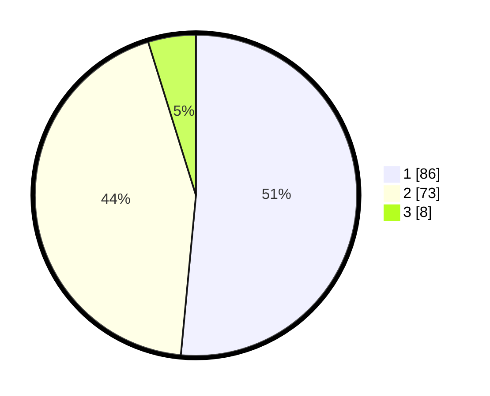

# Hasil

## Grafik

## Tabel

| No. | Nama Paslon    | Suara | Suara (raw) | Persentase |
|:--- |:-------------- | -----:| -----------:| ----------:|
| 1   | ANIES MUHAIMIN | 86    | [86][p-1]   | 51,50      |
| 2   | PRABOWO GIBRAN | 73    | [73][p-2]   | 43,71      |
| 3   | GANJAR MAHFUD  | 8     | [8][p-3]    | 4,79       |

[p-1]: https://github.com/gigit-pemilu/pemilu-2024-32-jawa-barat/blob/main/pilpres/hitung-suara/sub/32-jawa-barat/sub/08-kuningan/sub/22-pancalang/sub/2001-silebu/sub/003-tps/sub/paslon-1.txt
[p-2]: https://github.com/gigit-pemilu/pemilu-2024-32-jawa-barat/blob/main/pilpres/hitung-suara/sub/32-jawa-barat/sub/08-kuningan/sub/22-pancalang/sub/2001-silebu/sub/003-tps/sub/paslon-2.txt
[p-3]: https://github.com/gigit-pemilu/pemilu-2024-32-jawa-barat/blob/main/pilpres/hitung-suara/sub/32-jawa-barat/sub/08-kuningan/sub/22-pancalang/sub/2001-silebu/sub/003-tps/sub/paslon-3.txt

## Foto C Plano

https://sirekap-obj-formc.kpu.go.id/9c49/pemilu/ppwp/32/08/22/20/01/3208222001003-20240221-093731--bfa73286-abbb-4967-b3b9-f10c8b15e5f5.jpg

https://sirekap-obj-formc.kpu.go.id/9c49/pemilu/ppwp/32/08/22/20/01/3208222001003-20240220-142800--9de64361-8340-41b2-8eac-08db84c14990.jpg

https://sirekap-obj-formc.kpu.go.id/9c49/pemilu/ppwp/32/08/22/20/01/3208222001003-20240220-142842--8a5cc3e8-d514-4d90-b1b0-8e89d43f2f2d.jpg

## Metadata

| Key        | Value               |
| ---------- | ------------------- |
| Time Stamp | 2024-02-21 10:00:00 |

