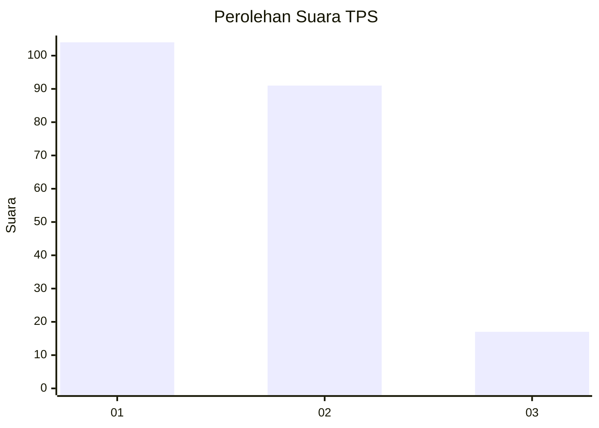
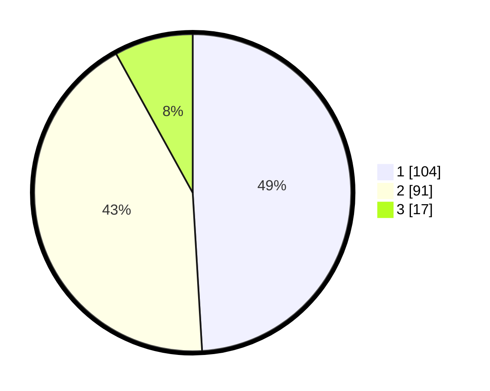

# Hasil

## Grafik

## Tabel

| No. | Nama Paslon    | Suara | Suara (raw) | Persentase |
|:--- |:-------------- | -----:| -----------:| ----------:|
| 1   | ANIES MUHAIMIN | 104   | [104][p-1]  | 49,06      |
| 2   | PRABOWO GIBRAN | 91    | [91][p-2]   | 42,92      |
| 3   | GANJAR MAHFUD  | 17    | [17][p-3]   | 8,02       |

[p-1]: https://github.com/gigit-pemilu/pemilu-2024-32-jawa-barat/blob/main/pilpres/hitung-suara/sub/32-jawa-barat/sub/08-kuningan/sub/23-japara/sub/2001-garatengah/sub/001-tps/sub/paslon-1.txt
[p-2]: https://github.com/gigit-pemilu/pemilu-2024-32-jawa-barat/blob/main/pilpres/hitung-suara/sub/32-jawa-barat/sub/08-kuningan/sub/23-japara/sub/2001-garatengah/sub/001-tps/sub/paslon-2.txt
[p-3]: https://github.com/gigit-pemilu/pemilu-2024-32-jawa-barat/blob/main/pilpres/hitung-suara/sub/32-jawa-barat/sub/08-kuningan/sub/23-japara/sub/2001-garatengah/sub/001-tps/sub/paslon-3.txt

## Foto C Plano

https://sirekap-obj-formc.kpu.go.id/25d0/pemilu/ppwp/32/08/23/20/01/3208232001001-20240222-171704--ac31af8c-cdf4-4894-89ca-7dc87ae1f482.jpg

https://sirekap-obj-formc.kpu.go.id/25d0/pemilu/ppwp/32/08/23/20/01/3208232001001-20240222-171824--d3c0d332-66be-4473-a5a0-226a47f45cbb.jpg

https://sirekap-obj-formc.kpu.go.id/25d0/pemilu/ppwp/32/08/23/20/01/3208232001001-20240222-171835--aa1735b4-5c43-4e32-98f0-ca975efdc30f.jpg

## Metadata

| Key        | Value               |
| ---------- | ------------------- |
| Time Stamp | 2024-02-22 18:00:00 |

