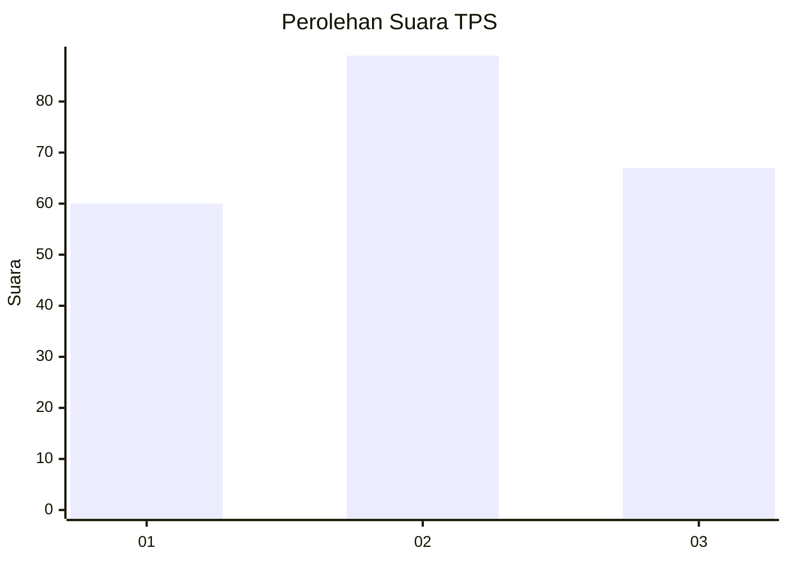
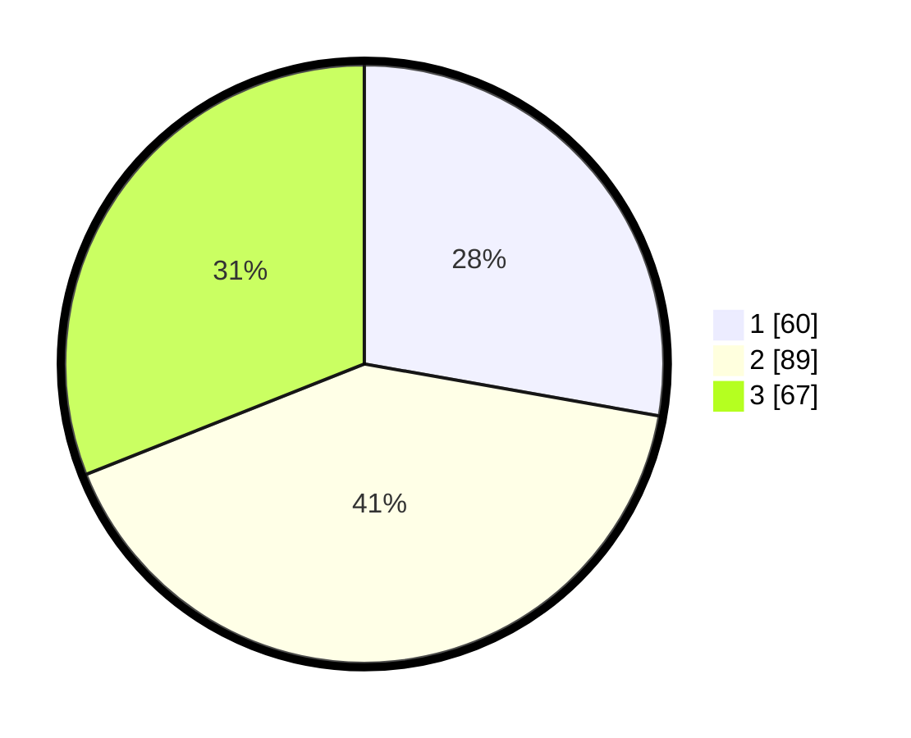

# Hasil

## Grafik

## Tabel

| No. | Nama Paslon    | Suara | Suara (raw) | Persentase |
|:--- |:-------------- | -----:| -----------:| ----------:|
| 1   | ANIES MUHAIMIN | 60    | [60][p-1]   | 27,78      |
| 2   | PRABOWO GIBRAN | 89    | [89][p-2]   | 41,20      |
| 3   | GANJAR MAHFUD  | 67    | [67][p-3]   | 31,02      |

[p-1]: https://github.com/gigit-pemilu/pemilu-2024/blob/main/pilpres/hitung-suara/sub/32-jawa-barat/sub/08-kuningan/sub/23-japara/sub/2001-garatengah/sub/002-tps/sub/paslon-1.txt
[p-2]: https://github.com/gigit-pemilu/pemilu-2024/blob/main/pilpres/hitung-suara/sub/32-jawa-barat/sub/08-kuningan/sub/23-japara/sub/2001-garatengah/sub/002-tps/sub/paslon-2.txt
[p-3]: https://github.com/gigit-pemilu/pemilu-2024/blob/main/pilpres/hitung-suara/sub/32-jawa-barat/sub/08-kuningan/sub/23-japara/sub/2001-garatengah/sub/002-tps/sub/paslon-3.txt

## Foto C Plano

https://sirekap-obj-formc.kpu.go.id/ff41/pemilu/ppwp/32/08/23/20/01/3208232001002-20240222-171924--9515beda-4696-4200-b4b4-3bf558908b83.jpg

https://sirekap-obj-formc.kpu.go.id/ff41/pemilu/ppwp/32/08/23/20/01/3208232001002-20240222-171937--5f73f685-3857-4df4-89b8-fc8b7854e870.jpg

https://sirekap-obj-formc.kpu.go.id/ff41/pemilu/ppwp/32/08/23/20/01/3208232001002-20240222-171947--a94943fc-a333-4301-94a2-bd3ac05c2c98.jpg

## Metadata

| Key        | Value               |
| ---------- | ------------------- |
| Time Stamp | 2024-02-22 18:00:00 |

