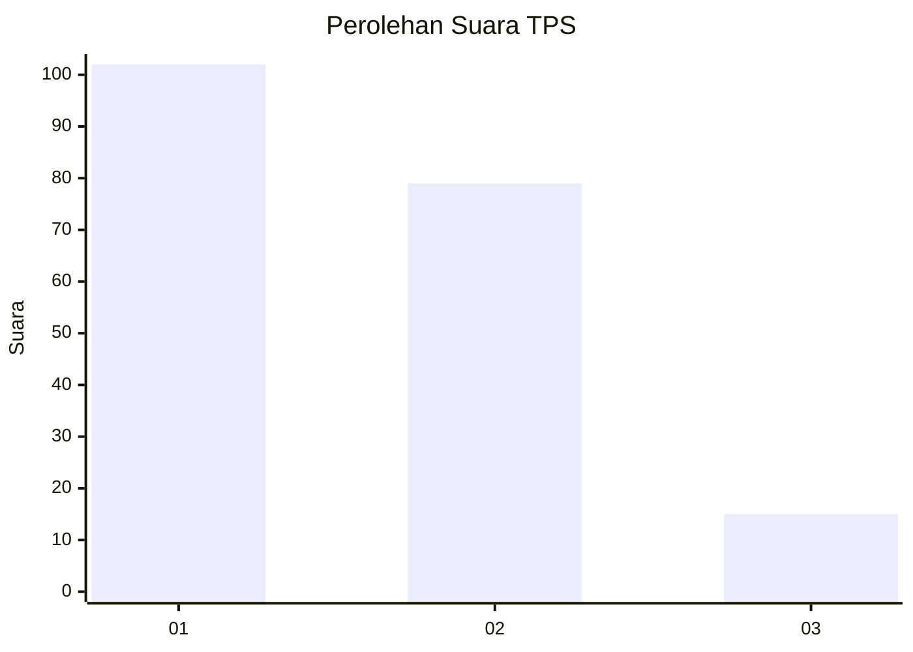
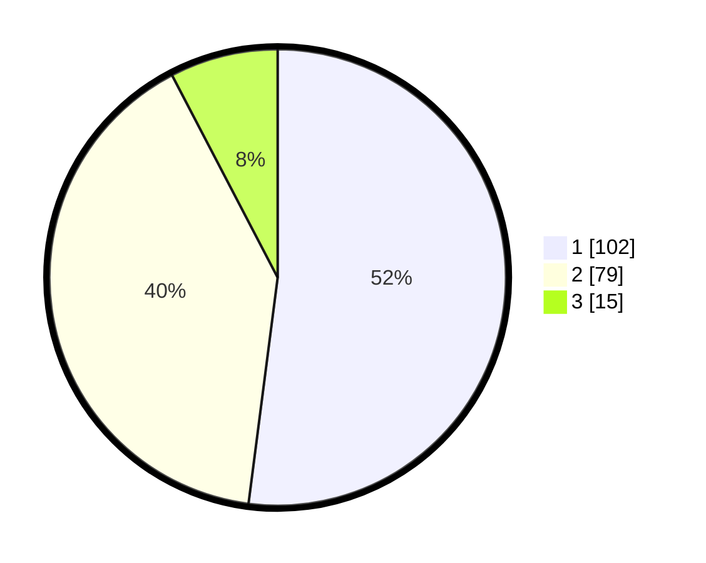

# Hasil

## Grafik

## Tabel

| No. | Nama Paslon    | Suara | Suara (raw) | Persentase |
|:--- |:-------------- | -----:| -----------:| ----------:|
| 1   | ANIES MUHAIMIN | 102   | [102][p-1]  | 52,04      |
| 2   | PRABOWO GIBRAN | 79    | [79][p-2]   | 40,31      |
| 3   | GANJAR MAHFUD  | 15    | [15][p-3]   | 7,65       |

[p-1]: https://github.com/gigit-pemilu/pemilu-2024-32-jawa-barat/blob/main/pilpres/hitung-suara/sub/32-jawa-barat/sub/08-kuningan/sub/23-japara/sub/2002-rajadanu/sub/001-tps/sub/paslon-1.txt
[p-2]: https://github.com/gigit-pemilu/pemilu-2024-32-jawa-barat/blob/main/pilpres/hitung-suara/sub/32-jawa-barat/sub/08-kuningan/sub/23-japara/sub/2002-rajadanu/sub/001-tps/sub/paslon-2.txt
[p-3]: https://github.com/gigit-pemilu/pemilu-2024-32-jawa-barat/blob/main/pilpres/hitung-suara/sub/32-jawa-barat/sub/08-kuningan/sub/23-japara/sub/2002-rajadanu/sub/001-tps/sub/paslon-3.txt

## Foto C Plano

https://sirekap-obj-formc.kpu.go.id/75e9/pemilu/ppwp/32/08/23/20/02/3208232002001-20240222-174044--4500d0fc-7b8a-4b7b-b6ad-b879b6b9977d.jpg

https://sirekap-obj-formc.kpu.go.id/75e9/pemilu/ppwp/32/08/23/20/02/3208232002001-20240222-174100--f4d59f27-20f6-4902-97e5-d23aed836c30.jpg

https://sirekap-obj-formc.kpu.go.id/75e9/pemilu/ppwp/32/08/23/20/02/3208232002001-20240222-174119--4e940d6e-98db-465f-b6df-7477a80df7cf.jpg

## Metadata

| Key        | Value               |
| ---------- | ------------------- |
| Time Stamp | 2024-02-22 18:00:00 |

