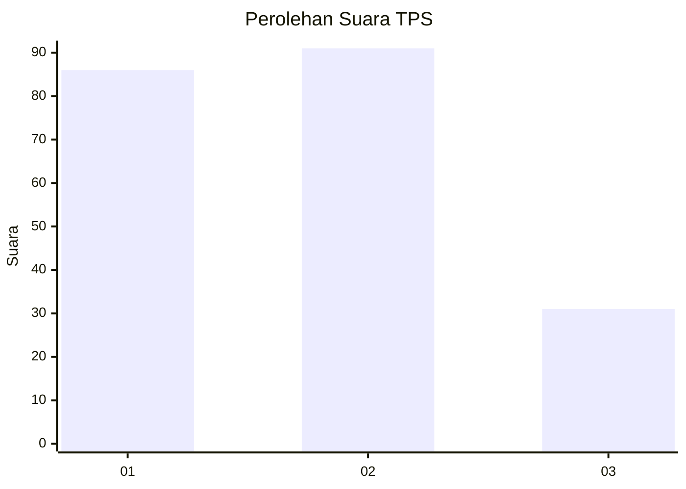
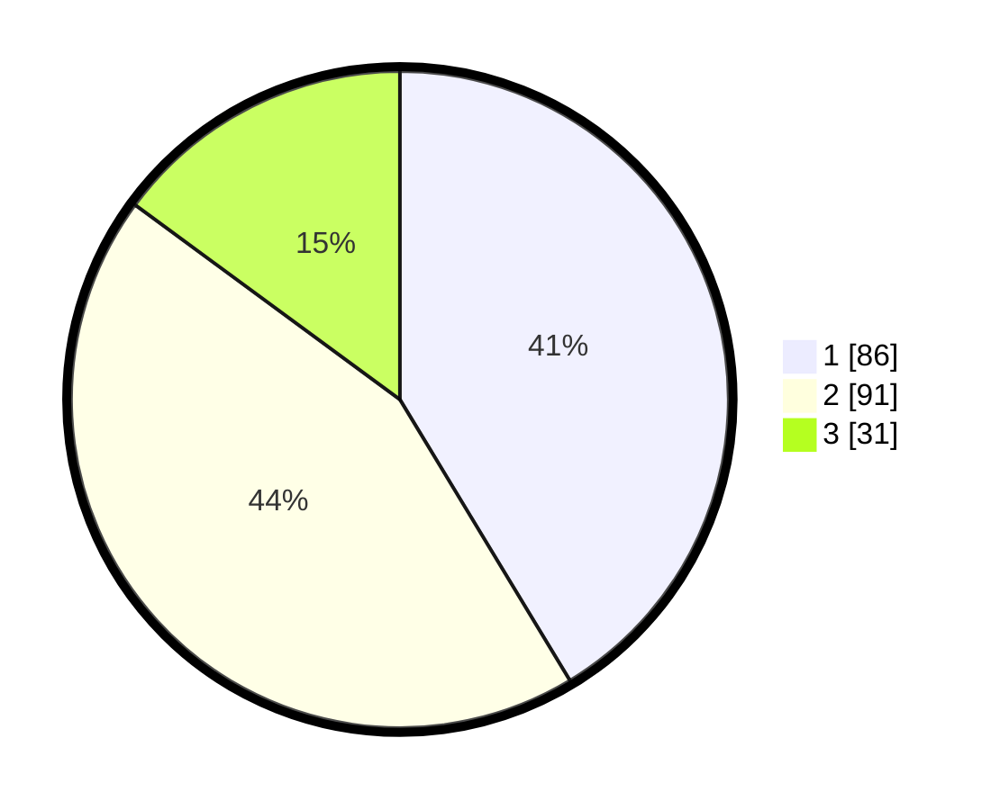

# Hasil

## Grafik

## Tabel

| No. | Nama Paslon    | Suara | Suara (raw) | Persentase |
|:--- |:-------------- | -----:| -----------:| ----------:|
| 1   | ANIES MUHAIMIN | 86    | [86][p-1]   | 41,35      |
| 2   | PRABOWO GIBRAN | 91    | [91][p-2]   | 43,75      |
| 3   | GANJAR MAHFUD  | 31    | [31][p-3]   | 14,90      |

[p-1]: https://github.com/gigit-pemilu/pemilu-2024/blob/main/pilpres/hitung-suara/sub/32-jawa-barat/sub/08-kuningan/sub/23-japara/sub/2002-rajadanu/sub/002-tps/sub/paslon-1.txt
[p-2]: https://github.com/gigit-pemilu/pemilu-2024/blob/main/pilpres/hitung-suara/sub/32-jawa-barat/sub/08-kuningan/sub/23-japara/sub/2002-rajadanu/sub/002-tps/sub/paslon-2.txt
[p-3]: https://github.com/gigit-pemilu/pemilu-2024/blob/main/pilpres/hitung-suara/sub/32-jawa-barat/sub/08-kuningan/sub/23-japara/sub/2002-rajadanu/sub/002-tps/sub/paslon-3.txt

## Foto C Plano

https://sirekap-obj-formc.kpu.go.id/300e/pemilu/ppwp/32/08/23/20/02/3208232002002-20240222-174202--146b3c10-a7f1-4c84-81f5-269ed6dd55b5.jpg

https://sirekap-obj-formc.kpu.go.id/300e/pemilu/ppwp/32/08/23/20/02/3208232002002-20240217-205221--83fa0ae0-e1d2-49a0-a001-f4a43149e934.jpg

https://sirekap-obj-formc.kpu.go.id/300e/pemilu/ppwp/32/08/23/20/02/3208232002002-20240222-174215--e40b2f9e-81d5-4775-875f-766fa80b02b7.jpg

## Metadata

| Key        | Value               |
| ---------- | ------------------- |
| Time Stamp | 2024-02-22 18:00:00 |

