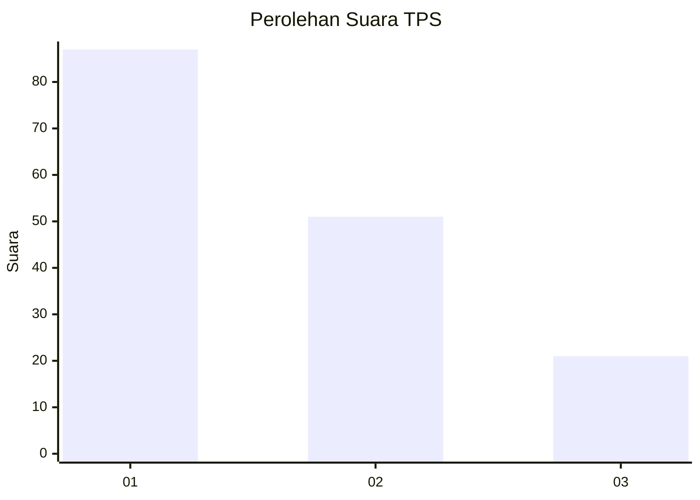
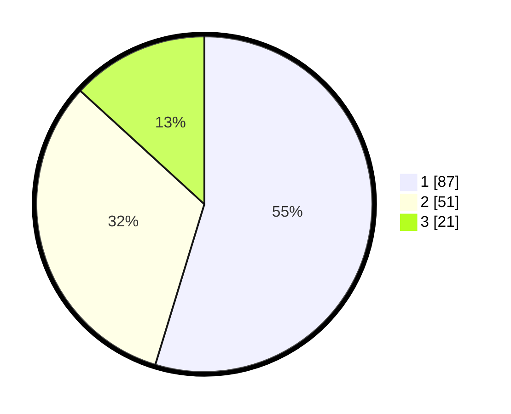

# Hasil

## Grafik

## Tabel

| No. | Nama Paslon    | Suara | Suara (raw) | Persentase |
|:--- |:-------------- | -----:| -----------:| ----------:|
| 1   | ANIES MUHAIMIN | 87    | [87][p-1]   | 54,72      |
| 2   | PRABOWO GIBRAN | 51    | [51][p-2]   | 32,08      |
| 3   | GANJAR MAHFUD  | 21    | [21][p-3]   | 13,21      |

[p-1]: https://github.com/gigit-pemilu/pemilu-2024/blob/main/pilpres/hitung-suara/sub/32-jawa-barat/sub/08-kuningan/sub/24-cimahi/sub/2003-cileuya/sub/001-tps/sub/paslon-1.txt
[p-2]: https://github.com/gigit-pemilu/pemilu-2024/blob/main/pilpres/hitung-suara/sub/32-jawa-barat/sub/08-kuningan/sub/24-cimahi/sub/2003-cileuya/sub/001-tps/sub/paslon-2.txt
[p-3]: https://github.com/gigit-pemilu/pemilu-2024/blob/main/pilpres/hitung-suara/sub/32-jawa-barat/sub/08-kuningan/sub/24-cimahi/sub/2003-cileuya/sub/001-tps/sub/paslon-3.txt

## Foto C Plano

https://sirekap-obj-formc.kpu.go.id/3755/pemilu/ppwp/32/08/24/20/03/3208242003001-20240216-095220--0b04a1a0-15cc-4c48-8111-f7817b8b213b.jpg

https://sirekap-obj-formc.kpu.go.id/3755/pemilu/ppwp/32/08/24/20/03/3208242003001-20240216-095402--8a2a1414-50c2-460c-9a76-62cd11be8e30.jpg

https://sirekap-obj-formc.kpu.go.id/3755/pemilu/ppwp/32/08/24/20/03/3208242003001-20240216-095519--a14eb7df-a37d-40ad-80df-82eefc8ec9ba.jpg

## Metadata

| Key        | Value               |
| ---------- | ------------------- |
| Time Stamp | 2024-02-17 18:00:00 |

