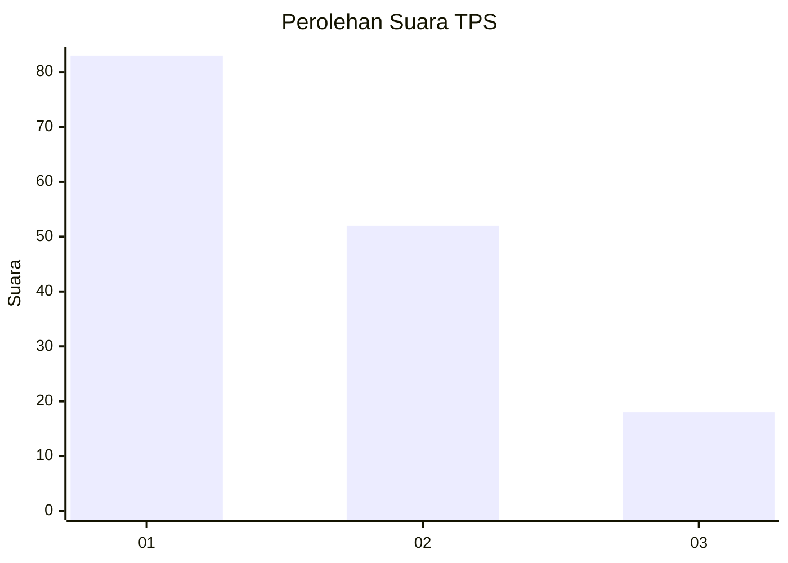
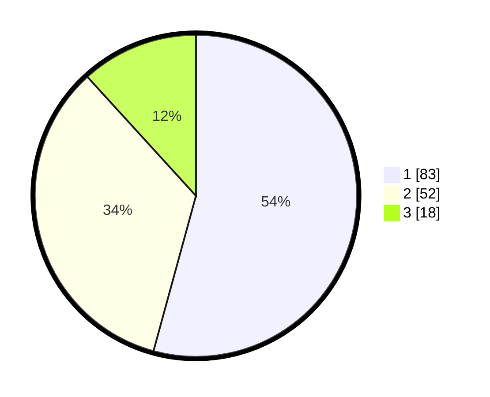

# Hasil

## Grafik

## Tabel

| No. | Nama Paslon    | Suara | Suara (raw) | Persentase |
|:--- |:-------------- | -----:| -----------:| ----------:|
| 1   | ANIES MUHAIMIN | 83    | [83][p-1]   | 54,25      |
| 2   | PRABOWO GIBRAN | 52    | [52][p-2]   | 33,99      |
| 3   | GANJAR MAHFUD  | 18    | [18][p-3]   | 11,76      |

[p-1]: https://github.com/gigit-pemilu/pemilu-2024/blob/main/pilpres/hitung-suara/sub/32-jawa-barat/sub/08-kuningan/sub/24-cimahi/sub/2003-cileuya/sub/002-tps/sub/paslon-1.txt
[p-2]: https://github.com/gigit-pemilu/pemilu-2024/blob/main/pilpres/hitung-suara/sub/32-jawa-barat/sub/08-kuningan/sub/24-cimahi/sub/2003-cileuya/sub/002-tps/sub/paslon-2.txt
[p-3]: https://github.com/gigit-pemilu/pemilu-2024/blob/main/pilpres/hitung-suara/sub/32-jawa-barat/sub/08-kuningan/sub/24-cimahi/sub/2003-cileuya/sub/002-tps/sub/paslon-3.txt

## Foto C Plano

https://sirekap-obj-formc.kpu.go.id/ba34/pemilu/ppwp/32/08/24/20/03/3208242003002-20240214-192719--f9159731-0f2e-49dc-9aa8-dd767f8b451b.jpg

https://sirekap-obj-formc.kpu.go.id/ba34/pemilu/ppwp/32/08/24/20/03/3208242003002-20240214-193036--78090e5c-ea2e-4ef9-a972-3912888e3b44.jpg

https://sirekap-obj-formc.kpu.go.id/ba34/pemilu/ppwp/32/08/24/20/03/3208242003002-20240214-193145--a4027050-bf52-417b-84bc-8d4bcb75d9be.jpg

## Metadata

| Key        | Value               |
| ---------- | ------------------- |
| Time Stamp | 2024-02-17 18:30:00 |

