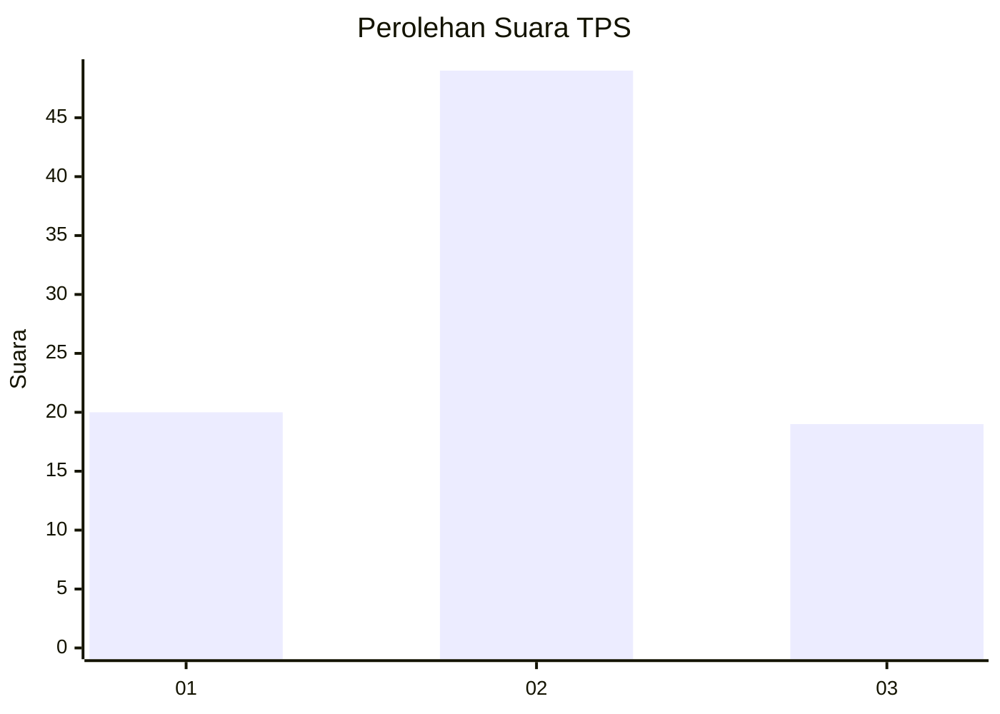
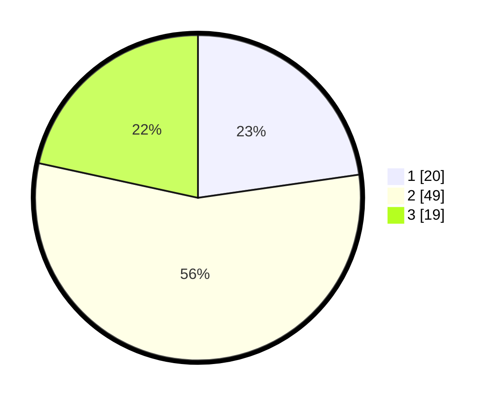

# Hasil

## Grafik

## Tabel

| No. | Nama Paslon    | Suara | Suara (raw) | Persentase |
|:--- |:-------------- | -----:| -----------:| ----------:|
| 1   | ANIES MUHAIMIN | 20    | [20][p-1]   | 22,73      |
| 2   | PRABOWO GIBRAN | 49    | [49][p-2]   | 55,68      |
| 3   | GANJAR MAHFUD  | 19    | [19][p-3]   | 21,59      |

[p-1]: https://github.com/gigit-pemilu/pemilu-2024/blob/main/pilpres/hitung-suara/sub/32-jawa-barat/sub/08-kuningan/sub/24-cimahi/sub/2003-cileuya/sub/011-tps/sub/paslon-1.txt
[p-2]: https://github.com/gigit-pemilu/pemilu-2024/blob/main/pilpres/hitung-suara/sub/32-jawa-barat/sub/08-kuningan/sub/24-cimahi/sub/2003-cileuya/sub/011-tps/sub/paslon-2.txt
[p-3]: https://github.com/gigit-pemilu/pemilu-2024/blob/main/pilpres/hitung-suara/sub/32-jawa-barat/sub/08-kuningan/sub/24-cimahi/sub/2003-cileuya/sub/011-tps/sub/paslon-3.txt

## Foto C Plano

https://sirekap-obj-formc.kpu.go.id/c8e2/pemilu/ppwp/32/08/24/20/03/3208242003011-20240215-133743--0e39d2b9-f412-4ec2-96df-265c83fd7ca4.jpg

https://sirekap-obj-formc.kpu.go.id/c8e2/pemilu/ppwp/32/08/24/20/03/3208242003011-20240215-133814--57aafe9b-0792-48fa-977d-172ea9a06ad3.jpg

https://sirekap-obj-formc.kpu.go.id/c8e2/pemilu/ppwp/32/08/24/20/03/3208242003011-20240215-133845--c83a961e-5cad-4572-bfcb-7f0e6e92c4e3.jpg

## Metadata

| Key        | Value               |
| ---------- | ------------------- |
| Time Stamp | 2024-02-17 18:30:00 |

