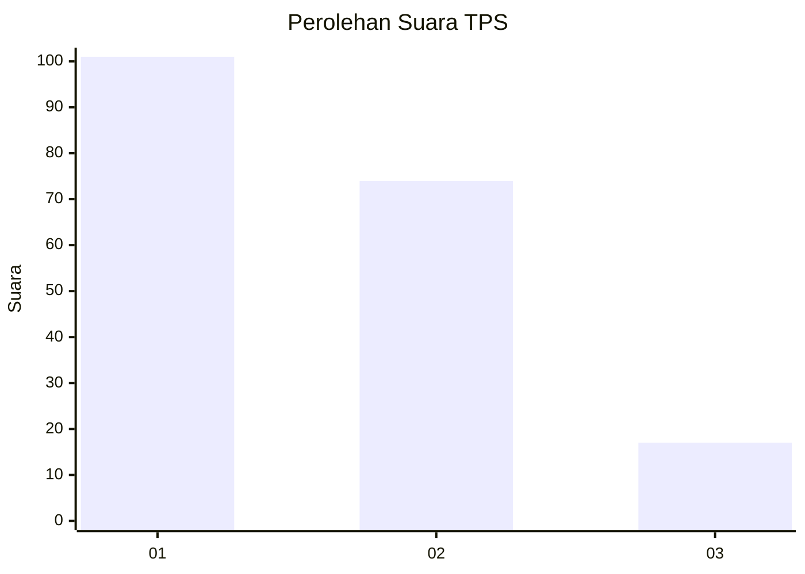
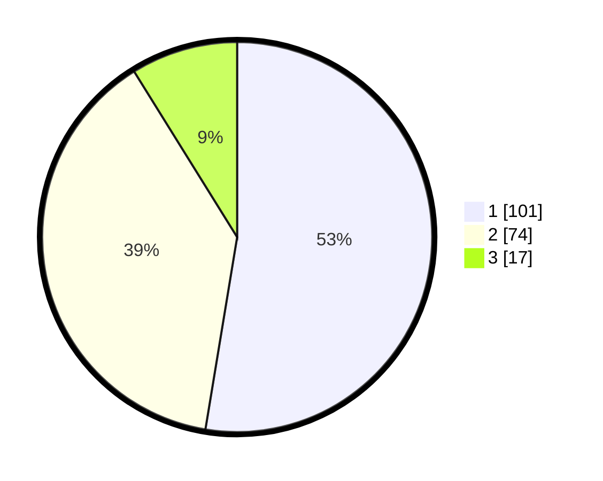

# Hasil

## Grafik

## Tabel

| No. | Nama Paslon    | Suara | Suara (raw) | Persentase |
|:--- |:-------------- | -----:| -----------:| ----------:|
| 1   | ANIES MUHAIMIN | 101   | [101][p-1]  | 52,60      |
| 2   | PRABOWO GIBRAN | 74    | [74][p-2]   | 38,54      |
| 3   | GANJAR MAHFUD  | 17    | [17][p-3]   | 8,85       |

[p-1]: https://github.com/gigit-pemilu/pemilu-2024-32-jawa-barat/blob/main/pilpres/hitung-suara/sub/32-jawa-barat/sub/08-kuningan/sub/26-hantara/sub/2001-citapen/sub/001-tps/sub/paslon-1.txt
[p-2]: https://github.com/gigit-pemilu/pemilu-2024-32-jawa-barat/blob/main/pilpres/hitung-suara/sub/32-jawa-barat/sub/08-kuningan/sub/26-hantara/sub/2001-citapen/sub/001-tps/sub/paslon-2.txt
[p-3]: https://github.com/gigit-pemilu/pemilu-2024-32-jawa-barat/blob/main/pilpres/hitung-suara/sub/32-jawa-barat/sub/08-kuningan/sub/26-hantara/sub/2001-citapen/sub/001-tps/sub/paslon-3.txt

## Foto C Plano

https://sirekap-obj-formc.kpu.go.id/e0c4/pemilu/ppwp/32/08/26/20/01/3208262001001-20240214-140957--0a9a96a6-724f-429d-8f13-ce8a0bf89a65.jpg

https://sirekap-obj-formc.kpu.go.id/e0c4/pemilu/ppwp/32/08/26/20/01/3208262001001-20240214-141211--6a8964d9-423b-41e6-a00a-5570ce665a61.jpg

https://sirekap-obj-formc.kpu.go.id/e0c4/pemilu/ppwp/32/08/26/20/01/3208262001001-20240214-201219--0b2fbd96-33ef-404f-9792-79e5bbad52b4.jpg

## Metadata

| Key        | Value               |
| ---------- | ------------------- |
| Time Stamp | 2024-02-14 21:46:01 |

