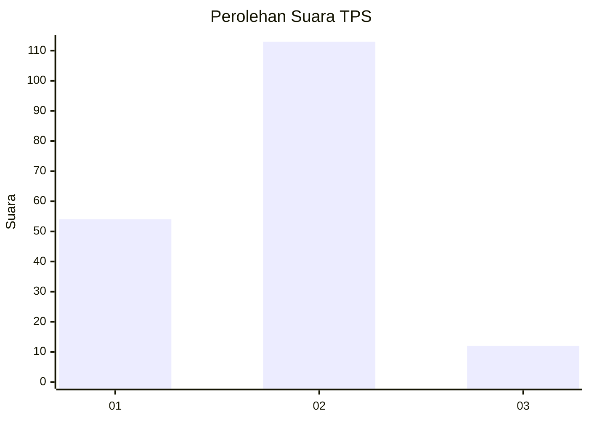
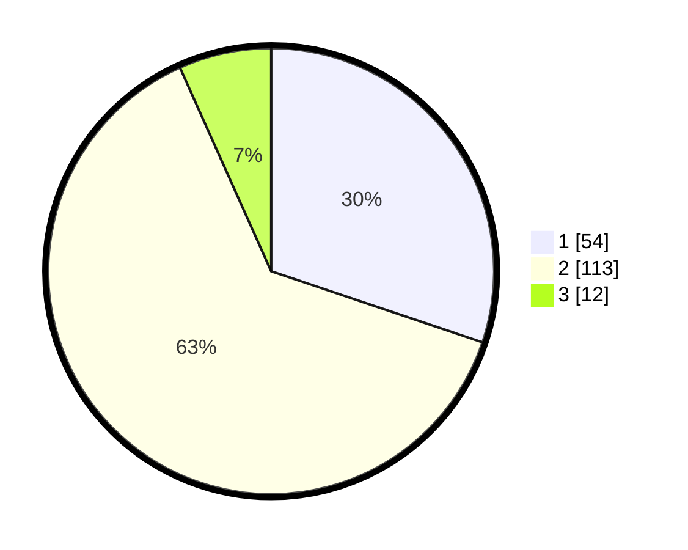

# Hasil

## Grafik

## Tabel

| No. | Nama Paslon    | Suara | Suara (raw) | Persentase |
|:--- |:-------------- | -----:| -----------:| ----------:|
| 1   | ANIES MUHAIMIN | 54    | [54][p-1]   | 30,17      |
| 2   | PRABOWO GIBRAN | 113   | [113][p-2]  | 63,13      |
| 3   | GANJAR MAHFUD  | 12    | [12][p-3]   | 6,70       |

[p-1]: https://github.com/gigit-pemilu/pemilu-2024/blob/main/pilpres/hitung-suara/sub/32-jawa-barat/sub/08-kuningan/sub/26-hantara/sub/2002-pasiragung/sub/001-tps/sub/paslon-1.txt
[p-2]: https://github.com/gigit-pemilu/pemilu-2024/blob/main/pilpres/hitung-suara/sub/32-jawa-barat/sub/08-kuningan/sub/26-hantara/sub/2002-pasiragung/sub/001-tps/sub/paslon-2.txt
[p-3]: https://github.com/gigit-pemilu/pemilu-2024/blob/main/pilpres/hitung-suara/sub/32-jawa-barat/sub/08-kuningan/sub/26-hantara/sub/2002-pasiragung/sub/001-tps/sub/paslon-3.txt

## Foto C Plano

https://sirekap-obj-formc.kpu.go.id/8664/pemilu/ppwp/32/08/26/20/02/3208262002001-20240215-043033--a518ce1f-de74-4404-95ed-de3b3487aef7.jpg

https://sirekap-obj-formc.kpu.go.id/8664/pemilu/ppwp/32/08/26/20/02/3208262002001-20240217-193959--d3dcee0b-f031-454e-94a3-0fd4147604d7.jpg

https://sirekap-obj-formc.kpu.go.id/8664/pemilu/ppwp/32/08/26/20/02/3208262002001-20240217-194010--d58e5bb5-ab57-4b84-b771-ef572a3bbed8.jpg

## Metadata

| Key        | Value               |
| ---------- | ------------------- |
| Time Stamp | 2024-02-19 06:16:00 |

