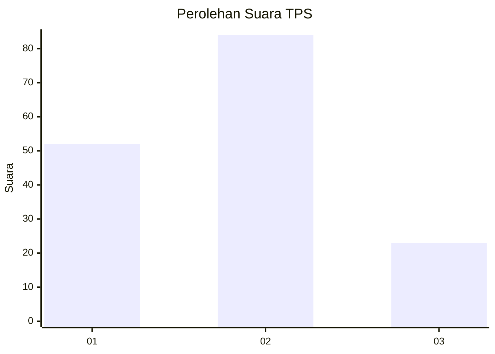
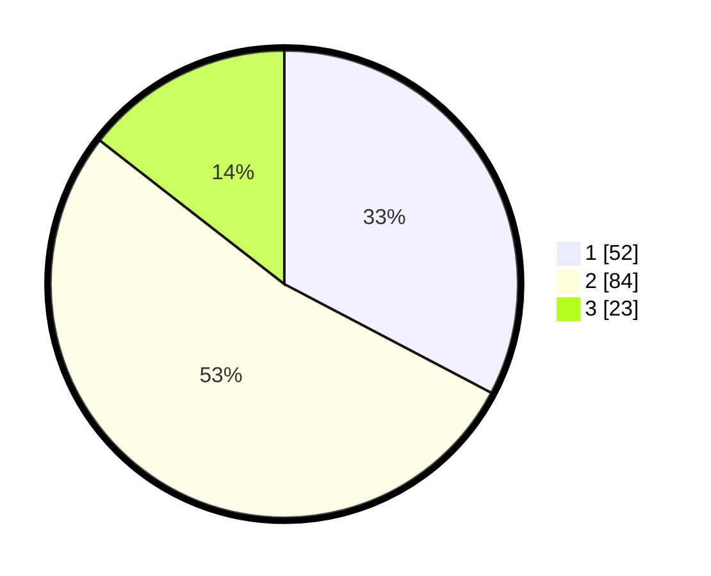

# Hasil

## Grafik

## Tabel

| No. | Nama Paslon    | Suara | Suara (raw) | Persentase |
|:--- |:-------------- | -----:| -----------:| ----------:|
| 1   | ANIES MUHAIMIN | 52    | [52][p-1]   | 32,70      |
| 2   | PRABOWO GIBRAN | 84    | [84][p-2]   | 52,83      |
| 3   | GANJAR MAHFUD  | 23    | [23][p-3]   | 14,47      |

[p-1]: https://github.com/gigit-pemilu/pemilu-2024/blob/main/pilpres/hitung-suara/sub/32-jawa-barat/sub/08-kuningan/sub/26-hantara/sub/2008-pakapasanhilir/sub/002-tps/sub/paslon-1.txt
[p-2]: https://github.com/gigit-pemilu/pemilu-2024/blob/main/pilpres/hitung-suara/sub/32-jawa-barat/sub/08-kuningan/sub/26-hantara/sub/2008-pakapasanhilir/sub/002-tps/sub/paslon-2.txt
[p-3]: https://github.com/gigit-pemilu/pemilu-2024/blob/main/pilpres/hitung-suara/sub/32-jawa-barat/sub/08-kuningan/sub/26-hantara/sub/2008-pakapasanhilir/sub/002-tps/sub/paslon-3.txt

## Foto C Plano

https://sirekap-obj-formc.kpu.go.id/51b4/pemilu/ppwp/32/08/26/20/08/3208262008002-20240215-165135--4d6180d7-afce-4d52-8e28-ee394fd03520.jpg

https://sirekap-obj-formc.kpu.go.id/51b4/pemilu/ppwp/32/08/26/20/08/3208262008002-20240215-165142--2d33c722-4c71-4d7a-9a71-c7d8ec34b720.jpg

https://sirekap-obj-formc.kpu.go.id/51b4/pemilu/ppwp/32/08/26/20/08/3208262008002-20240215-165149--755bd920-3c6c-419a-97a2-2493759be170.jpg

## Metadata

| Key        | Value               |
| ---------- | ------------------- |
| Time Stamp | 2024-02-17 18:30:00 |

