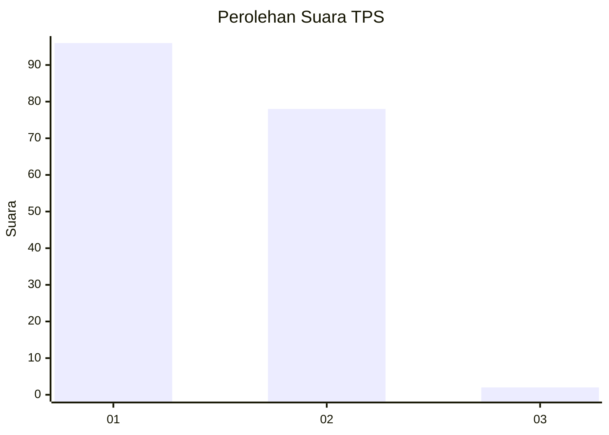
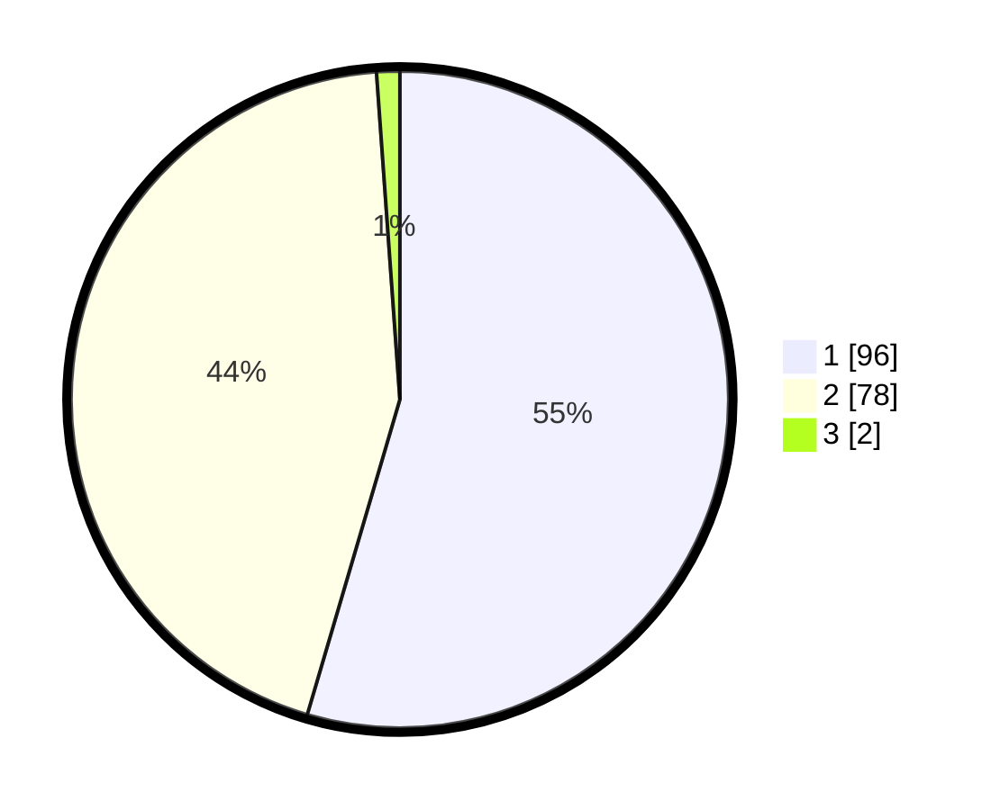

# Hasil

## Grafik

## Tabel

| No. | Nama Paslon    | Suara | Suara (raw) | Persentase |
|:--- |:-------------- | -----:| -----------:| ----------:|
| 1   | ANIES MUHAIMIN | 96    | [96][p-1]   | 54,55      |
| 2   | PRABOWO GIBRAN | 78    | [78][p-2]   | 44,32      |
| 3   | GANJAR MAHFUD  | 2     | [2][p-3]    | 1,14       |

[p-1]: https://github.com/gigit-pemilu/pemilu-2024-32-jawa-barat/blob/main/pilpres/hitung-suara/sub/32-jawa-barat/sub/08-kuningan/sub/27-kalimanggis/sub/2001-kalimanggiskulon/sub/001-tps/sub/paslon-1.txt
[p-2]: https://github.com/gigit-pemilu/pemilu-2024-32-jawa-barat/blob/main/pilpres/hitung-suara/sub/32-jawa-barat/sub/08-kuningan/sub/27-kalimanggis/sub/2001-kalimanggiskulon/sub/001-tps/sub/paslon-2.txt
[p-3]: https://github.com/gigit-pemilu/pemilu-2024-32-jawa-barat/blob/main/pilpres/hitung-suara/sub/32-jawa-barat/sub/08-kuningan/sub/27-kalimanggis/sub/2001-kalimanggiskulon/sub/001-tps/sub/paslon-3.txt

## Foto C Plano

https://sirekap-obj-formc.kpu.go.id/7e7a/pemilu/ppwp/32/08/27/20/01/3208272001001-20240215-103747--6589e4dd-db55-42aa-9c91-db8efe0897f5.jpg

https://sirekap-obj-formc.kpu.go.id/7e7a/pemilu/ppwp/32/08/27/20/01/3208272001001-20240215-103916--1c39b43e-7ac1-4ab5-9516-81c4db116842.jpg

https://sirekap-obj-formc.kpu.go.id/7e7a/pemilu/ppwp/32/08/27/20/01/3208272001001-20240215-104013--2f30a437-cfa4-4e6d-a7bd-57453e3d2aa4.jpg

## Metadata

| Key        | Value               |
| ---------- | ------------------- |
| Time Stamp | 2024-02-16 16:25:10 |

