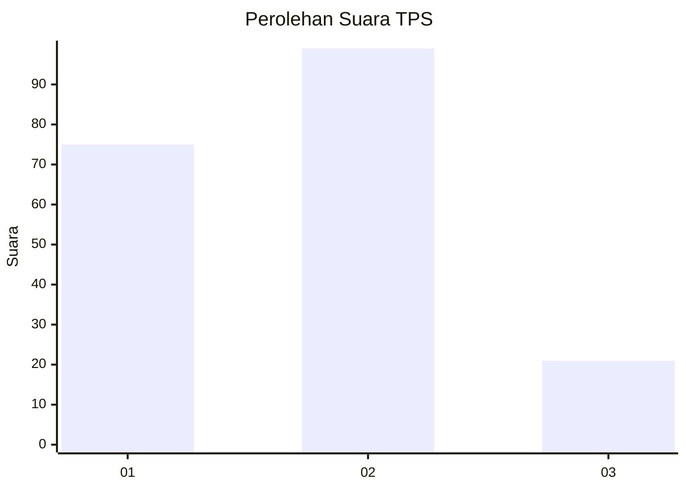
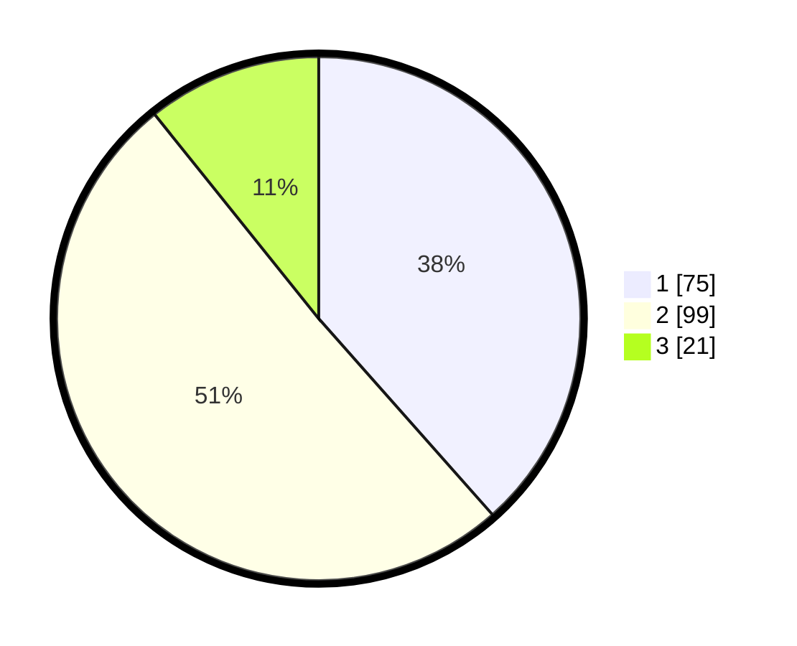

# Hasil

## Grafik

## Tabel

| No. | Nama Paslon    | Suara | Suara (raw) | Persentase |
|:--- |:-------------- | -----:| -----------:| ----------:|
| 1   | ANIES MUHAIMIN | 75    | [75][p-1]   | 38,46      |
| 2   | PRABOWO GIBRAN | 99    | [99][p-2]   | 50,77      |
| 3   | GANJAR MAHFUD  | 21    | [21][p-3]   | 10,77      |

[p-1]: https://github.com/gigit-pemilu/pemilu-2024/blob/main/pilpres/hitung-suara/sub/32-jawa-barat/sub/08-kuningan/sub/27-kalimanggis/sub/2001-kalimanggiskulon/sub/004-tps/sub/paslon-1.txt
[p-2]: https://github.com/gigit-pemilu/pemilu-2024/blob/main/pilpres/hitung-suara/sub/32-jawa-barat/sub/08-kuningan/sub/27-kalimanggis/sub/2001-kalimanggiskulon/sub/004-tps/sub/paslon-2.txt
[p-3]: https://github.com/gigit-pemilu/pemilu-2024/blob/main/pilpres/hitung-suara/sub/32-jawa-barat/sub/08-kuningan/sub/27-kalimanggis/sub/2001-kalimanggiskulon/sub/004-tps/sub/paslon-3.txt

## Foto C Plano

https://sirekap-obj-formc.kpu.go.id/2a23/pemilu/ppwp/32/08/27/20/01/3208272001004-20240215-002748--97f5a276-551f-4095-9311-034da83d5a48.jpg

https://sirekap-obj-formc.kpu.go.id/2a23/pemilu/ppwp/32/08/27/20/01/3208272001004-20240214-160114--e0d9c9f9-2907-4639-b979-894a4b5ac480.jpg

https://sirekap-obj-formc.kpu.go.id/2a23/pemilu/ppwp/32/08/27/20/01/3208272001004-20240214-160100--d48324ff-3cdd-493a-b963-35870d28e23f.jpg

## Metadata

| Key        | Value               |
| ---------- | ------------------- |
| Time Stamp | 2024-02-15 04:00:24 |

