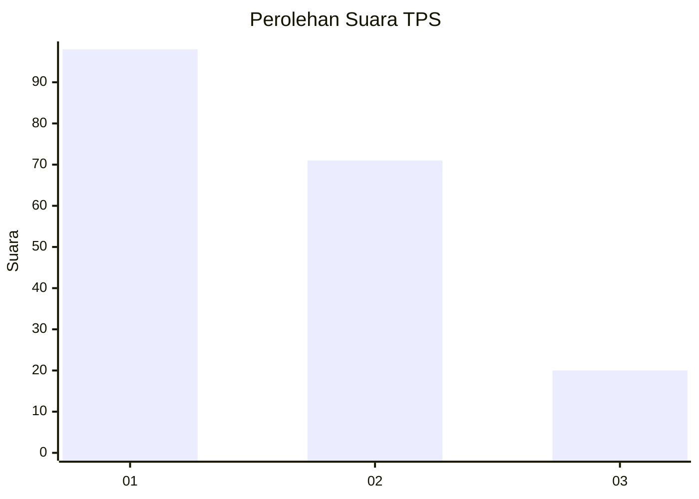
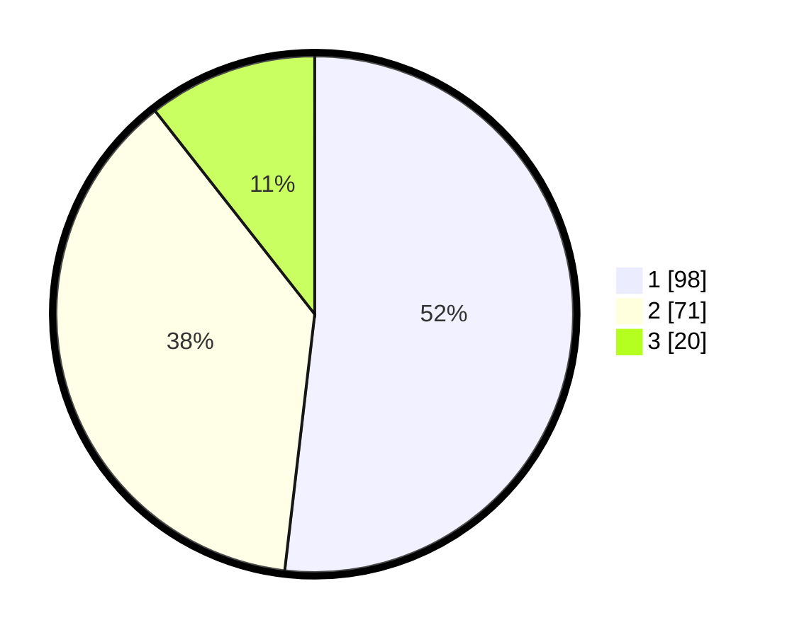

# Hasil

## Grafik

## Tabel

| No. | Nama Paslon    | Suara | Suara (raw) | Persentase |
|:--- |:-------------- | -----:| -----------:| ----------:|
| 1   | ANIES MUHAIMIN | 98    | [98][p-1]   | 51,85      |
| 2   | PRABOWO GIBRAN | 71    | [71][p-2]   | 37,57      |
| 3   | GANJAR MAHFUD  | 20    | [20][p-3]   | 10,58      |

[p-1]: https://github.com/gigit-pemilu/pemilu-2024-32-jawa-barat/blob/main/pilpres/hitung-suara/sub/32-jawa-barat/sub/08-kuningan/sub/27-kalimanggis/sub/2001-kalimanggiskulon/sub/005-tps/sub/paslon-1.txt
[p-2]: https://github.com/gigit-pemilu/pemilu-2024-32-jawa-barat/blob/main/pilpres/hitung-suara/sub/32-jawa-barat/sub/08-kuningan/sub/27-kalimanggis/sub/2001-kalimanggiskulon/sub/005-tps/sub/paslon-2.txt
[p-3]: https://github.com/gigit-pemilu/pemilu-2024-32-jawa-barat/blob/main/pilpres/hitung-suara/sub/32-jawa-barat/sub/08-kuningan/sub/27-kalimanggis/sub/2001-kalimanggiskulon/sub/005-tps/sub/paslon-3.txt

## Foto C Plano

https://sirekap-obj-formc.kpu.go.id/ee0b/pemilu/ppwp/32/08/27/20/01/3208272001005-20240226-095813--4b594d28-d8d8-447a-9b7c-bab80ea75cc7.jpg

https://sirekap-obj-formc.kpu.go.id/ee0b/pemilu/ppwp/32/08/27/20/01/3208272001005-20240226-095831--fe57cc5a-c7a0-4394-aef1-a3c39a9499ce.jpg

https://sirekap-obj-formc.kpu.go.id/ee0b/pemilu/ppwp/32/08/27/20/01/3208272001005-20240226-095855--2e2e391c-a228-4aaa-9be9-a2a502176ee4.jpg

## Metadata

| Key        | Value               |
| ---------- | ------------------- |
| Time Stamp | 2024-02-26 11:00:00 |

