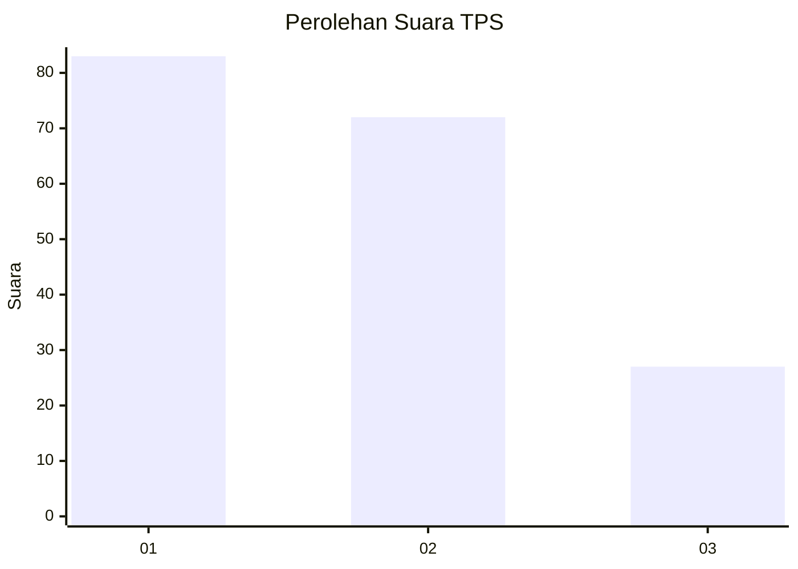
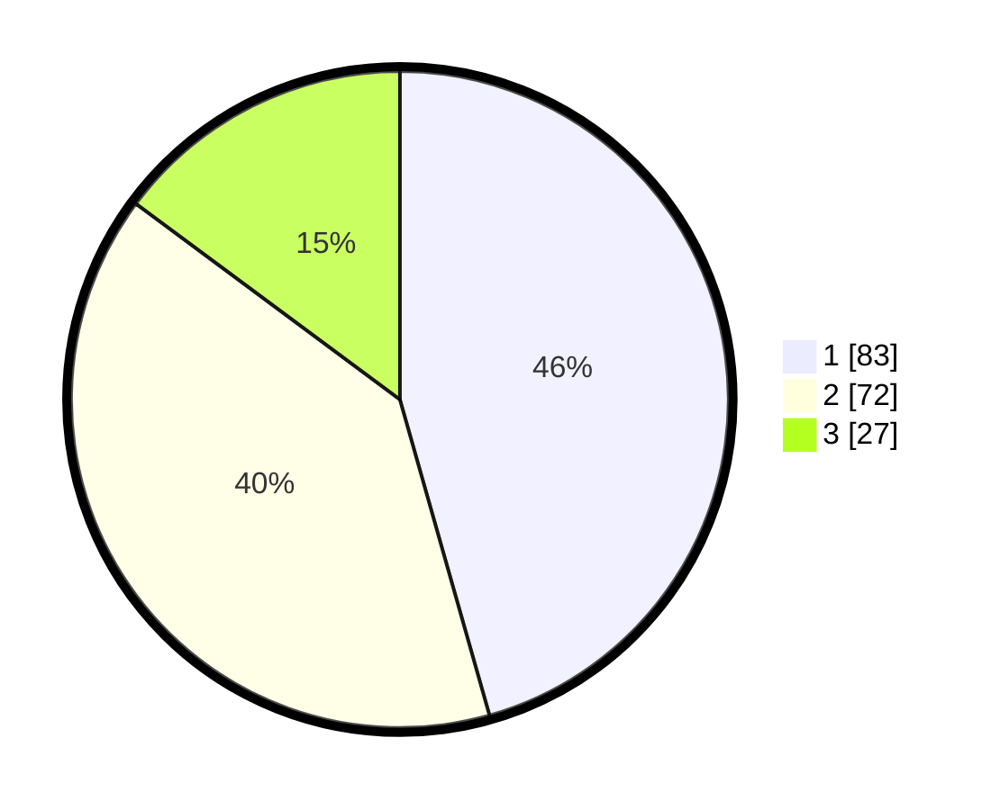

# Hasil

## Grafik

## Tabel

| No. | Nama Paslon    | Suara | Suara (raw) | Persentase |
|:--- |:-------------- | -----:| -----------:| ----------:|
| 1   | ANIES MUHAIMIN | 83    | [83][p-1]   | 45,60      |
| 2   | PRABOWO GIBRAN | 72    | [72][p-2]   | 39,56      |
| 3   | GANJAR MAHFUD  | 27    | [27][p-3]   | 14,84      |

[p-1]: https://github.com/gigit-pemilu/pemilu-2024-32-jawa-barat/blob/main/pilpres/hitung-suara/sub/32-jawa-barat/sub/08-kuningan/sub/27-kalimanggis/sub/2001-kalimanggiskulon/sub/006-tps/sub/paslon-1.txt
[p-2]: https://github.com/gigit-pemilu/pemilu-2024-32-jawa-barat/blob/main/pilpres/hitung-suara/sub/32-jawa-barat/sub/08-kuningan/sub/27-kalimanggis/sub/2001-kalimanggiskulon/sub/006-tps/sub/paslon-2.txt
[p-3]: https://github.com/gigit-pemilu/pemilu-2024-32-jawa-barat/blob/main/pilpres/hitung-suara/sub/32-jawa-barat/sub/08-kuningan/sub/27-kalimanggis/sub/2001-kalimanggiskulon/sub/006-tps/sub/paslon-3.txt

## Foto C Plano

https://sirekap-obj-formc.kpu.go.id/fc75/pemilu/ppwp/32/08/27/20/01/3208272001006-20240214-155053--764df450-447d-4662-81ca-527b01dc7a86.jpg

https://sirekap-obj-formc.kpu.go.id/fc75/pemilu/ppwp/32/08/27/20/01/3208272001006-20240214-155854--476ab693-2d93-4e96-a265-133969fce345.jpg

https://sirekap-obj-formc.kpu.go.id/fc75/pemilu/ppwp/32/08/27/20/01/3208272001006-20240226-095911--0b48195d-48a1-44cb-aadb-3f77eaa6fb0f.jpg

## Metadata

| Key        | Value               |
| ---------- | ------------------- |
| Time Stamp | 2024-02-26 10:00:00 |

