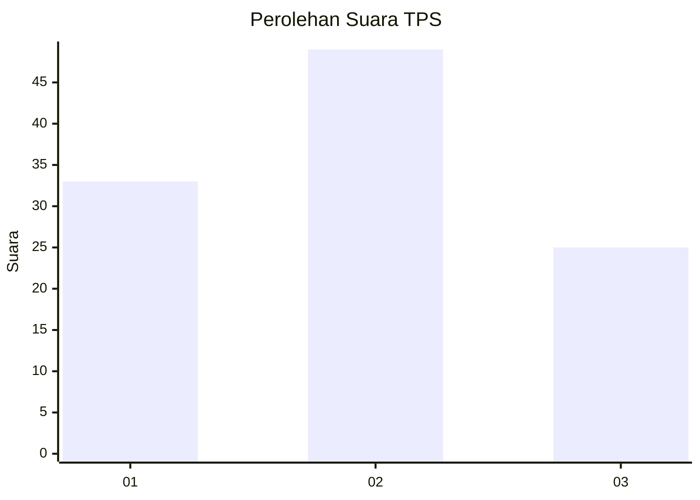
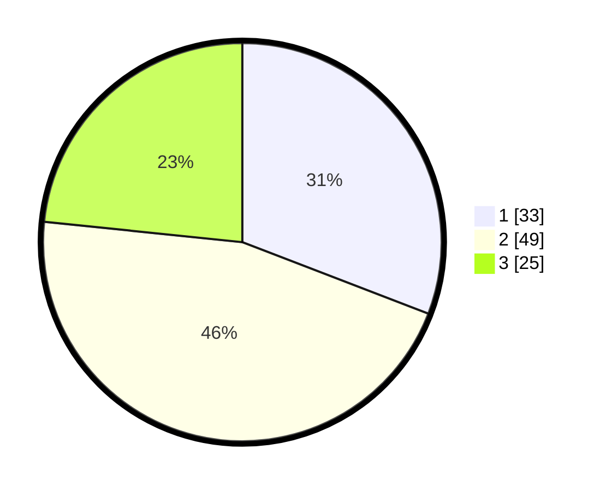

# Hasil

## Grafik

## Tabel

| No. | Nama Paslon    | Suara | Suara (raw) | Persentase |
|:--- |:-------------- | -----:| -----------:| ----------:|
| 1   | ANIES MUHAIMIN | 33    | [33][p-1]   | 30,84      |
| 2   | PRABOWO GIBRAN | 49    | [49][p-2]   | 45,79      |
| 3   | GANJAR MAHFUD  | 25    | [25][p-3]   | 23,36      |

[p-1]: https://github.com/gigit-pemilu/pemilu-2024-32-jawa-barat/blob/main/pilpres/hitung-suara/sub/32-jawa-barat/sub/08-kuningan/sub/27-kalimanggis/sub/2006-kalimanggiswetan/sub/003-tps/sub/paslon-1.txt
[p-2]: https://github.com/gigit-pemilu/pemilu-2024-32-jawa-barat/blob/main/pilpres/hitung-suara/sub/32-jawa-barat/sub/08-kuningan/sub/27-kalimanggis/sub/2006-kalimanggiswetan/sub/003-tps/sub/paslon-2.txt
[p-3]: https://github.com/gigit-pemilu/pemilu-2024-32-jawa-barat/blob/main/pilpres/hitung-suara/sub/32-jawa-barat/sub/08-kuningan/sub/27-kalimanggis/sub/2006-kalimanggiswetan/sub/003-tps/sub/paslon-3.txt

## Foto C Plano

https://sirekap-obj-formc.kpu.go.id/f221/pemilu/ppwp/32/08/27/20/06/3208272006003-20240215-191912--1889bdb2-d73e-4af2-8d15-3b1337d3a751.jpg

https://sirekap-obj-formc.kpu.go.id/f221/pemilu/ppwp/32/08/27/20/06/3208272006003-20240226-134928--55a889cf-8bec-4de2-92b5-dbf58bc9485c.jpg

https://sirekap-obj-formc.kpu.go.id/f221/pemilu/ppwp/32/08/27/20/06/3208272006003-20240226-134936--6bca566a-49af-4468-931b-38490acf4d9b.jpg

## Metadata

| Key        | Value               |
| ---------- | ------------------- |
| Time Stamp | 2024-02-26 15:00:00 |

