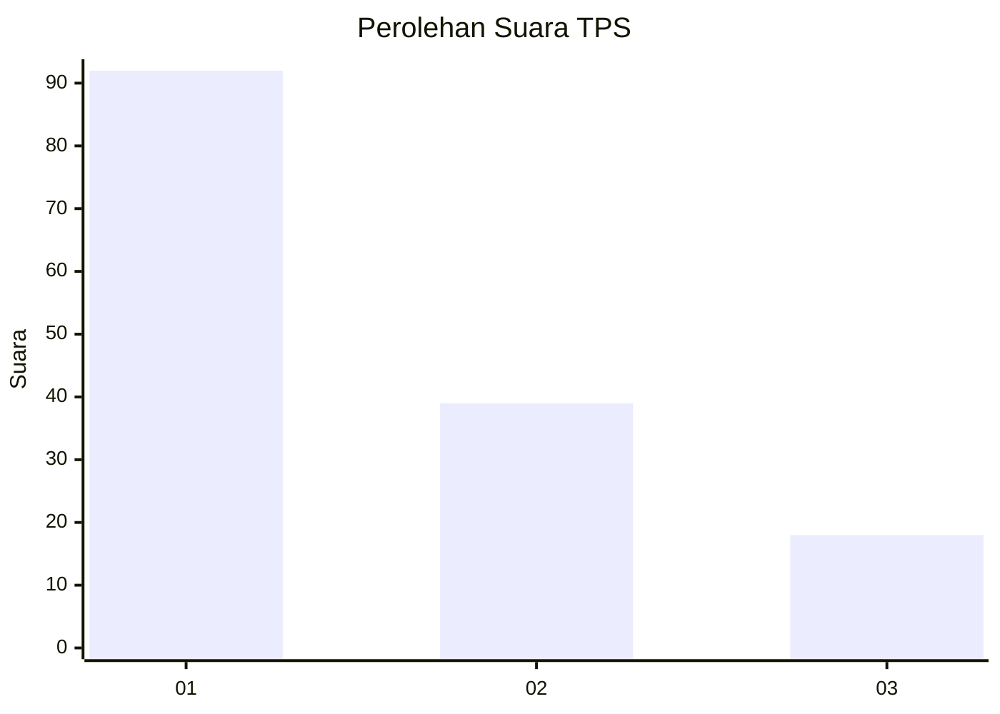
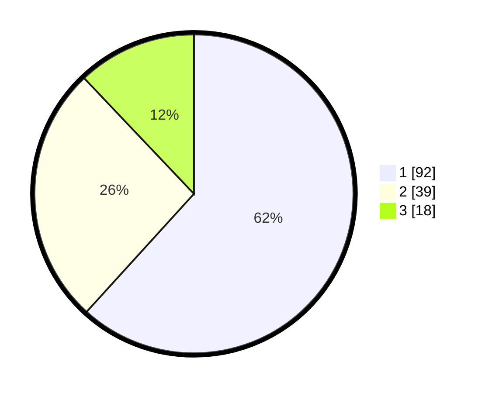

# Hasil

## Grafik

## Tabel

| No. | Nama Paslon    | Suara | Suara (raw) | Persentase |
|:--- |:-------------- | -----:| -----------:| ----------:|
| 1   | ANIES MUHAIMIN | 92    | [92][p-1]   | 61,74      |
| 2   | PRABOWO GIBRAN | 39    | [39][p-2]   | 26,17      |
| 3   | GANJAR MAHFUD  | 18    | [18][p-3]   | 12,08      |

[p-1]: https://github.com/gigit-pemilu/pemilu-2024/blob/main/pilpres/hitung-suara/sub/32-jawa-barat/sub/08-kuningan/sub/28-cibeureum/sub/2001-cimara/sub/001-tps/sub/paslon-1.txt
[p-2]: https://github.com/gigit-pemilu/pemilu-2024/blob/main/pilpres/hitung-suara/sub/32-jawa-barat/sub/08-kuningan/sub/28-cibeureum/sub/2001-cimara/sub/001-tps/sub/paslon-2.txt
[p-3]: https://github.com/gigit-pemilu/pemilu-2024/blob/main/pilpres/hitung-suara/sub/32-jawa-barat/sub/08-kuningan/sub/28-cibeureum/sub/2001-cimara/sub/001-tps/sub/paslon-3.txt

## Foto C Plano

https://sirekap-obj-formc.kpu.go.id/9641/pemilu/ppwp/32/08/28/20/01/3208282001001-20240214-223708--c985d5ac-8979-483e-8e29-b1b8eee2526b.jpg

https://sirekap-obj-formc.kpu.go.id/9641/pemilu/ppwp/32/08/28/20/01/3208282001001-20240214-223713--ca8b7528-871a-4f02-a20a-0bffd9654052.jpg

https://sirekap-obj-formc.kpu.go.id/9641/pemilu/ppwp/32/08/28/20/01/3208282001001-20240214-223721--4293bce5-9b65-454c-9d43-b1dc72ef2d38.jpg

## Metadata

| Key        | Value               |
| ---------- | ------------------- |
| Time Stamp | 2024-02-15 12:00:28 |

